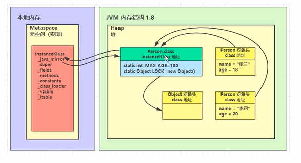

# 内存结构

## 1. 程序计数器
program counter register程序计数器(寄存器)
作用:记住下一条指令的执行地址,在CPU中用寄存器实现
特点:
   - 线程私有
   - 唯一不会内存溢出的区

## 2. 虚拟机栈
作用:线程运行时的内存空间,栈内由多个**栈帧**组成
栈帧: 每个方法运行时需要的内存(参数,局部变量,返回地址)
每个线程只有一个活动栈帧,对应当前的正在执行的方法

问题:
1. 垃圾回收是否涉及栈内存?
> 不需要,方法运行完自动弹出!
2. 栈内存分配越大越好吗?
> -Xss: 设置栈大小(stack size)的参数</br>
> 默认大小1024KB(Linux/x64,macOS),Linux根据虚拟内存来影响栈大小</br>
> 实例:</br>
> ```
> -Xss 1m
> -Xss 1024k
> -Xss 1048576
> ```
> 栈越大,线程越少.栈越大,可以多次递归调用!</br>
3. 方法内的局部变量是否线程安全?
> 如果方法内局部变量没有逃离方法内的作用返回,它是线程安全的</br>
> 如果是局部变量引用对象,并逃离了方法的作业范围,需要考虑线程安全</br>
> 没有入参，没有返回值

### 栈内存溢出 StackOverFlowError
- 栈帧过多: 递归过多
- 栈帧过大: 

### 线程运行诊断
案例1: cpu占用过多
- top命令,定位占CPU用过高的进程
- ps H -eo pid,tid,%cpu|grep 进程id定位哪个线程引起的cpu占用过高
- jstack命令进程id查看,找对应的线程编号(nid换算),定位代码
  - 可以根据线程id找到有问题的线程,进一步定位到问题代码的源码行数

案例2: 程序运行很长时间没有结果
- jstack 进程号 对应进程,查死锁

## 3. 本地方法栈
非java代码方法
例如Object中的clone，hashcode,notify,wait方法


## 4. 堆

- 通过new关键字, 创建的对象都会使用堆内存

### 4.1 特点: 

- 它是线程共享的, 堆中对象需要考虑线程安全问题
- 有垃圾回收机制

### 堆内存溢出 OutOfMemoryError
-Xmx4G

## 堆内存诊断

1. jps
  - 查看当前系统中有哪些进程
2. jmap工具
jmap -heap 检查堆内存占用
  - 查看堆内存占用情况
3. jconsole工具
  - 图形界面的,多功能的检测工具, 可以连续监测
4. jvisualvm
  - oracle才有的，更全面

案例

- 多次回收后占用还是很高
jps
jcousole gc


5. 方法区

- 所以java虚拟机线程共享的区
- 类相关的信息(成员等),运行时常量池
- 逻辑上是堆的组成部分，不强制位置(oracle是永久代，1.8之后是元空间)

1.8以前是永久代

1.8以后是元空间

设置最大有永久代空间大小

-XX:MaxPermSize=8m

设置最大元空间大小

-XX:MaxMetaspaaceSize=8m 

场景 cglib

- spring

- mybatis

javap -v 反编译字节码

# 面试题 StringTable

## StringTable特性

- 常亮池中的字符串仅是符号，第一次用到时才变为对象
- 利用串池机制，来避免重复创建字符串对象
- 字符串变量拼接的原理是StringBuilder
- 字符串拼接的原理是编译期优化
- 可以使用intern方法,主动将串池中还没有的字符串对象放入串池

intern() 1.6之前是复制一份(不同对象)放入串池，1.6之后是(同一对象)直接放入串池


关闭 "过长的定义是，超过98%的时间用来做GC并且回收了不到2%的堆内存。用来避免内存过小造成应用不能正常工作。" 策略

-XX:-UseGCOverheadLimit

## StringTable垃圾回收机制

-XX:+PrintStringTableStatistics 打印字符串表的统计信息

-XX:+PrintGCDetails -verbose:gc 打印大集会上详细信息

-XX:StringTableSize=200000 StringTable桶个数为200000，字符串常量非常多的话应该设置大一点


没有引用的常量会被垃圾回收


StringTable类似HashTable实现


# 直接内存

属于系统内存

- 常见于NIO操作时, 用于数据缓冲区
- 分配回收成本较高, 但读写性能高
- 不受JVM内存回收管理

基本使用, 比虚拟机栈速度更快


使用Unsafe对象释放内存

ByteBuffer中集成了Unsafe对象回收对象

-XX:+DisableExplicitGC 禁用显式垃圾回收 代码中的System.gc()无效 可能导致被分配的直接内存无法回收

# 垃圾回收机制/

1. 如何判断对象可以回收
2. 垃圾回收算法
3. 分代垃圾回收
4. 垃圾回收器
5. 垃圾回收调优

## 如何判断对象可以回收

引用计数: 记录引用次数，但是无法防止循环引用，早期python虚拟机使用了该技术

可达性分析算法: 根对象扫描, 不能被扫描到的算法被回收

- Java虚拟机中的垃圾回收采用可达性分析来探索所有存活的对象
- 扫描堆中的对象， 看是否能够沿着GC Root对象为起点的引用链找到该对象,找不到，表示可以回收
- 哪些对象可以作为GC Root?

Eclipse MAT工具 堆分析工具

抓取内存快照
jmap -dump:format=b,live,file=1.bin 21384(pid)

根对象：

- 系统类 Object Hashmap String
- Native Stack 本地方法
- BusyMOnitor synchonize关键字枷锁
- 线程对象

## 五种引用


- 强引用 根对象直接能找到的引用
- 软引用 根对象间接引用,没有被其他强引用直接引用。垃圾回收内存空间不够的时候会被回收
- 弱引用 强引用间接引用，垃圾回收时不管内存够不够都会被回收

引用队列, 释放软弱引用的对象

以下两种需要配合应引用队列使用

- 虚引用 ByteBuffer 内有Cleaner回收分配的直接内存,在回收ButeBuffer时,首先释放虚引用,由referenceHandler对象回收
- 终结器引用 垃圾回收时Object的finalize()方法被调用时,将其加入引用队列,效率低,不推荐

软引用应用:
用SoftRefference引用不重要的对象

引用队列清理软引用

弱引用应用
WeakReference


## 垃圾回收算法

- 标记清除胡算法：先标记再清除

优点: 速度快
缺点: 内存碎片，造成空间不连续

- 标记整理: 标记完成在整理,防止内存碎片

优点: 没有内存碎片
缺点: 速度慢

- 复制算法: 复制未被清理的内容到一个新的空白内存，再交换位置

优点: 没有内存碎片
缺点：占用双倍的内存空间

### 分代回收

新生代，老年代

minior gc: eden->form->to---15次GC以后或者to内存空间不够-->老年代
引发stop the world 暂停其他线程,暂停时间不长
对象超过阈值时,晋升到老年代。最大寿命15

FUll gc: 全部包含老年代的垃圾回收


- 对象首先分配在伊甸园区
- 新生代空间不足时触发minor gc,伊甸园和from存活的对象使用copy复制到to中, 存活的对象年龄加1并且交换from to
- minor gc会引发stop the world, 暂停其他用户的线程,等回收结束才恢复运行
- 当对象寿命超过阈值时会晋升至老年代,最大寿命是15(4bit)
- 当老年代空间不足,会先尝试触发minor gc，如果之后空间仍不足,那么触发full gc, STW(stop the world)时间更长

相关VM参数

|含义|参数|
|----|----|
|堆初始大小|-Xms|
|堆最大大小|-Xmx或-XX:MaxHeapSize=size|
|新生代大小|-Xmn或-XX:NewSize=size + -XX:MaxNewSize=size|
|幸存区比例(动态)|-XX:InitialSurvivorRatio=ratio和-XX:+UseAdaptiveSizePolicy|
|幸存区比例|-XX:SurvivorRatio=ratio|
|晋升阈值|-XX:MaxTenuringThreshold=threshold|
|晋升详情|-XX:+PrintTenuringDistribution|
|GC详情|-XX:+printGCDetails -verbose:gc|
|FullGC前MinorGC|-XX:+ScavengeBeforeFullGC|

##  垃圾回收器

1. 串行
- 单线程
- 堆内存较小，适合个人电脑

1. 吞吐量优先
- 多线程
- 堆内存较大，多核CPU
- 让单位时间内STW的时间最短
   
1. 响应时间优先
- 多线程
- 堆内存较大，多核CPU
- 尽可能让STW的时间最短


### 串行垃圾回收器
-XX:+UseSerialGC=Serial+SerialOld 开启串行垃圾回收器,包括新生代和老生代的垃圾回收器

所有线程在安全点先停下来,其中一个垃圾回收线程运行，其他的阻塞

### 吞吐量优先的垃圾回收器
-XX:+UseParallelGC ~ -XX:+UseParallelOldGC 1.8默认开启并行GC,开启其中一个会开启另一个 老年代使用标记整理算法
-XX:+UseAdaptiveSizePolicy 新生代自适应调整大小
-XX:GCTimeRatio=ratio 垃圾回收时间占用率
-XX:MaxGCPauseMillis=ms 最大暂停时间 默认200ms
-XX:ParallelGCThreads=n 垃圾回收线程数


### 响应时间优先

-XX:+UseConcMarkSweepGC ~ -XX:+UseParNewGC ~SerialOld 开启并发标记清除垃圾回收器
-XX:ParallelGCThreads=n ~ -XX:ConcGCThreads=threads 并行，并发线程数
-XX:CMSInitiatinggOccupancyFraction=percent 执行CMS的内存占比
-XX:+CMSScavengeBeforeRemark 重新标记时做一下minor GC

内存碎片过多会导致并发失败

# G1

定义: Garbage First (优先收集垃圾最多的区域)

- 2004论文发布
- 2009 JDK6u14体验
- 2012 JDK 7u4官方支持
- 2017 JDK 9 默认

适用场景

- 同时注重吞吐量(Throughput)和低延迟(Low latency),默认暂停目标是200ms
- 超大堆内存,会将堆划分为多个大小相等的Region
- 整体上是标记+整理算法,两个区域之间是复制算法

相关JVM参数
-XX:+UseG1GC 使用G1垃圾回收器(jdk9之后默认的)
-XX:G1HeapRegionSize=size
-XX:MaxGCPauseMillis=time(ms)
 
## G1垃圾回收阶段

### 三阶段循环

1. young Collection

- 新生代垃圾收集
- 会STW(时间短)
- eden区域->s幸存区
- s幸存区->o老年代


2. Young Collection + Collection Mark 新生代的垃圾回收和并发标记

   - 在Young GC时会进行GC Root 的初始标记
   - 老年代占用堆内存比例达到阈值时,进行并发标记(不会STW), 由下面的JVM参数决定

   -XX:InitiatingHeapOccupancyPercent=percent (默认45%)

3. Mixed Collection
 
  会对E,S,O进行全面垃圾回收

  - 最终标记(Remark)会STW

  - 拷贝存活(Evacuation)会STW

  -XX:MaxGCPauseMillis=ms
  从老年代挑出部分回收价值最高的进行回收

## Full GC

- serialGC
  - 新生代内存不足发生的垃圾收集 minor gc
  - 老年代内存不足发生的垃圾收集 full gc
- ParallelGC
  - 新生代内存不足发生的垃圾收集 minor gc
  - 老年代内存不足发生的垃圾收集 full gc
- CMS
  - 新生代内存不足发生的垃圾收集 minor gc
  - 老年代内存不足 
- G1
  - 新生代内存不足发生的垃圾收集 minor gc
  - 老年代内存不足 达到阈值,并发标记+混合收集

6) Young Collection 跨代应用

  - 新生代回收的跨代引用(老年代引用新生代)问题
    - 卡表与Remembered Set 老年代细分，每个card 512k 如果有新生代引用将对应card标记为脏card
  - 在引用变更时通过post-write barrier+dirtyy card queue 更新card标记，异步操作
  - connect refinement threads 更新 Remembered Set

7) remark 重新标记
pre-write barrier 写屏障 对象应用改变前把对象加入队列
satb_mark_queue
并发标记-> 重新标记
 写屏障指令

8) jdk 8u20 字符串去重

- 优点： 节省大量内存
- 缺点： 略微多了点cpu空间,新生代回收时间略微增加

-XX: +UserStringDeduplication

- 将所有新分配的字符串放入一个队列
- 当新生代回收时，G1并发检查是否有字符串重复
- 如果和他们值一样，让他们应用同一个char[]
- 注意, 与String.intern()不一样
  - String.intern()关注的是字符串连接
  - 而字符串去重关注的的char[]
  - 在jvm内部使用了不同的字符串表

节省内存

9) 并发标记类卸载 jdk8u40
所有对象经过并发标记后，就能知道那些类不再被使用，当一个类加载器的所有类都不再被使用，则卸载它所加载的所有类

-XX:+ClassUnloadingWithConcurrentMark 默认启用

10） 回收巨型对象
- 一个对象大于region的一半时, 称为巨型对象
- G1不会对巨型对象进行拷贝
- 回收时被优先考虑
- G1会跟踪老年代所有incoming引用, 这样老年代incoming引用为0的巨型对象就可以在新生代垃圾回收时处理掉
- "越早回收越好"

11) JDK9并发标记时间的调整

- 并发标记时间必须在堆空间占满前完成， 否则退化为 FullGC
- JDK9之前需要使用 -XX:InitiatingHeapOccupancyPercent
- JDK9可以动态调整阈值 
  - -XX:InitiatingHeapOccupancyPercent用来设置初始值
  - 进行数据采样并动态调整
  - 总会添加一个安全的空挡空间

12) jdk9 更高效的回收

- 250+增强
- 180+ bug修复


# 垃圾回收调优

预备知识

- 掌握GC相关的VM参数, 会基本的空间调整
- 掌握相关工具
- 准则: 调优跟2应用, 环境有关, 没有同意的法则

java -XX:+PrintFlagsFinal -versiion | findstr "GC" //查看虚拟机垃圾回收参数

5.1 调优领域

- 内存
- 锁竞争
- cpu占用
- io

5.2 确定目标

- [低延迟]还是[高吞吐量],选择合适的回收器
- CMS(低延迟),G1(大内存效果好),ZGC(G1之后低延迟)
- ParallelGC

- Zing 虚拟机(大内存，低停顿)

5.3 最快的GC是不发生GC
- 查看FullGC前后的内存占用, 考虑下面几个问题
  - 数据是不是太多
    - resultSet=statement.executeQuery("select * from xxx");//限制返回记录
  - 数据表示是否太臃肿
    - 对象图 用到哪个查哪个
    - 对象大小 最小的要16个字节，包装类大约24个字节，尽量使用基本数据类型
  - 是否存在内存泄漏
    - static Map map= 
    - 软应用
    - 弱引用
    缓存尽量使用第三方缓存实现
  
5.4 新生代调优
- 新生代特点
  - 所有的new 操作的内存分配非常廉价
    - TLAB thread-local allocation buffer
  - 死亡对象的回收代价是0
  - 大部分对象用过即死
  - Minor GC 的时间远远低于Full GC

-Xmx 设置新生代初始和最大值
新生代建议是堆的25% 到50% 新生代越大，吞吐量越高，到一定程度会下降(回收时间变长)

- 新生代能容纳所有```[并发量*(请求-响应)]```的数据

- 幸存区大道能保留 ```[当前活跃对象+需要晋升的对象]```

- 晋升区阈值配置得当,让长时间存活对象得到尽快晋升
  -XX: MaxTenuringThreshold=threashold 最大晋升阈值门槛，默认15
  -XX: +PrintTenuringDistribution 在每次新生代GC时，打印出幸存区中对象的年龄分布

5.5 老年代调优

以CMS为例
- CMS的老年代内存越大越好
- 先尝试不做调优，如果没有Full GC 那么已经...,否则先尝试新生代调优
- 观察发生Full GC时老年代内存占用,将老年代内存预设调大1/4~1/3
  - XX: CMSInitiatingOccupancyFraction=percent 老年代垃圾回收阈值 一般是75%~80%

> 1、CMSInitiatingOccupancyFraction默认值是-1，并不是许多人说的68、92之类的。
> 2、CMSInitiatingOccupancyFraction是用来计算老年代最大使用率（_initiating_occupancy）的。大于等于0则直接取百分号，小于0则根据公式来计算。这个_initiating_occupancy需要配合-XX:+UseCMSInitiatingOccupancyOnly来使用。
> 3、不同版本最终得到的_initiating_occupancy不同，归根结底应该是不同版本下的MinHeapFreeRatio值不同。


5.6 案例

- 案例1 Full GC和Minor GC频繁
空间紧张 幸存区空间紧张会快速晋升到老年代 观察堆空间大小
增大新生代空间 减少晋升到老年代

- 案例2 请求高峰期发生Full GC，单次暂停时间特别长(CMS)
查看CMS 日志
-XX:+CMSScavengeBeforeRemark 重新标记前先对新生代对象进行垃圾清理
  
- 案例3 老年代充裕情况下,发生Full GC (cms jdk1.7)
元空间内存不足

# 类加载和字节码技术

1. 类文件结构

```
ClassFile {
    u4             magic; //Class 文件的标志：魔数
    u2             minor_version;//Class 的次版本号
    u2             major_version;//Class 的主版本号
    u2             constant_pool_count;//常量池的数量
    cp_info        constant_pool[constant_pool_count-1];//常量池
    u2             access_flags;//Class 的访问标志
    u2             this_class;//当前类
    u2             super_class;//父类
    u2             interfaces_count;//接口
    u2             interfaces[interfaces_count];//一个类可以实现多个接口
    u2             fields_count;//Class 文件的字段属性
    field_info     fields[fields_count];//一个类会可以有个字段
    u2             methods_count;//Class 文件的方法数量
    method_info    methods[methods_count];//一个类可以有个多个方法
    u2             attributes_count;//此类的属性表中的属性数
    attribute_info attributes[attributes_count];//属性表集合
}
```

1.1 魔数
0-3字节, 表示它是否是【class】类型的文件
cafebabe

1.2 类的版本
4-7 类的版本 表示是java 对应的jdk版本


1.3 常量池

8-9 常量池的长度 

#0项不计入,也没有值


1.4 访问标识与继承信息


各个标识相与得到结果
如21=20+1：公共的类

1.5 field成员变量的信息

字段描述符的类型含义表：

|字段描述符|类型|含义|
|---|---|---|
|B|byte|基本类型byte|
|C|char|基本类型char|
|D|double|基本类型double|
|F|float|基本类型float|
|I|int|基本类型int|
|J|long|基本类型long|
|LClassName;|reference|对象类型，例如Ljava/lang/Object;|
|S|short|基本类型short|
|Z|boolean|基本类型boolean|
|[|reference|数组类型|

1.6 Method信息
...

1.7 附加属性
...

详情看java虚拟机规范

2. 字节码指令

2.1 入门
0x2a: aload_0 加载slot 0的变量(即this) 作为下面构造方法的参数
0xb7: invokespecial 预备调用构造方法
0x0001: 常量池中的#1项目 构造方法
0xb1: return 返回

2.2 javap工具

javap -v xxx.class 输出详细信息

2.3 图解方法执行流程

  1. 常量池载入运行时常量池
  2. 方法字节码载入方法区
  3. main线程开始运行，分配栈帧内存(局部变量表+操作数栈)
  4. 执行引擎开始执行字节码
    bipush： byte变量压栈
    sipush:  short变量压栈
    ldc:     常量池int数据入栈
    ldc2_2:  long类型压栈(2次压入)
    > 超过short的数字存入常量池,否则和字节码一起，如果超过32767会在编译期间计算好放常量池(常量折叠)
    istore_1: 将操作数栈顶数据弹出，存入局部变量表 slot 1
    ldc #3: 从常量池加载#3数据到操作数栈
    istore_2: 将操作数栈顶数据弹出，存入局部变量表 slot 2
    iload_1: 局部变量slot 1的值读入操作数栈
    iload_2: 局部变量slot 2的值读入操作数栈
    iadd:    加法运算
    istore_3: 将操作数栈顶数据弹出，存入局部变量表 slot 3
    getstatic #4: 在常量池中找到成员变量的引用(System.out对象)
    iload_3: 局部变量slot 3的值读入操作数栈
    invokevirtual #5:
      - 找到常量池#5 项目
      - 定位到方法区println(I)V方法
      - 生成新的栈帧
      - 传递参数, 执行新栈帧中的字节码
    return: 完成main方法调用，弹出main栈帧程序结束

2.4 示例 a++:

```java
public class Demo1 {
    public static void main(String[] args) {
        int a=10;
        int b=a++ + ++a + a--;
        System.out.println(a);
        System.out.println(b);
    }
}
```

javap -v:
```
Classfile /D:/CodingPractise/java/jvmLearn/out/production/jvmLearn/top/snowlands/Demo1.class
  Last modified 2023年4月28日; size 580 bytes
  SHA-256 checksum cc3c5b1d04ef83da0067501758f5caa15792f5d811f82f6289260c38ef2ea338
  Compiled from "Demo1.java"
public class top.snowlands.Demo1
  minor version: 0
  major version: 61
  flags: (0x0021) ACC_PUBLIC, ACC_SUPER
  this_class: #19                         // top/snowlands/Demo1
  super_class: #2                         // java/lang/Object
  interfaces: 0, fields: 0, methods: 2, attributes: 1
Constant pool:
   #1 = Methodref          #2.#3          // java/lang/Object."<init>":()V
   #2 = Class              #4             // java/lang/Object
   #3 = NameAndType        #5:#6          // "<init>":()V
   #4 = Utf8               java/lang/Object
   #5 = Utf8               <init>
   #6 = Utf8               ()V
   #7 = Fieldref           #8.#9          // java/lang/System.out:Ljava/io/PrintStream;
   #8 = Class              #10            // java/lang/System
   #9 = NameAndType        #11:#12        // out:Ljava/io/PrintStream;
  #10 = Utf8               java/lang/System
  #11 = Utf8               out
  #12 = Utf8               Ljava/io/PrintStream;
  #13 = Methodref          #14.#15        // java/io/PrintStream.println:(I)V
  #14 = Class              #16            // java/io/PrintStream
  #15 = NameAndType        #17:#18        // println:(I)V
  #16 = Utf8               java/io/PrintStream
  #17 = Utf8               println
  #18 = Utf8               (I)V
  #19 = Class              #20            // top/snowlands/Demo1
  #20 = Utf8               top/snowlands/Demo1
  #21 = Utf8               Code
  #22 = Utf8               LineNumberTable
  #23 = Utf8               LocalVariableTable
  #24 = Utf8               this
  #25 = Utf8               Ltop/snowlands/Demo1;
  #26 = Utf8               main
  #27 = Utf8               ([Ljava/lang/String;)V
  #28 = Utf8               args
  #29 = Utf8               [Ljava/lang/String;
  #30 = Utf8               a
  #31 = Utf8               I
  #32 = Utf8               b
  #33 = Utf8               SourceFile
  #34 = Utf8               Demo1.java
{
  public top.snowlands.Demo1();
    descriptor: ()V
    flags: (0x0001) ACC_PUBLIC
    Code:
      stack=1, locals=1, args_size=1
         0: aload_0
         1: invokespecial #1                  // Method java/lang/Object."<init>":()V
         4: return
      LineNumberTable:
        line 6: 0
      LocalVariableTable:
        Start  Length  Slot  Name   Signature
            0       5     0  this   Ltop/snowlands/Demo1;

  public static void main(java.lang.String[]);
    descriptor: ([Ljava/lang/String;)V
    flags: (0x0009) ACC_PUBLIC, ACC_STATIC
    Code:
      stack=2, locals=3, args_size=1
         0: bipush        10
         2: istore_1
         3: iload_1                           //i++ 先load再自增
         4: iinc          1, 1                //直接在槽位上进行自增运算
         7: iinc          1, 1                //++i 先自增，再load
        10: iload_1
        11: iadd
        12: iload_1
        13: iinc          1, -1
        16: iadd
        17: istore_2
        18: getstatic     #7                  // Field java/lang/System.out:Ljava/io/PrintStream;
        21: iload_1
        22: invokevirtual #13                 // Method java/io/PrintStream.println:(I)V
        25: getstatic     #7                  // Field java/lang/System.out:Ljava/io/PrintStream;
        28: iload_2
        29: invokevirtual #13                 // Method java/io/PrintStream.println:(I)V
        32: return
      LineNumberTable:
        line 8: 0
        line 9: 3
        line 10: 18
        line 11: 25
        line 12: 32
      LocalVariableTable:
        Start  Length  Slot  Name   Signature
            0      33     0  args   [Ljava/lang/String;
            3      30     1     a   I
           18      15     2     b   I
}
SourceFile: "Demo1.java"
```

2.5 条件判断指令

|指令|助记符|含义|
|----|----|----|
|0x99|ifeq|判断是否 == 0|
|0x9a|ifne|判断是否 != 0|
|0x9b|iflt|判断是否 < 0|
|0x9c|ifge|判断是否 >= 0|
|0x9d|ifgt|判断是否 > 0|
|0x9e|ifle|判断是否 <= 0|
|0x9f|if_icmpeq|两个int 是否 ==|
|0xa0|if_icmpne|两个int 是否 !=|
|0xa1|if_icmplt|两个int 是否 <|
|0xa2|if_icmpge|两个int 是否 >=|
|0xa3|if_icmpgt|两个int 是否 >|
|0xa4|if_icmple|两个int 是否 <=|
|0xa5|if_acmpeq|两个引用是否 ==|
|0xa6|if_acmpne|两个引用是否 !=|
|0xc6|ifnull|判断是否 == null|
|0xc7|ifnonnull|判断是否 != null|

说明： 
- byte,short,char都会按照int进行比较,因为操作数栈都是4字节
- goto用来进行跳转到指定行号的字节码

```java
public class Demo2 {
    public static void main(String[] args) {
        int a=0;
        if(a==0){
            a=10;
        }else{
            a=20;
        }
        System.out.println(a);
    }
}
```

```
Code:
  stack=2, locals=2, args_size=1
      0: iconst_0
      1: istore_1
      2: iload_1             
      3: ifne          12    
      6: bipush        10
      8: istore_1
      9: goto          15
    12: bipush        20
  StackMapTable: number_of_entries = 2
    frame_type = 252 /* append */
      offset_delta = 12
      locals = [ int ]
    frame_type = 2 /* same */
```

2.6 循环控制指令

```java
public class Demo3 {
    public static void main(String[] args) {
        int a=0;
        while(a<10){
            a++;
        }
    }
}

```

```
0: iconst_0
1: istore_1
2: iload_1
3: bipush        10   //操作数栈上现有0，再入栈一个10
5: if_icmpge     14   //操作数栈最上面两个int 是否 >= (栈顶第二个>=栈顶第一个)
8: iinc          1, 1
11: goto          2
14: return
```

do-while循环

```java
public class Demo4 {
    public static void main(String[] args) {
        int a=0;
        do{
            a++;
        }while (a<10);
    }
}
```

```
Code:
  stack=2, locals=2, args_size=1
      0: iconst_0
      1: istore_1
      2: iinc          1, 1
      5: iload_1
      6: bipush        10
      8: if_icmplt     2
     11: return

```

2.7 练习-判断结果

```java
public class Demo5 {
    public static void main(String[] args) {
        int i=0;
        int x=0;
        while(i<10){
            x=x++;
            i++;
        }
        System.out.println(x);
    }
}
```

```
Constant pool:
   #1 = Methodref          #2.#3          // java/lang/Object."<init>":()V
   #2 = Class              #4             // java/lang/Object
   #3 = NameAndType        #5:#6          // "<init>":()V
   #4 = Utf8               java/lang/Object
   #5 = Utf8               <init>
   #6 = Utf8               ()V
   #7 = Fieldref           #8.#9          // java/lang/System.out:Ljava/io/PrintStream;
   #8 = Class              #10            // java/lang/System
   #9 = NameAndType        #11:#12        // out:Ljava/io/PrintStream;
  #10 = Utf8               java/lang/System
  #11 = Utf8               out
  #12 = Utf8               Ljava/io/PrintStream;
  #13 = Methodref          #14.#15        // java/io/PrintStream.println:(I)V
  #14 = Class              #16            // java/io/PrintStream
  #15 = NameAndType        #17:#18        // println:(I)V
  #16 = Utf8               java/io/PrintStream
  #17 = Utf8               println
  #18 = Utf8               (I)V
  #19 = Class              #20            // top/snowlands/Demo5
  #20 = Utf8               top/snowlands/Demo5
  #21 = Utf8               Code
  #22 = Utf8               LineNumberTable
  #23 = Utf8               LocalVariableTable
  #24 = Utf8               this
  #25 = Utf8               Ltop/snowlands/Demo5;
  #26 = Utf8               main
  #27 = Utf8               ([Ljava/lang/String;)V
  #28 = Utf8               args
  #29 = Utf8               [Ljava/lang/String;
  #30 = Utf8               i
  #31 = Utf8               I
  #32 = Utf8               x
  #33 = Utf8               StackMapTable
  #34 = Utf8               SourceFile
  #35 = Utf8               Demo5.java


    Code:
      stack=2, locals=3, args_size=1
         0: iconst_0
         1: istore_1
         2: iconst_0
         3: istore_2
         4: iload_1
         5: bipush        10
         7: if_icmpge     21
        10: iload_2                           // 局部变量表x读进操作数栈
        11: iinc          2, 1                // 对局部变量（Slot 0）进行自增（+1）操作，与栈无关
        14: istore_2                          // 操作数栈上的0 覆盖了局部变量表的x
        15: iinc          1, 1
        18: goto          4
        21: getstatic     #7                  // Field java/lang/System.out:Ljava/io/PrintStream;
        24: iload_2
        25: invokevirtual #13                 // Method java/io/PrintStream.println:(I)V
        28: return
```

2.8 构造方法 

  1. <cinit>()V
  只在该类型被加载时才执行，只会执行一次。

```java
public class Demo6 {
    static int i=0;
    static {
        i=20;
    }
    static {
        i=30;
    }
}
```

```
public class top.snowlands.Demo6
  minor version: 0
  major version: 52
  flags: ACC_PUBLIC, ACC_SUPER
Constant pool:
   #1 = Methodref          #4.#14         // java/lang/Object."<init>":()V
   #2 = Fieldref           #3.#15         // top/snowlands/Demo6.i:I
   #3 = Class              #16            // top/snowlands/Demo6
   #4 = Class              #17            // java/lang/Object
   #5 = Utf8               i
   #6 = Utf8               I
   #7 = Utf8               <init>
   #8 = Utf8               ()V
   #9 = Utf8               Code
  #10 = Utf8               LineNumberTable
  #11 = Utf8               <clinit>
  #12 = Utf8               SourceFile
  #13 = Utf8               Demo6.java
  #14 = NameAndType        #7:#8          // "<init>":()V
  #15 = NameAndType        #5:#6          // i:I
  #16 = Utf8               top/snowlands/Demo6
  #17 = Utf8               java/lang/Object
{
  static int i;
    descriptor: I
    flags: ACC_STATIC

  public top.snowlands.Demo6();
    descriptor: ()V
    flags: ACC_PUBLIC
    Code:
      stack=1, locals=1, args_size=1
         0: aload_0
         1: invokespecial #1                  // Method java/lang/Object."<init>":()V
         4: return
      LineNumberTable:
        line 3: 0

  static {};
    descriptor: ()V
    flags: ACC_STATIC
    Code:
      stack=1, locals=0, args_size=0
         0: iconst_0
         1: putstatic     #2                  // Field i:I
         4: bipush        20
         6: putstatic     #2                  // Field i:I
         9: bipush        30
        11: putstatic     #2                  // Field i:I 以最后一次赋值为准
        14: return
      LineNumberTable:
        line 4: 0
        line 6: 4
        line 9: 9
        line 10: 14
}
```

  2. <init>()V
```java
public class Demo7 {
    private String a="s1";

    {
        b=20;
    }

    private int b=10;

    {
        a="s2";
    }

    public Demo7(String a,int b){
        this.a=a;
        this.b=b;
    }

    public static void main(String[] args) {
        Demo7 demo7=new Demo7("s3",30);
        System.out.println(demo7.a);
        System.out.println(demo7.b);
    }

}
```

```
Code:
  stack=2, locals=3, args_size=3
      0: aload_0
      1: invokespecial #1                  // Method java/lang/Object."<init>":()V
      4: aload_0
      5: ldc           #7                  // String s1
      7: putfield      #9                  // Field a:Ljava/lang/String;
    10: aload_0
    11: bipush        20
    13: putfield      #15                 // Field b:I
    16: aload_0
    17: bipush        10
    19: putfield      #15                 // Field b:I
    22: aload_0
    23: ldc           #19                 // String s2
    25: putfield      #9                  // Field a:Ljava/lang/String;
    28: aload_0
    29: aload_1
    30: putfield      #9                  // Field a:Ljava/lang/String;
    33: aload_0
    34: iload_2
    35: putfield      #15                 // Field b:I
    38: return
```

编译器会按照从上到下的顺序收集所有{}代码块和成员变量赋值的代码，形成新的构造方法，但原始构造方法内的代码总是在最后

<init>是实例化类时调用的方法，对非静态变量解析初始化，而<clinit>是类在初始化时调用的方法，是class类构造器对静态变量，静态代码块进行初始化，子类的<init>方法中会先对父类<init>方法的调用，并且clinit优先于init

2.9 方法调用

```java
package top.snowlands;

public class Demo8 {
    public Demo8(){}

    private void test1(){}

    private final void test2(){}

    public void test3(){}

    public static void test4(){}

    public static void main(String[] args) {
        Demo8 demo8 = new Demo8();
        demo8.test1();
        demo8.test2();
        demo8.test3();
        Demo8.test4();
        Demo8.test4();
    }
}
```

```
Code:
  stack=2, locals=2, args_size=1
      0: new           #7                  // class top/snowlands/Demo8 肥胖内存然后把对象引用放入操作数栈
      3: dup
      4: invokespecial #9                  // Method "<init>":()V 静态绑定
      7: astore_1
      8: aload_1
      9: invokevirtual #10                 // Method test1:()V
    12: aload_1
    13: invokevirtual #13                 // Method test2:()V  动态绑定，需要运行时确定
    16: aload_1
    17: invokevirtual #16                 // Method test3:()V  静态方法不用入栈
    20: invokestatic  #19                 // Method test4:()V  静态绑定 性能高点
    23: invokestatic  #19                 // Method test4:()V 
    26: return
```

2.10 多态调用

```java
public class Demo9 {

    public static void test(Animal animal){
        animal.eat();
        System.out.println(animal.toString());
    }

    public static void main(String[] args) throws IOException {
        test(new Cat());
        test(new Dog());
        System.in.read();
    }

}

abstract class Animal{
    public abstract void eat();

    @Override
    public String toString() {
        return "我是"+this.getClass().getSimpleName();
    }
}

class Dog extends Animal{
    @Override
    public void eat() {
        System.out.println("啃骨头");
    }
}

class Cat extends Animal{
    @Override 
    public void eat() {
        System.out.println("吃鱼");
    }
}
```

  1. 运行代码
  停在System.in.read()方法上, 这时运行jps获取进程id

  2. 运行HSDB工具
  进入JDK安装目录,执行

```
java -cp ./lib/sa-jdi.jar sun.jvm.hotspot.HSDB
```
进入图形界面attach进程id

   3. 查找某个对象

   对象找到class类，提供class类找到虚方法地址

小结:
当执行invokevirtual指令时:
- 先通过栈帧中的对象引用找到对象
- 分析对象头,找到对象的实际class
- Class结构中有vtable,它在类加载的链接阶段就已经根据方法重写规则生成好了
- 查表得到方法的具体地址
- 执行方法的字节码

2.11 异常处理

```java
public class DemoTryCatch {
    public static void main(String[] args) {
        int i=0;
        try{
            i=10;
        }catch (Exception e){
            i=20;
        }
    }
}

```

```
Code:
      stack=1, locals=3, args_size=1
         0: iconst_0
         1: istore_1
         2: bipush        10
         4: istore_1
         5: goto          12
         8: astore_2
         9: bipush        20
        11: istore_1
        12: return
Exception table:  //异常表,从第二行开始，如果出现异常进入第八行
         from    to  target type
             2     5     8   Class java/lang/Exception
```

多个single-catch的情况

```java
public class DemoTryCatch {
    public static void main(String[] args) {
        int i=0;
        try{
            i=10;
        }catch (ArithmeticException e){
            i=30;
        }catch (NullPointerException e){
            i=40;
        }catch (Exception e){
            i=20;
        }
    }
}
```

```
Code:
    stack=1, locals=3, args_size=1
        0: iconst_0
        1: istore_1
        2: bipush        10
        4: istore_1
        5: goto          26
        8: astore_2
        9: bipush        30
      11: istore_1
      12: goto          26
      15: astore_2
      16: bipush        40
      18: istore_1
      19: goto          26
      22: astore_2
      23: bipush        20
      25: istore_1
      26: return
    Exception table:
        from    to  target type
            2     5     8   Class java/lang/ArithmeticException
            2     5    15   Class java/lang/NullPointerException
            2     5    22   Class java/lang/Exception
```
- 因为异常出现时，只能进入Exception table中的一个分支,所以局部变量表slot 2 的位置被共用

multi-catch的情况,只是一个语法糖,三个异常入口一样

```java
public class DemoTryCatch {
    public static void main(String[] args) {
        int i=0;
        try{
            i=10;
        }catch (ArithmeticException | NullPointerException  e){
            i=30;
        }
    }
}
```

finally语法

```java
public class DemoTryCatch {
    public static void main(String[] args) {
        int i=0;
        try{
            i=10;
        }catch (Exception e){
            i=30;
        }finally {
            i=40;
        }
    }
}

```

```
Code:
      stack=1, locals=4, args_size=1
         0: iconst_0
         1: istore_1
         2: bipush        10
         4: istore_1
         5: bipush        40 //把finally中的内容全部放在try分支上
         7: istore_1
         8: goto          27
        11: astore_2
        12: bipush        30
        14: istore_1
        15: bipush        40
        17: istore_1
        18: goto          27
        21: astore_3          //slot 存储异常引用
        22: bipush        40
        24: istore_1
        25: aload_3
        26: athrow
        27: return
      Exception table:
         from    to  target type
             2     5    11   Class java/lang/Exception
             2     5    21   any  //任意剩余异常
            11    15    21   any
```

#### finally 面试题 1

- finally 出现了return 会出现什么？

```java
public class DemoTryCatch {

    public static int test(){
        try {
            return 10;
        }finally {
            return 20;
        }
    }
    public static void main(String[] args) {
        System.out.println(test());  //输出20
    }
}
```

```
public static int test();
    Code:
       0: bipush        10
       2: istore_0
       3: bipush        20 /finally中的代码一定会执行
       5: ireturn
       6: astore_1
       7: bipush        20
       9: ireturn
    Exception table:
       from    to  target type
           0     3     6   any
```

#### finally 面试题 2

finally对返回值的影响


> 如果在finally中return 会吞掉异常，一定不要在finally中return

```java
public class DemoTryCatch {

    public static int test(){
        int i=10;
        try{
            return i;
        }finally {
            i=20;
        }
    }
    public static void main(String[] args) {
        System.out.println(test());  //返回10
    }
}
```

```
public static int test();
    Code:
       0: bipush        10
       2: istore_0
       3: iload_0
       4: istore_1      //将栈顶数据移除后存入 slot 1 为了固定返回值
       5: bipush        20
       7: istore_0
       8: iload_1       // 载入slot 1 暂存的值(10)
       9: ireturn       // 返回的就是10
      10: astore_2
      11: bipush        20  //返回后再赋值20
      13: istore_0
      14: aload_2
      15: athrow
    Exception table:
       from    to  target type
           3     5    10   any
```

2.13 synchronized

对代码块进行枷锁解锁操作

```java
public class Demo {
    public static void main(String[] args) {
        Object lock=new Object();
        synchronized (lock){
            System.out.println("ok");
        }
    }

```

```
 public static void main(java.lang.String[]);
    Code:
       0: new           #2                  // class java/lang/Object
       3: dup                               // 复制对象的引用
       4: invokespecial #1                  // Method java/lang/Object."<init>":()V
       7: astore_1                          //第二个对象的引用赋值给slot 1的lock
       8: aload_1                           // lock引用加载到操作数栈, 对象引用开始
       9: dup                               // 需要两份 一份加锁，一份解锁
      10: astore_2                          // lock 引用-> slot 2
      11: monitorenter                      // 对laock进行加锁
      12: getstatic     #3                  // Field java/lang/System.out:Ljava/io/PrintStream;
      15: ldc           #4                  // String ok
      17: invokevirtual #5                  // Method java/io/PrintStream.println:(Ljava/lang/String;)V
      20: aload_2                           // 加载slot 2的对象到栈顶
      21: monitorexit                       // 解锁
      22: goto          30
      25: astore_3                          // 如果有异常 进入25
      26: aload_2                           // 对同一个对象进行解锁
      27: monitorexit
      28: aload_3
      29: athrow                            // 抛出异常
      30: return
    Exception table:
       from    to  target type
          12    22    25   any
          25    28    25   any

```


3. 编译器处理

所谓的`语法糖`其实就是java 编译器把*.java源码编译为*.class字节码的过程中, 自动生成和转换的一些代码，主要是为了减轻程序员的负担。

编译器转换java源码只是等价的源码，并不是真的源码

3.1 默认构造器

```java
public class Candy1 {

}
```

编译成class后的等价源代码

```java
public class Candy1 {
    public Candy1() { //这个无参构造器是自动加上的0
    }
}
```

3.2 自动拆装箱

jdk5加入的，代码片段

```java
public class Candy2 {
    public static void main(String[] args) {
        Integer x=1;
        int y=x;
    }

}
```

等价代码：

```java
public class Candy2 {
    public static void main(String[] args) {
        Integer x=Integer.valueOf(1);
        int y=x.intValue();
    }
}
```

3.3 泛型集合取值

java 编译泛型代码后会执行擦除的动作，即泛型信息在编译为字节码后时，当作Object来处理
取容器元素时进行强制类型转换


3.4 泛型反射
字节码上的泛型信息被擦除，LocalVariableTypeTable仍然保留了方法参数的泛型信息

方法的参数和返回值上的泛型信息才能在反射中获取

```java
public class Candy3 {

    public Set<Integer> test(List<String> list, Map<Integer,Object> map){
        return null;
    }


    public static void main(String[] args) throws NoSuchMethodException {
        Method test = Candy3.class.getMethod("test", List.class, Map.class);
        Type[] types = test.getGenericParameterTypes();
        for(Type type:types){
            if(type instanceof ParameterizedType){
                ParameterizedType parameterizedType = (ParameterizedType) type;
                System.out.println("原始类型 - "+parameterizedType.getRawType());
                Type[] arguments = parameterizedType.getActualTypeArguments();
                for(int i=0;i<arguments.length;i++){
                    System.out.printf("泛型参数[%d] - %s\n",i,arguments[i]);
                }
            }
        }
    }

}
```

3.4 可变参数

```java
public class Candy4 {

    public static void foo(String... args){ //实际上就是一个数组对象
        String[] array = args;
        System.out.println(array);
    }

    public static void main(String[] args) throws NoSuchMethodException {
        foo("hello","world");
    }

}
```

3.5 foreach循环

jdk5引入的语法糖，数组的循环:

```java
public class Candy5 {

    public static void main(String[] args) {
        int[] array={1,2,3,4,5};
        for(int e:array){
            System.out.println(e);
        }
    }
}
```

会被编译器转换为:

```java
public class Candy5 {
    public Candy5() {
    }

    public static void main(String[] args) {
        int[] array = new int[]{1, 2, 3, 4, 5};
        int[] var2 = array;
        int var3 = array.length;

        for(int var4 = 0; var4 < var3; ++var4) {
            int e = var2[var4];
            System.out.println(e);
        }

    }
}
```

- list则会用iterator迭代器进行循环

3.6 switch字符串

从jdk7开始，switch可以用于字符串和枚举类,这个功能其实也是语法糖,例如

```java
public class Candy7 {

    public static void main(String[] args) {
        String str="hello";
        switch (str){
            case "hello":{
                System.out.println("h");
                break;
            }
            case "world":{
                System.out.println("w");
                break;
            }
        }
    }
}

实际上是利用将字符串转换为hashcode进行进行switch操作，哈希码在编译期间就已经知道了
执行了两遍switch
先比较hashcode再比较equals： hashcode提高效率，equals避免hashcode冲突
再利用bytecode进行比较

3.7 switch枚举

```java
public class Candy8 {

    enum Sex{
        MALE,FEMALE
    }

    public static void foo(Sex sex){
        switch (sex){
            case MALE:
                System.out.println("男");break;
            case FEMALE:
                System.out.println("女");break;
        }
    }

    public static void main(String[] args) {
        foo(Sex.FEMALE);
    }

}
```
- 定义一个合成类(仅jvm使用，对我们不可见)
- 用来映射枚举的ordianal与数组元素的关系
- 枚举的ordinal表示枚举对象的序号，从0开始
- 即MALE的ordianl()=0,FEMALE的ordinal()=1

3.8 枚举类

枚举本质是合成类class,枚举类实例个数是有限的
本质上是final class,使用私有构造方法

3.9 try-with-resources

jdk7新增的语法

```java
try(资源变量=创建资源对象){

}catch(){

}
```

其中资源对象需要实现AutoCloseable接口，例如InputStream, OutputStream, Connection, Statement, ResultSet等接口都实现了AutoCloseable, 使用try-with-resources可以不在写finally语句块,编译器自动生成关闭资源代码

原始代码:
```java
public class Candy9 {

    public static void main(String[] args) {
        try(InputStream is=new FileInputStream("d:\\1.txt")){
            System.out.println(is);
        }catch (IOException e){
            e.printStackTrace();
        }
    }
}
```

编译后等价代码:

```java
public class Candy9 {
    public Candy9() {
    }

    public static void main(String[] args) {
        try {
            InputStream is = new FileInputStream("d:\\1.txt");
            Throwable var2 = null;

            try {
                System.out.println(is);
            } catch (Throwable var12) {
              //var2 是我们刚刚出现的异常
                var2 = var12;
                throw var12;
            } finally {
              //判断了资源不为空
                if (is != null) {
                  //如果我们代码有异常
                    if (var2 != null) {
                        try {
                            is.close();
                        } catch (Throwable var11) {
                          //如果close出现异常，作为被压制异常添加
                            var2.addSuppressed(var11);
                        }
                    } else {
                      //如果代码没有异常，close出现的异常就行最后catch块中的e
                      //防止异常信息的丢失
                        is.close();
                    }
                }

            }
        } catch (IOException var14) {
            var14.printStackTrace();
        }

    }
}

```

示例

```java
public class Candy10 {

    public static void main(String[] args) {
        try(MyResource resource=new MyResource()){
            int i=1/0;
        }catch (Exception e){
            e.printStackTrace();
        }
    }

}

class MyResource implements AutoCloseable {
    @Override
    public void close() throws Exception {
        throw new Exception("close 异常");
    }
}
```

输出
```
java.lang.ArithmeticException: / by zero
	at top.snowlands.Candy10.main(Candy10.java:11)
	Suppressed: java.lang.Exception: close 异常
		at top.snowlands.MyResource.close(Candy10.java:22)
		at top.snowlands.Candy10.main(Candy10.java:12)
```

3.10 方法重写时的桥接方法

方法重写时返回值分两种情况：

- 父子类返回值一致
- 子类返回值是可以父类方法返回值类型的子类

示例:

```java
class A{
    public Number m(){
        return 1;
    }
}

class B extends A{
    @Override
    public Number m() {
        return 2;
    }
}
```

实际jvm上会这么处理
```java
class B extends A{
    public Number m(){
        return 1;
    }

    //这个才是真正重写了父类的合成方法，这个对程序员不可见，允许同名，jvm内部使用
    public synthetic bridge Number m() {
        return m();
    }
}
```

3.11 匿名内部类

源代码:

```java
public class Candy12 {
    public Candy12() {
    }

    public static void main(String[] args) {
        Runnable var10000 = new Runnable() {
            public void run() {
                System.out.println("ok");
            }
        };
    }
}
```

转换后代码:

```java
//额外生成的类
final class Candy11$1 implements  Runnable{
    public void run() {
        System.out.println("ok");
    }
}

public class Candy12 {
    public static void main(String[] args) {
        Runnable runable=new Candy11$1();
    }
}
```

引用局部变量的匿名内部类,源代码:

```java
public class Candy12 {
  public static void test(final int x){
      Runnable ok = new Runnable() {
          @Override
          public void run() {
              System.out.println("ok"+x);
          }
      };
  }
}
```

转换后的代码:
```java
//额外生成的类
final class Candy11$1 implements  Runnable{
  int val$x;
  Candy11$1(int x){
    this.val$x=x;
  }
  public void run() {
      System.out.println("ok");
  }
}
```

注意
匿名内部类引用局部变量时，局部必须是final的；
因为在创建Candy11$1对象时，将x的值赋给了Candy11$1对象的value属性，所以x不应该再发生变化了
如果变化，那么valx属性没有机会再一起跟着变化

# 类加载

加载-链接-初始化

4.1 加载

- 将类的字节码载入方法区中，内部采用C++的instanceKlass描述的java类，它的重要field有:
  - _java_minor即java的类镜像，例如对String来说,就是String.class,作用是把klass暴露给java使用
  - _super即父类
  - _fields即成员变量
  - _methods即方法
  - _constants即常量池
  - _class_loder即类加载器
  - _vtable虚方法表
  - _itable接口方法表
- 如果这个类还有父类没加载，先加载父类
- 加载和链接可能是交替运行的

注意

- instanceKlass这样的【元数据】是存储在方法区的(1.8 后的元空间), 但_java_mirror是存储在堆中
- 可以通过前面介绍的HSDB工具查看



4.2 链接

- 验证: 验证类是否符合JVM规范，安全性检查
    用UE等支持二进制的编辑器修改HelloWorld.class的魔数,在控制台运行

    验证阶段会完成以下校验：

    - 文件格式验证：验证字节流是否符合Class文件格式的规范。例如：是否以0xCAFEBABE开头、主次版本号是否在当前虚拟机的处理范围之内、常量池中的常量是否有不被支持的类型 ...... 等等

    - 元数据验证：对字节码描述的元数据信息进行语义分析，要符合Java语言规范。例如：是否继承了不允许被继承的类（例如final修饰过的）、类中的字段、方法是否和父类产生矛盾 ...... 等等

    - 字节码验证：对类的方法体进行校验分析，确保这些方法在运行时是合法的、符合逻辑的。

    - 符号引用验证：发生在解析阶段，符号引用转为直接引用的时候，例如：确保符号引用的全限定名能找到对应的类、符号引用中的类、字段、方法允许被当前类所访问 ...... 等等

- 准备: 为static变量分配空间, 设置默认值
  - static变量在JDK 7 之前存储于instanceKlass末尾,从JDK7开始,存储于_java_mirror末尾
  - static变量分配空间和赋值是两个操作,分配空间在**准备阶段**完成，赋值在**初始化**阶段完成
  - 如果static变量是final的基本类型,那么编译阶段就确定了，赋值在初始化阶段完成
  - 如果static变量是final的,但属于引用类型，那么赋值也会在初始化阶段完成

- 解析: 将常量池中的符号引用解析为直接引用


4.3 初始化

<cinit> ()v方法

初始化即调用<cinit>()V，虚拟机会保证这个类的**构造方法**的线程安全

发生的时机

概括地说，类初始化是**懒惰的**

- main 方法所在的类,总会被首先初始化
- 首次访问这个类的静态变量或者静态方法时
- 子类初始化，如果父类还没初始化，会引发
- 子类访问父类的静态变量，只会触发父类的初始化，子类不会初始化
- Class.forName
- new 会导致初始化

不会导致类初始化的情况

- 访问类的static final静态变量(**基本类型和字符串**)不会触发初始化
- 类对象.class不会触发初始化
- 创建该类的数组不会触发初始化
- 类加载的localClass方法
- Class.forName的参数2为false时


4.4 联系

从字节码分析, 使用a,b,c这三个常量是否会导致E初始化

```java
public class Load4 {

    public static void main(String[] args) {
        System.out.println(E.a);//不会
        System.out.println(E.b);//不会
        System.out.println(E.c);//会，包装类型,需要初始化，不是基本类型和字符串
    }

}

class E{
    public static final int a=10;
    public static final String b="hello";
    public static final Integer c=20;

    static {
        System.out.println("init E");
    }
}
```

典型应用 - 完成懒惰初始化单例模式

```java
public class Singleton {

    private Singleton(){}

    //内部类中保存单例
    private static class LazyHolder{
        static final Singleton INSTANCE=new Singleton();
    }

    public static Singleton getInstance(){
        return LazyHolder.INSTANCE;
    }

}
```

以上的实现特点是:

- 懒惰实例化
- 初始化时的线程安全是有保障的


# 5. 类加载器 

以JDK8为例子:  

|名称|加载哪的类|说明|
|----|----|----|
|Bootstrap ClassLoader|JAVA_HOME/jre/lib|无法直接访问|
|Extension ClassLoader|JAVA_HOME/jre/lib/ext|上级为Bootstrap,显示为null|
|Application ClassLoader|classpath|上级为Extension|
|自定义加载类|自定义|上级为Application|

5.1 启动类加载器

用Bootstrap类加载器加载类:

```java
public class F {
    static {
        System.out.println("bootstrap F init");
    }
}
```

执行

```java
public class Load5_1 {

    public static void main(String[] args) throws ClassNotFoundException {
        Class<?> aClass = Class.forName("top.snowlands.F");
        System.out.println(aClass.getClassLoader());
    }

}
```

- _-Xbootclasspath表示设置bootclasspath
- 其中 /a:表示将当前目录追加至bootclasspath之后
- 可以用这个办法替换核心类
  - java -Xbootclasspath:<bew bootclasspath>
  - java -Xbootclasspath/a:<追加路径>
  - java -Xbootclasspath/p:<追加路径>


5.2 扩展类加载器

代码和上面应一样，代码打jar包放到JAVA_HOME/jre/lib/ext下面

5.3 双亲委派魔术

所谓的双亲委派，就是指调用类加载器的loadClass方法时，查找类的规则

> 注意
> 这里所谓的双亲，翻译为上级更合适,因为他们没有继承关系

5.4 线程上下文类加载器

我们在使用JDBC时，都需要加载Driver驱动，就算不屑
```java
Class.forName("com.mysql.jdbc.Driver")
```
也是可以让com.mysql,jdbc.Driver正确加载的

这个类的加载器是Bootstrap ClassLoader，会到JAVA_HOME/jre/lib下搜索类,但JAVA_HOME/jre/lib下显然没有mysql-connector-java-xxxx.jar的包,那么，在DriverManager的静态代码块中，如何正确加载com.mysql.jdbc.Driver呢？

LoadInitialDrivers()方法:

1. 使用SerrviceLoader机制加载驱动
2. 使用jdbcdrivers定义的驱动名加载驱动

jdk打破了双亲委派模式，会调用应用程序类加载器进行加载

1. 中使用了Service Provider-Interface

约定如下，在jar包的META-INF/service包下，以接口全限定名为文件，文件内容是实现类名称

这样就可以使用

```java
public class ServiceLoaderDemo {

    public static void main(String[] args) {
        ServiceLoader<Load4> load = ServiceLoader.load(Load4.class);
        Iterator<Load4> iterator = load.iterator();
        while (iterator.hasNext()){
            iterator.next();//next()已经隐式初始化了
        }
    }

}
```

面向对象+解耦

线程上下文类加载器是当前线程使用的类加载器，默认就是应用程序类加载器，它的内部又是由Class.forName调用了线程上下文类加载器完成加载，具体代码在ServiceLoader的内部类LazyIterator中:


5.5 自定义类加载器

什么时候需要自定义类加载器

- 


2. 运行期优化