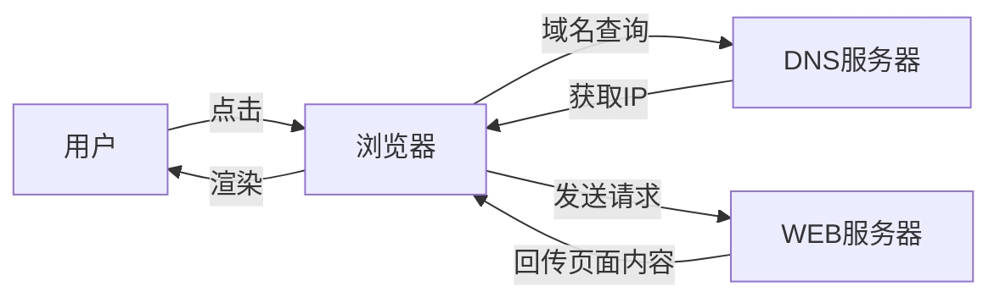
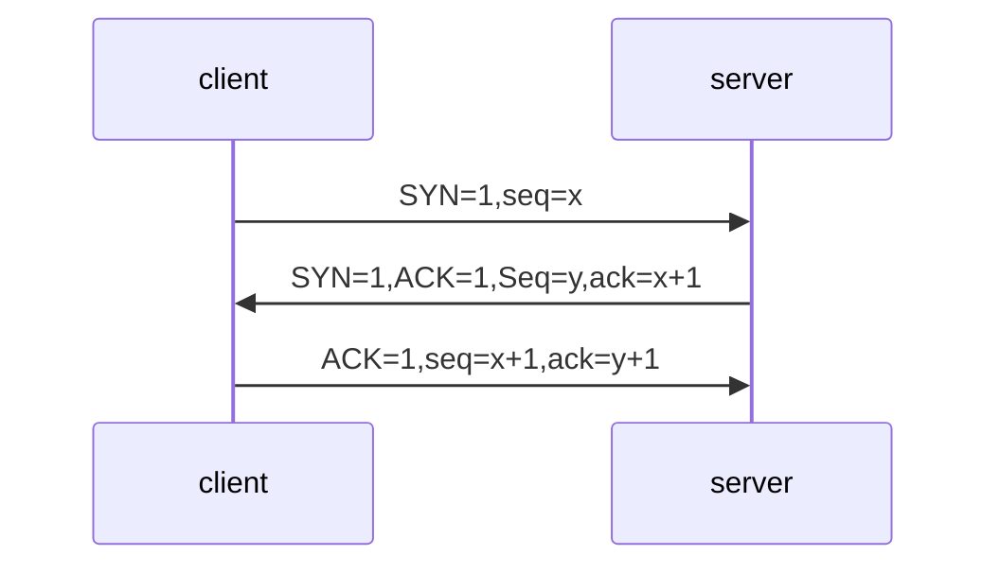
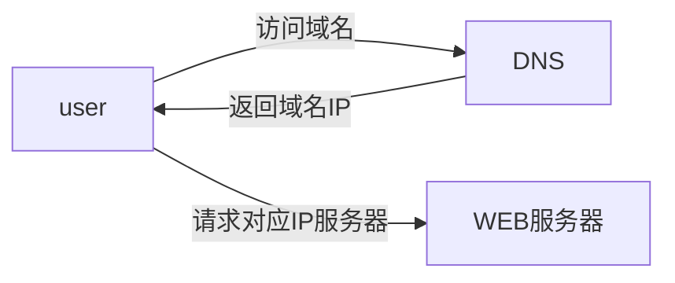
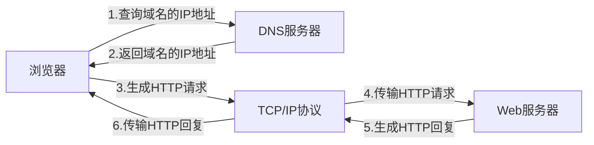

# 了解http协议
  
## 浏览器背后的故事

HTTP:

- 超文本传输协议(HTTP)是一种通信协议,它允许将**超文本标记语言**(HTML)文档从Web服务器传送到客户端的浏览器

- HTTP是一个属于**应用层的面向对象的协议**,由于其简捷、快速的方式,适用于分布式超媒体信息系统。它于1990年提出,经过几年的使用与发展,得到不断地完善和扩展

WEB和HTTP:

-  WEB是一种基于超文本和HTTP的、全球性的、动态交互的、跨平台的分布式**图形信息系统**
-  建立在Internet上的一种网络服务，为浏览者在Internet上查找和浏览信息提供了图形化的、易于访问的直观界面，其中的文档及超链接将Internet上的信息节点组织成一个互为关联的网状结构

## HTTP协议的前世今生

- 1990年10月 Tim Berners-Lee 最早提出了HTTP协议
- 1991年     Http0.9诞生
- 1996年5月  HTTP1.0发布
- 1997年1月  HTTP1.1发布
- 2015年5月  HTTP2.0提出
- HTTP3.0 QUIC协议

## 透过TCP/IP看HTTP

- HTTP协议是构建中TCP/IP协议上的，是TCP/IP协议的一个子集
- 为了更好的理解HTTP协议，我们先要了解一下TCP/IP的相关知识

## TCP/IP协议族

- TCP/IP协议其实是一系列与互联网相关联的协议集合起来的总称
- 分层管理是TCP/IP协议的重要特征

### TCP/IP协议的分层

- TCP/IP协议是由一个四层协议组成的系统，这四层分别为: **应用层**,**传输层**,**网络层**和**数据链路层**
  - 应用层一般是我们编写的应用程序，决定了向用户提供的应用服务。应用层可以通过系统调用与传输层进行通信。如**FTP**,**DNS**,**HTTP**等
  - 传输层通过系统调用向应用层提供处于网络连接中的两台计算机之间的数据传输功能
    - 在传输层有两个性质不同的协议: **TCP**和**UDP**
  - 网络层用于处理在网络上流动的数据包, 数据包是网络传输的最小的数据单位。该层规定了通过怎样的路径(传输线路)到达对方计算机,并把数据包传输给对方
  - 链路层用来处理连接网络的硬件部分，包括控制操作系统、硬件社保驱动、NIC(Network Interface Card,网络适配器)以及光纤等物理可见部分。硬件上的范畴均在链路层的作用范围之内。

### 数据封装过程

应用程序        (用户数据)
TCP             (Appl首部(用户数据))
IP              (TCP首部(Appl首部(用户数据)))
以太网驱动程序   (以太网首部(TCP首部(Appl首部(用户数据)))以太网尾部)

### HTTP数据传输过程

- 发送端发送数据时，数据会从上层传输到下层，且每经过一层都会被打上该层的头部信息。而接收端接收数据时，数据会从下层传输到上层，传输前会把下层的头部信息删除

### TCP层三次握手

- 使用TCP协议进行通信的双方必须先建立连接,然后才能开始传输数据。未来却把连接双方可靠性，在双方建立连接时，TCP协议采用了三次握手策略。

- 第一次握手: 客户端发送带有SYN标志的连接请求报文段,然后进入SYN_SEND状态,等待服务端的确认
- 第二次握手: 服务端接收到用户端的SYN报文段后，需要发送ACK信息对这个SYN报文段进行确认。同时，还要发送自己的SYN请求信息。服务端会将上述的信息放到一个报文段(SYN+ACK报文段)中,一并发送22给客户端,此时服务端将会进入SYN_RECV状态。
- 第三次握手: 客户端接收到服务器端的SYN+ACK报文段后,会想服务端发送ACK确认报文段，这个报文段发送完毕后，客户端和服务端都进入ESTABLISHED状态，完成TCP三次握手。

# "你是如何访问慕课的" -- DNS域名解析

- 已经介绍了与HTTP协议有着密切关系的TCP/IP协议，接下来介绍的DNS服务也是与HTTP协议有着密不可分的关系。
- 通常我们访问一个网站，使用的是主机名或者域名来进行访问的。因为相对于IP地址(一组纯数字)，域名更容易让人记住。但TCP/IP协议使用的是IP地址进行访问的，所以必须有个机制或者服务把域名转换成IP地址。**DNNS**服务就是用来解决这个问题的，它提供**域名到IP地址之间的解析服务**。

# 回溯HTTP事务处理过程

