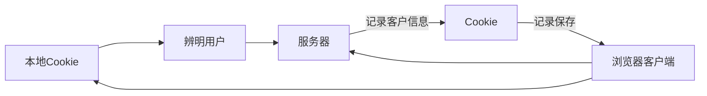
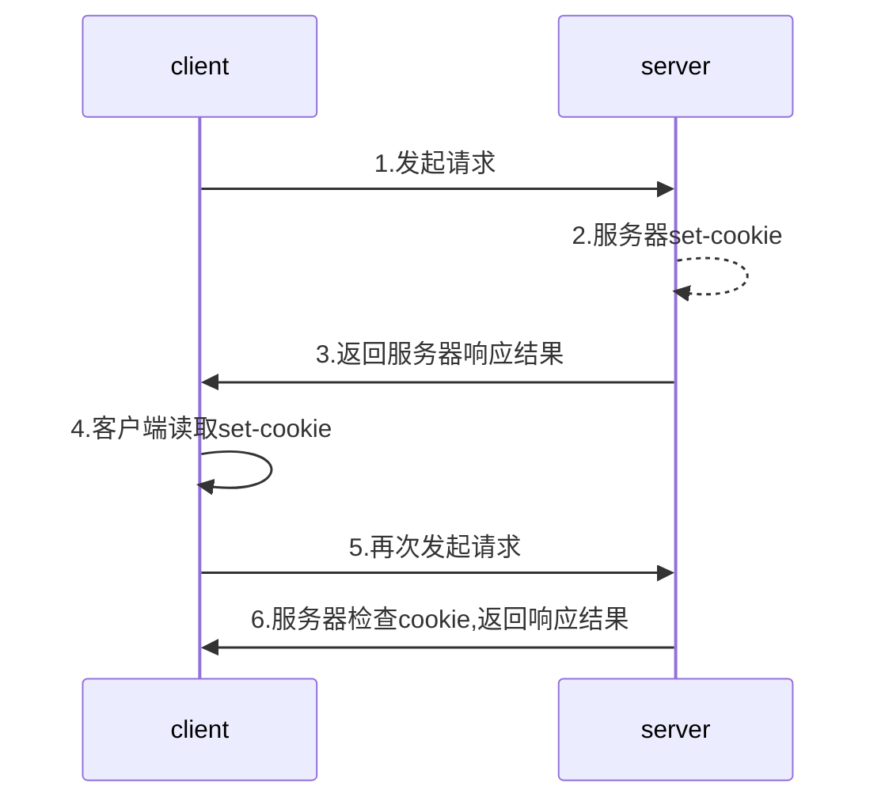
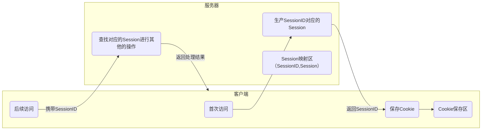

# 熟悉HTTP协议结构和通讯原理

## HTTP 协议特点

1. 支持客户端/服务器模式

- 客户端/服务器模式工作的方式是有客户端向服务器发出请求，服务器端响应请求，并进行相应服务

2. 简单快速

- 客户向服务器请求服务时，只需传送请求方法和路径
- 请求方法常用的有**GET**、**HEAD**、**POST**。每种方法规定了客户与服务器联系的类型不同。
- 由于HTTP西医简单，是的HTTP服务器的程序规模很小，因而通信速度很快

3. 灵活

- HTTP运行传输任意类型的数据对象
- 正在传输的类型由Content-Type(Content-Type是HTTP包中用来表示内容类型的标识)加以标记

4. 无连接

- 无连接的含义是限制每次链接只处理一个请求
- 服务器处理完客户的请求，收到客户端应答后，即断开连接
- 采用这种方式可以节省传输时间

5. 无状态

- HTTP协议是无状态协议
- 无状态是指协议对于事务处理没有记忆能力。缺少状态意味着如果后续处理需要前面的信息，则它必须重传，这样可能导致每次连接传送的数据量增大
- 另一方面，在服务器不需要先前信息时它的应答就较快

## URI与URL

Q: Web地址是URL还是URI?

URI(URL|URN)

- URI: 一个紧凑的的字符串用来标识抽象的或物理资源 **（全称：Uniform Resource Identifier）统一资源标识符，它是一个字符串用来标示抽象或物理资源。**
- A URI可以进一步被分为定位符，名字或两者都是
- 术语"Uniform Resource Locator"(URL)是URI的子集，除了确定一个资源，还提供一种定位该资源的主要访问机制(如其网络"位置")

> 维基百科
> - URI可以分为URL,URN或同时具备Locators和names特性的一个东西
> - URN作用就好像一个人的名字,URl就是一个人的地址
> - 换句话说: URN确定了东西的身份，URL提供各类找到它的方式

- URL是URI的一种，但不是所有URI都是URL
- URI和URL最大的差别是"访问机制"
- URN是唯一标识的一部分，是身份信息

## HTTP报文结构分析-请求报文

part1: 请求方法 URI HTTP协议及版本
part2: 报文头
- 大体分为四类:
    - 通用报文头
        - Cache_Control     控制缓存的行为
        - Connection        逐跳首部，连接的管理1
        - Date              创建报文的日期时间
        - Pargma            报文指令
        - Trailer           报文末端的首部一栏
        - Transfer-Encoding 指定报文主题的传输编码格式
        - Upgrade           升级为其他协议
        - Via               代理服务器相关信息
        - Warning           错误通知
    - 请求报文头
        - Accept                 用户代理可处理的媒体类型
        - Accept-Charset         优先的字符集
        - Accept-Eoncoding       优先的内容编码
        - Accept-Language        优先的语言
        - Athorization           Web认证信息
        - Except                 期待服务器的特定行为
        - From                   用户的电子邮箱地址
        - Host                   请求资源所在的服务器
        - If-Match               比较实体标记(ETag)
        - If-Modified-Since      比较资源的更新时间
        - If-None-Match          比较实体标记(与If-Match相反)
        - If-Range               资源未更新时发送实体Byte的范围请求
        - If-Unmodifieed_Since   比较资源更新时间，与If-Modified——since相反）
        - Max-Forwards           最大传输逐跳数
        - Proxy-Authorization    代理服务器要求客户端的认证信息
        - Range                  实体的字节范围请求
        - Reffer                 对请求中URI的原始获取方
        - TE                     传输编码优先级
        - User-Agent             HTTP客户端程序的信息
    - 响应报文头
        - Accept-Range           是否接受字节范围请求
        - Age                    推算资源创建经过时间
        - ETag                   资源的匹配信息
        - Location               令客户端重定向至指定URI
        - Proxy_Authenticate     代理服务器对客户端的认证信息
        - Retry-After            对再次发起请求发时机要求
        - Server                 HTTP服务器的安装信息
        - Vary                   代理服务器缓存的管理信息
        - WWW-Authenticate       服务器对客户端的认证信息
    - 实体报文头
        - Allow                  资源可支持的HTTP方法
        - Content_Encoding       实体主体适用的编码方式
        - Content-Language       实体主体的自然语言
        - Content-Length         实体主体的大小(单位:字节)
        - Content-Location       替代对应的URI
        - Content-MD5            实体主体的报文摘要
        - Content-Range          实体主体的位置范围
        - Contet-Type            实体主体的媒体类型
        - Expires                实体主体过期的日期时间
        - Last-Modified          资源的最后修改时间
- 在HTTP/1.1里一共规范了47种报文头字段

1. ACEEPT

- 作用:浏览器端可以接受的媒体类型

Accept:text/html 代表浏览器可以接受服务器会发的类型为text/html也就是我们常说的html文档，如果服务器无法返回text/html类型的数据,服务器应该返回一个406错误(Non Acceptable)

Accept： `*/*` 代表浏览器可以处理所以类型

如果想要给显示的媒体类型增加优先级,则使用q=来额外标识权重值
权重值q的范围是0~1(可精确到小数点后3位),且1为最大值。不指定权重q值时,默认权重为q=1.0。当服务器提供多种内容时,将会首先返回权重值最高的媒体类型。

2. Accept-Encoding

- 作用: 浏览器申明自己接受的编码方法,通常指定压缩方法,是否支持压缩。支持什么压缩方法(gzip，deflate)

```properties
Accept-Encoding: gzip,deflate
```

3. Accept-Language

- 作用: 浏览器申明自己接受的语言

```
Accept-Language: zh-cn,zh;q.0.7,en-us,en;q=0.3
```

客户端在服务器有中文版资源的情况下,会请求其返回中文版对应的响应,没有中文版时,则请求返回英文版响应

4. Connection


- Connection： keep-alive 当一个网页打开完成后，客户端和服务器之间用于传输HTTP数据的TCP连接不会关闭,如果客户端再次访问这个服务器上的网页,会继续使用这一条已经建立的连接

- Connection: close 代表一个Request完成后,客户端和服务器之间用于传输HTTP数据的TCP连接会关闭，当客户端再次发送request,需要重新建立TCP连接

5. Host

- 作用: 请求报头域要用于指定被请求资源的Internet主机和端口号,它通常从HTTP URL 中提取出来的


我们在浏览器中输入: http://www.fljf.com:8080

浏览器发送的请求消息中,就会包含Host请求报头域，如下:

```
Host: www.fljf.com:8080
```
6. Referer

- 当浏览器向web服务器发送请求的时候,一般会带上Referer,告诉服务器我是从哪个网页链接过来的,服务器藉此可以获得一些信息用于处理

7. User-Agent

- 作用: 告诉HTTP服务器,客户端使用的操作系统和浏览器的名称和版本

- 很多情况下我们会通过User-Agent来判断浏览器类型,从而进行不同的兼容设计


8. Content-Type

- 作用: 说明了报文体对象的媒体类型

text/html: HTML格式
text/plain: 纯文本格式
text/xml: XML格式
image/gif: gif图片格式
image/jpeg: jpg图片格式
image/png: png图片格式

application/xhtml+xml :XHTML格式
application/xml：XML数据格式
application/atom+xml: Atom XML聚合格式
application/json：JSON 数据格式
application/pdf: pdf格式
application/msword: Word文档格式
application/oxtet-stream: 二进制流数据(如常见的文件下载)
application/x-www-foorm-urlencoded: 表单提交


part3：报文体


## HTTP报文结构分析-响应报文

响应头:
报文协议及版本 
状态码及状态描述

响应体

# HTTP请求方法剖析 

HTTP/1.1 常用方法

1. GET
2. POST
3. PUT
4. HEAD
5. DELETE
6. OPTIONS
7. TRACE
8. CONNECT

## GET获取资源

- GET方法用来获取请求访问已被URI识别的资源
- 指定的1资源服务器端解析后返回响应内容

 

### GET


- GET方法也可以用来提交表单和其他数据

http://localhost/login.php?username=aa&怕死是我热点4

从上面的URL请求中，很容易就可以辨认表单提交的内容

## POST

- POST方法和GET功能类似,一般用来传输实体的主体
- POST方法的主要目的部署获取主体内容

## PUT
- 从客户端向服务器传送的数据取代指定的文档内容
- PUT方法与POST方法最大的不同是: PUT是幂等的，而POST不是幂等的
- 因此，我们更多的时候将PUT方法用作传输资源

## HEAD/DELETE

- HEAD
类似于GET请求，只不过返回的响应中没有对应的绝体内容,用于获取报头

- DELETE
请求服务器删除指定的资源

## OPTIONS

- 用来查询针对1请求URI指定的资源支持的方法

## TRACE/CONNECT

- TRACE
回显服务器收到的请求，主要用于测试或诊断

- CONNECT
开启一个客户端与所求资源之间的双向沟通的通道,它可以用来创建隧道

# 状态码


- 是用以表示网页服务器超文本传输协议响应状态的3位数字代码

##  HTTP状态码详解

|分类|含义|
|----|----|
|1XX|表示消息。这一类的状态码代表请求已被接受，需要继续处理。这类响应是临时响应，只包含状态行和某些可选的响应头消息，并以空行结束|
|2XX|表示成功。最类型的状态码，代表请求已经成功被服务器接收、理解、并接受。|
|3XX|表示重定向。这类状态码代表需要客户端采取进一步的操作才能完成请求。通常这些状态码用来重定向，后续的请求地址(重定向目标)在本次响应的location域中指明。|
|4XX|表示请求错误。这类的状态码代表了客户端看起来可能发生了错误，妨碍了服务器的处理。除非响应的是一个HEAD请求，否则服务器就应该返回一个解释当前错误状况的实体,以及这是临时的还是永久性的情况。这类状态码适用任何请求方法。浏览器应向用户显示任何包含此类错误响应中的实体内容。|
|5XX|表示服务器错误。这类状态码代表了服务器在处理请求的过程中有错误或者异常状态发生，也有可能是服务器意识到以当前的软硬件资源无法完成对请求的处理。除非这是一个HEAD请求，否则服务器应当包含一个解释当前错误状态以及这个状况是临时的还是永久的解释信息实体。浏览器应当向用户展示任何在当前响应中被包含的实体|

## 常用HTTP状态码

|状态码|状态码英文名称|描述|
|----|----|----|
|200|OK|请求已成功,请求所希望的响应头或数据体将随此响应返回|
|202|Accepted|已接受,已经接受请求，但未处理完成|
|206|Partial Content|部分内容,服务器成功处理了部分get请求|

|状态码|状态码英文名称|描述|
|----|----|----|
|301|Moved Permanently|永久移动,欠缺的资源已被永久移动到新的Uri,返回的信息会包括新的Uri.先后任何新的请求都应使用新的Uri代替|
|302|Found|临时移动,与301类似。但资源只是临时被移动。客户端应继续使用原有URI|


|状态码|状态码英文名称|描述|
|400|Bad Request|客户端请求的语法错误,服务器无法理解|
|401|Unauthorized|请求要求用户的身份认证|
|403|Forbidden|服务器理解请求客户端的请求,但是拒绝执行此请求|
|404|Not Found|服务器无法根据客户端的请求找到资源(网页)|

|状态码|状态码英文名称|描述|
|500|Internal Server Error|服务器内部错误,无法完成请求|
|502|Bad Gateway|充当网关或代理的服务器,从远端服务器接收到了一个无效的请求|

## 实验:用telnet分析http协议的通讯过程

```cmd
telnet
```

## HTTP状态管理: Cookie与Session

- 由一个咖啡店老板的故事说开来

### Cooike

- Cookie实际上是一小段的文本信息。客户端请求服务器，如果服务器需要记录该用户状态，就向客户端浏览器颁发一个Cookie。

- 客户端浏览器会把cookie保存起来。当浏览器再请求该网站时，浏览器把请求的网址连同该cookie一同提交给服务器。服务器检查该cookie，以此来辨认用户状态



### Cookie 工作原理



### Session

- Session是另一种记录客户状态的机制，保存在服务器上。客户端浏览器访问服务器的时候，服务器把客户端信息以某种形式记录在服务器上。

- 客户端浏览器再次访问时只需要从该session中查找该客户的状态就可以了



### 保存Session ID的方式

- Cookie

- URL重写

```url
http//host:port/xxx?Sessionid=xxxxx
```

- 隐藏表单

### Session的有效期

- Session超时失效

- 程序调用HttpSession.invalidate()

- 服务器异常中止

### Cookie与Session

- 存放位置不同

- 安全性(隐私策略)的不同

- 有效期上的不同

- 对服务器压力不同

