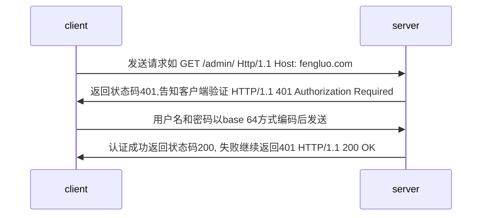
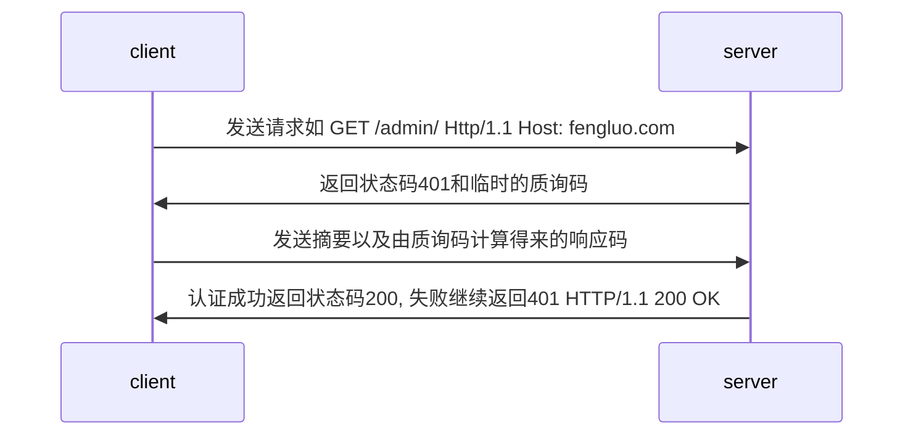
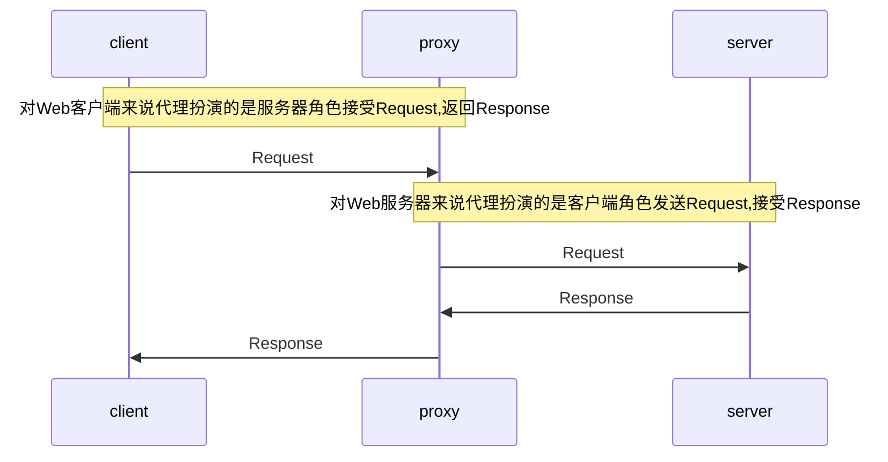
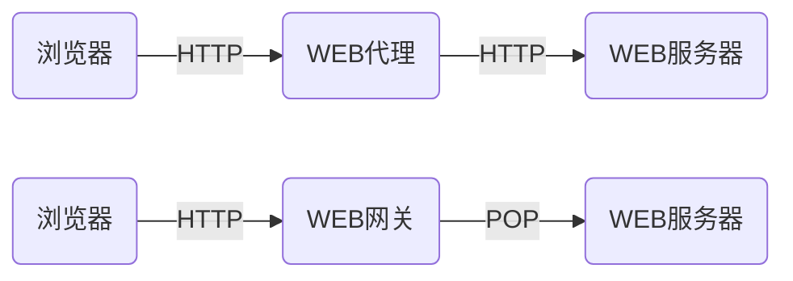

## url的编码与解码

- '%编码'规范

- 对URL中属于ASCII字符集的非保留字不做编码;对URL中的保留字需要取其ASCII内码，然后加上"%"前缀将该字符进行编码;对URL中的非ASCII字符需要取其Unicode内码,然后加上%前缀将该字符进行编码。

## HTTP协议之身份认证

### 身份认证信息

- 密码
- 动态令牌
- 数字证书
- 生物认证
- IC卡等

### 常见认证方式

- BASIC认证(基本认证)

- DIGEST认证(摘要认证)

什么是DIGEST认证？

为弥补basic认证存在的弱点从HTTP/1.1起就有了digest认证

Digest认证使用同样质询/响应的方式，但不会像basic认证那样直接发送明文密码

- SSL 客户端认证

SSL客户端认证是指借由https客户端证书完成认证的方式。凭借客户端证书认证服务器可以确认访问是否来自自己登录的客户端。

- FormBase认证(基于表单的认证)

1. 基于表单的认证方法并不是在HTTP协议中定义的

2. 使用由web应用程序各自实现基于表单的认证方式

3. 使用cookie和session的方式来保持用户状态

## HTTP的长连接与短连接

- HTTP协议是基于请求/响应模式的，因此只要服务端给了响应，本次HTTP请求就结束了。

- HTTP的长连接和短连接本质上是TCP长连接和短连接

- HTTP/1.0中，默认使用的是短连接。也就是说，浏览器和服务器每进行一次HTTP操作，就建立一次连接，结束就中断。

- HTTP/1.1起，默认使用长连接，用以保持连接特性。

- 短连接

建立连接--传输数据--关闭连接...建立连接--传输数据--关闭连接

- 长连接

建立连接--数据传输...(保持连接)...数据传输--关闭连接

## HTTP中介之代理

### 代理的作用

- 抓包 作为拦截服务器

- FQ

- 匿名访问

- 过滤器 

## HTTP中介之网关

- 网关可以作为某种翻译器使用，它抽象了一个能够到达资源的方法。网关是资源和应用程序之间的粘合剂

- 网关扮演的是"协议转换器"的角色

### WEB网关

- Web网关在一侧使用HTTP协议,在另一侧使用另一种协议。<客户端协议>/<服务器协议>

1. (HTTP/)服务器端网关:通过HTTP协议与客户端对话,通过其他协议与服务器通信

2. (/HTTP)客户端网关: 通过其他协议与客户端对话，通过HTTP协议与服务器通信

### 常见的网关类型

- (HTTP/*)服务器端Web网关

- (HTTP/HTTPS)服务器端安全网关

- (HTTPS/HTTP)客户端安全加速器网关

- 资源网关

## 内容协商机制

- 指客户端和服务器叫响应的资源内容进行交涉，然后提供给客户端最为合适的资源。内容协商会议响应资源的语言，字符集，编码方式等作为判断的基准。

### 内容协商方式

- 客户端驱动

客户端发起请求，服务器发送可选项列表，客户端做出选择后再发送第二次请求。

- 服务器驱动

服务器检查客户端的请求头部集并决定提供哪个版本的页面

- 透明协商

某个中间设备(通常是缓存代理)代表客户端进行协商。

### 服务器驱动内容协商-请求首部集

- Accept-Type: 告知服务器发送何种媒体类型 对应Content-Type

- Accept-Languag: 告知服务器发送何种语言 对应 Content-Language

- Accept-Charset: 告知服务器发送何种字符集 对应Charset

- Accept-Encoding: 告知服务器采用何种编码 对应 Content-Encoding

### 服务器驱动内容协商-近似匹配

Accpet-Language: en;q=0.5, fr;q=0.0,nl;q=1.0,tr;q=0.0

优先荷兰语，其次法语不接受土耳和法语

## 断点续传和多线程下载

- 断点续传?多线程下载

HTTP是通过Header里面的两个参数实现的，客户端发送请求时对应的是Range，服务器端响应时对应的是Content-Range。

- Range

用于请求头中,指定第一个字节的位置和最后一个字节的位置，一般格式：

Range:(unit= first byte pos)-[last byte pos]

举例:

Range:bytes=0-499
Range:bytes=500-999
Range:bytes=-500
Range:bytes=500-
Range:bytes=500-600,601-999

- Contet-Range

用于响应头中,在发出带Range的请求后,服务器会在Content-Range头部返回当前接受的范围和文件总大小。一般格式:

Contet-Range: bytes(unit first byte pos)-[last byte pos]/[entity length]

在响应完成后，返回的响应内容也不同:

HTTP/1.1 200 OK (不使用断点续传方式)
HTTP/1.1 205 Partial Content (使用断点续传方式)

### 断点续传过程

1. 客户端下载了一个1024K的文件，已经下载了其中的512K。

2. 网络中断，客户端请求续传，因此需要在HTTP头中声明本次需要续传的片段：
Range:bytes=52100-
这个头通知服务端从文件的512K位置开始传输文件。

3. 服务器端收到断点续传请求，从文件的512K位置开始传输，并且在HTTP头中增加：
Contet-Range: bytes 512000-/1024000
并且此时服务端返回的HTTP状态码应该是206，而不是200。

