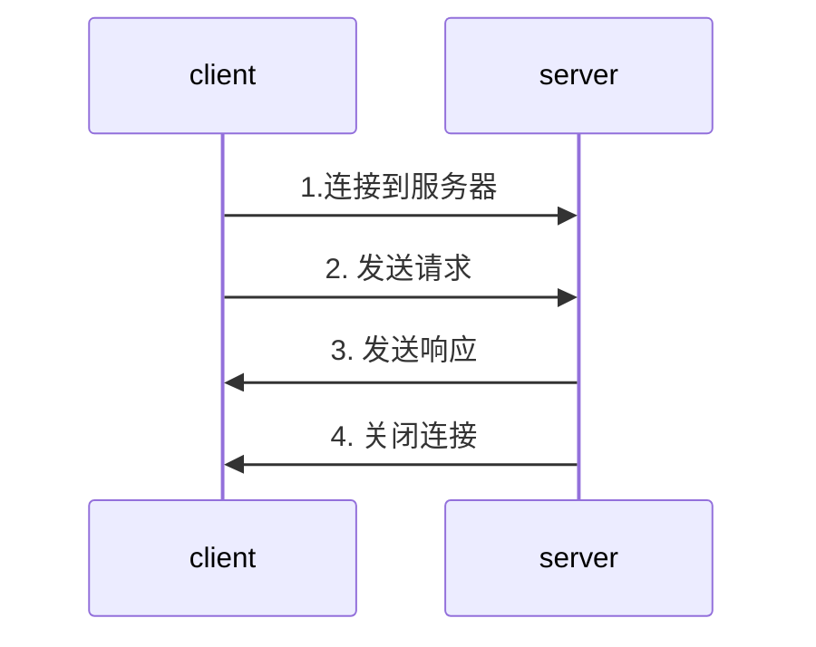

# 基于HTTP的功能追加协议

## 影响HTTP网络请求的因素

- 带宽

- 延迟

## HTTP协议的瓶颈

- 一条连接上只可发送**一个**请求

- 请求只能**从客户端开始**，客户端不可以接受响应以外的指令

- 请求/响应头部**不经压缩**就发送

- 每次互相发送**相同**的头部造成的浪费较多

- 非强制压缩发送

## WebSocket与HTTP

### 非持久化的HTTP

### WebSocket的"握手"

- WebSocket示例

GET /cahr HTTP/1.1
Host: server.excample.com
Upgarde: websocket
Connection: Upgrade
Sec-WebSocket-Key: x3JJHMbDL1EzLkh9GBhXDw==
Sec-WebSocket-Protocol: chat,superchat
Sec-WebSocket-Version: 13
Origin: http://example.com

- WebSocket核心

Upgarde: websocket
Connection: Upgrade

- WebSocket的"握手"

Sec-WebSocket-Key: x3JJHMbDL1EzLkh9GBhXDw==
Sec-WebSocket-Protocol: chat,superchat
Sec-WebSocket-Version: 13

响应

HTTP/1.1 101 Switching Protocols
Upgarde: websocket
Connection: Upgrade
Sec-WebSocket-Accept: HSmrc0sMlYUkAGmm5OPpG2HaGWk=
Sec-WebSocket-Protocol: chat

- AJAX轮询

定时轮询

- Long Poll(阻塞模型)

客户端发起轮询，服务器有效性再返回

### WebSocket特点

- 真正的**全双工方式**

- 减少**通信量**

## SPDY(被HTTP2.0取代,谷歌已放弃)

在HTTP的TCP协议上增加TLS层，SPDY层，最后是SPDY

### HTTP的缺陷

- 加单路连接，请求低效

- HTTP只允许由客户端主动发起请求

- HTTP头部冗余

### SPDY的改进

- 多路复用 请求优化

- 支持服务器推送技术

- SPDY压缩了HTTP头 

- 强制使用SSL传输协议

### SPDY的意义

普通: 快

前端: 加载快

运维: 省资源

## HTTP2.0

### HTTP2.0性能增强的核心：二进制分帧

首部-> Headers frame
请求体-> DATA frame

### HTTP2.0首部压缩

第二次发送之后发送过的首部不再发送，新增，更新的才发送

### HTTP2.0多路复用

HTTP/2 Inside: multiplexing

### 单链接多资源的优势

- 可以减少**服务链接压力**，内存占用少了，连接吞吐量大了

- 由于TCP连接减少而使**网络拥塞情况**得以改观

- 慢启动时间减少，**拥塞**和**丢包**恢复速度更快

### 并行双向字节流的请求和响应

将数据帧乱序发送，在另一端组合起来

- 并行交错地发送**请求**,请求之间**互不影响**

- 并行交错地发送**响应**,响应之间**互不干扰**

- 只使用一个连接即可以**并行发送**多个请求和响应

- 消除不必要的延迟,减少页面加载的时间

### 请求优先级

- 高优先级的流都应该优先发送

- 优先级不是绝对的

- 不同优先级混合也是必须的

### 服务器推送

## WebDav协议

直接对Web服务器上的文件进行操作

### WEBDAV追加方法

|方法|用途|
|----|----|
|PROPFIND|获取属性|
|PROPPATCH|修改属性|
|MKCOL|创建结婚|
|COPY|复制资源及属性|
|MOVE|移动资源|
|LOCK|资源加锁|
|UNLOCK|资源解锁|

### WEBDAV新增状态码

|状态码|含义|
|----|----|
|102Processing|可正常处理请求,但目前是处理中状态|
|207Multi-Status|存在多种状态|
|42UnprocessibleEntity|格式正确，内容有误|
|423Locked|资源已被加锁|
|424FailedDependency|处理与某请求关联的请求失败，因此不再维持依赖关系|
|507InsufficientStroage|保存空间不足|

应用: NAS的使用

## QUIC&HTTP3.0

### HTTP2.0的问题

- 队头阻塞

- 建立连接的握手延迟大

### QUIC特性

- 0 RTT

传输层就能建立连接

- 没有队头阻塞的多路复用

- 前向纠错，如果丢失一个包，利用每个包的冗余计算丢失的包的内容