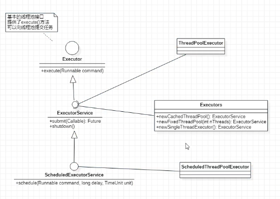
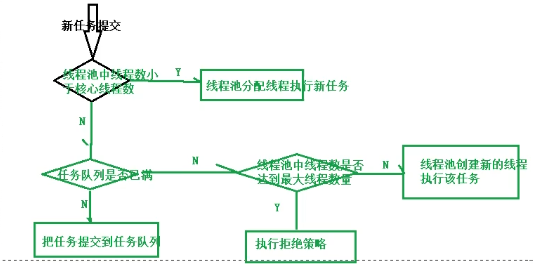
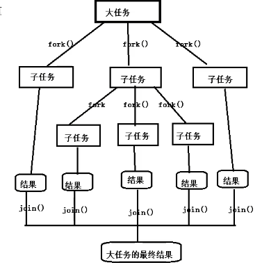
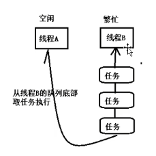
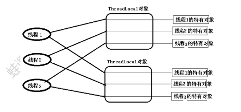

# 线程的概述
## 线程相关概念
- 进程: 是计算机中的程序关于数据集合上的一次活动，是操作系统进行资源分派与调度的基本单位
可以把进程简单理解为正在操作系统中简单允许的一个程序

- 线程: 进程的一个执行单元
一个线程就是进程中一个单一顺序的执行流，进程的一个执行分支，进程是线程的容器，一个进程至少有一个线程，一个进程中也可以有多个线程
在操作系统中以进程为单位分配资源，如虚拟存储空间，文件描述符等，每个线程都有各自的线程栈，自己的寄存器环境，自己的线程本地存储


- 主线程和子线程
JVM启动时会创建一个主线程，该主线程负责执行main方法
java中的线程不是孤立的，线程间存在一些联系。如果在A线程中创建了B线程，称B线程为A线程的子线程，相应的A线程就是B线程的父线程

- 串行，并发与并行
  - 串行sequential,先做任务A,完成后再做任务B,完成后在做任务C,所有任务逐个完成，共耗时15+10+10=35分钟
  - 并发(concurrent),先做任务A,在A等待期间做任务B,B准备期间做任务C,耗时5+2+10=17分钟
  - 并行(parallel),三个任务同时开始，总耗时取决于需要时间最长的那个任务
    并发可以提高对事务的处理效率，即一段时间内可以完成更多的事情
    并行是一种更严格离线的并发
    从硬件角度来说，如果单核CPU，一个处理器一次只能执行一个线程的情况下，处理器可以使用时间片轮转技术，可以让CPU快速的在各个线程之间进行切换，对于用户来说感觉是三个线程在同步执行，如果是多核心CPU,可以为不同的线程分配不同的CPU内核，

## 线程的创建与启动
在java中创建一个线程就是创建一个Thread类(子类)的对象(实例).

Thread类有两种常用的构造方法: Thread()与Thread(Runnable).对于创建线程的两种方式:
    定义Thread类的子类
    定义一个Runnable接口的实现类
    这两种创建线程的方式没有本质的区别

## 线程的常用方法
### currentThread()方法
Thread.currentThread()可以获取当前线程,执行当前代码的线程就是当前线程
同一段代码可能被不同的线程执行，因此当前的线程是相对的，Thread.currentThread()返回代码实地允许的线程对象


### setName()/getNmae()
thread.setName(线程名称)//设置线程名称
thread.getName()//返回线程名称
通过设置线程名称提高程序可读性

### isAlive()
isAlive()判断当前线程是否处于活动状态
活动状态就是线程已经启动但是还没有终止

### sleep()
Thread.sleep(millis);让当前线程休眠指定的毫秒数
当前线程是指Thread.currentThread()返回的线程

在run方法中如果由编译时异常只能选择捕获处理，不能抛出处理

### getId()
Thread.getId(): 可以获得线程的唯一标识
注意:
某个编号的线程允许结束后，该编号可能被后续创建的线程使用
重启JVM后，同一个线程的编号可能不一样

### yield()
Thread.yield()方法的作用是放弃当前的CPU资源

### setPriority()
Thread.setPriority(num)设置线程优先级
java线程的优先级取值范围是1-10，超出范围会抛出illegalArgumentException.
在操作系统中，优先级较高的线程获得CPU资源越多
线程优先级本质上只是给线程调度器一个提示信息，以便于调度器决定先调度那些线程，注意不能保证优先级高的线程先运行
java优先级设置不当或者滥用会导致某些线程永远得不到允许，会导致线程饥饿
线程优先级并不是设置的越高越好，一般情况下使用普通的优先级即可，即在开发时不必设置线程的优先级
线程的优先级既有继承性，在A线程中创建了B线程，则B线程的优先级与A线程是一样的

### interrupt()
可以中断线程
调用interrupt()方法仅仅是在当前线程打一个停止标志，并不是真正停止线程
isInterrupted()//判断线程是否被标记为中断

### setDaemon(bool)
java中的线程分为用户线程和守护线程
守护线程是为其他线程服务的线程，例如垃圾回收去(gc)是一个典型的守护线程
守护线程不能单独运行，当JVM中没有其他线程，只有守护线程时，守护线程会自动销毁，JVM会退出
设置守护线程的代码应该在线程启动前

## 线程的生命周期
线程的生命周期是线程对象的生老病死，即线程的状态
线程生命周期可以通过getState()方法获得, 线程的状态是thread.state枚举类型定义的，由以下几种:
NEW新状态，创建了线程对象，在调用start()启动之前的状态;
RUNNABLE,可运行状态，包含ready和running两个状态
  - ready状态表示该线程可以被线程调度器调度使用
  - running状态表示该线程正在执行。Thread.yield()可以将running状态转为ready状态
  - blocked阻塞状态。线程发起阻塞IO操作，或者申请其他线程的独占资源，线程转为blocked状态，处于阻塞状态的线程不会占用cpu资源。当阻塞I/O操作执行完成，或者线程获得了其申请的资源，线程可以转换为Runnable
  - waiting 等待状态。线程执行了object.wait(),thread.join()方法会把线程转换为waiting等待状态，执行object.notify()方法，或者加入的线程执行完毕，当前线程会转换为runnable状态
  - timed_waiting状态，与waiting状态类似，都是等待状态。区别在于该状态的线程不会无限等待，如果线程没有在指定的时间范围完成期望的操作，该线程自动转换为runnable
  - terminated终止状态，线程结束处于终止状态
  

## 多线程的优势与存在的风险
多线程编程具有以下优势：
  1. 提高系统的吞吐率(Throughout). 多线程编程可以使一个进程有多个并发(concurrent, 即同时运行)的操作
  2. 提高响应性(Responsiveness). Web服务器会采用专门的线程负责用户的请求处理，缩短了用户等待时间
  3. 充分应用多核(multicore)处理器资源。 通过多线程可以充分利用CPU资源

多线程编程存在的问题与风险:
  1.  线程安全(Thread safe)问题. 多线程共享数据时, 如果没有采取正确的并发访问控制措施， 就可能会产生数据一致性问题, 如读取脏数据(过期的数据), 如丢失数据更新. 
  2.  线程活性问题(thread liveness)问题. 由于程序自身的缺陷或者由资源稀缺性导致线程一直处于非runnable状态，这就是线程活性问题, 常见的活性故障有以下几种:
      1.  死锁(DeadLock). 类似鹬蚌相争.
      2.  锁死(Lockout),类似于睡美人中王子挂了
      3.  活锁(livelock)，类似于小猫咬自己的尾巴
      4.  饥饿(Satrvation),类似于健壮的雏鸟总是从木鸟嘴中抢到事务
  3.  上下文切换(context switch). 处理器从执行一个线程切换到执行另外一个线程
  4.  可靠性. 可能会有一个线程导致JVM意外终止，其它的线程也无法执行.

# 线程安全问题
非线程安全主要是多个线程对同一个对象的示例变量进行操作时，会出现值被更改，值不同步的情况.
线程安全问题表现为三个方面: 原子性，可见性和有序性

## 原子性
原子(Atomic)就是不可分割的意思. 原子操作的不可分割有两层含义:
  1. 访问(读，写)某个变量的操作从其他线程来看, 该操作要么已经执行完毕，要么尚未发生，即其他线程看不到当前线程的中间结果
  2. 访问同一组共享变量的原子操作是不能够交错的，如现实中从ATM机取款，对于用户来说，要么操作成功，用户拿到钱，余额减少了，增加一条交易记录;要么没拿到前，相当于取款操作没有发生

java 有两种方式实现原子性: 一种是使用锁; 另一种是利用处理器的CAS(Comapre and Swap)指令
锁具有排他性, 保证共享变量在某一时刻只能被一个线程访问
CAS指令直接在硬件(处理器和内存)层次上实现，看作是硬件锁。

AtomicInteger 原子integer类，保证线程安全

## 可见性
在多线程环境中，一个线程对某个变量进行更新后，后续其他线程可能无法立即读到这个更新结果，这就是线程安全问题的另外一种形式:可见性(visibility)
如果一个线程对变量更新后，后续访问变量的其他线程可以读到更新的结果，称这个线程对共享变量的更新对其他线程可见，否则称这个线程对共享变量的更新对其他线程不可见
多线程因为可见性问题可能导致其他线程读取到了旧数据(脏数据).

## 有序性
有序性(ordering)是指什么情况下一个处理器上运行的一个线程所执行的内存访问操作在另一个处理器运行的其他线程看来是乱序的(out of order)
乱序是指内存访问操作的顺序看起来发生了变化
在多核处理器的环境下，编写的顺序结构，这种操作执行的顺序可能是没有保证的:
  编译器可能会改变两个操作的先后顺序;
  处理器也可能不会按照目标代码的顺序执行;
  这种一个处理器上执行多个操作，在其他处理器看来它的顺序与目标代码指定的顺序可能不一样，这种现象称为重排序。
  重排序是对内存访问操作的一种优化，可以在不影响单线程程序正确的前提下提升程序的性能。但是，可能对多线程程序的正确性产生影响，即可能导致线程安全问题
  重排序和可见性类似，不是必然出现的问题

与内存操作顺序有关的几个概念:
  源代码顺序, 就是源码中指定的内存访问顺序
  程序顺序, 处理器上运行的目标代码所指定的内存访问顺序
  执行顺序, 内存访问操作在处理器上的实际执行顺序
  感知顺序, 给定处理器所感知到的该处理器即其他处理器的内存访问操作的顺序

  可以把重排序分为指令重排序和存储子系统重排序两种.
  指令重排序主要是指由jit编译器，处理器引起的，指程序顺序与执行顺序不一样
  存储子系统重排序是由高速缓存, 写缓冲器引起的, 感知顺序与执行顺序不一致

- 指令重排序
  在源码顺序与程序顺序不一致, 或者程序顺序与执行顺序不一致的情况下，我们就说发生了指令重排序(Instruction Reorder).
  指令重排是一种动作，确实对指令的顺序进行了调整，重排序的对象的指令
  javac编译器一般不会执行指令重排序，而jit编译器可能执行指令重排序
  处理器也可能执行指令重排序，使得执行顺序与程序顺序不一致

  指令重排不会对单线程程序的结果正确性产生影响，可能导致多线程程序导致非预期的结果


- 存储子系统重排序
  存储子系统是指写缓冲器与高速缓存
  高速缓存(Cacahe)是CPU中为了匹配与主存处理速度不匹配而设计的一个高数缓存
  写缓冲器(Store buffer, Write buffer)用来提高写告诉缓存操作的效率

  即使处理器严格按照程序顺序执行两个内存访问操作，在存储子系统的作用下，其他处理器对这两个操作的感知顺序与程序顺序也可能不一致，即这两个操作的执行顺序看起来像是发生了变化，这种现象称为存储子系统重排序
  存储之子系统重排序并没有真正对指令执行顺序进行调整，而是造成一种指令执行顺序被调整的假象.
  存储子系统重排序的对象是内存操作的结果.

  从处理器角度来看，都内存就是从指定的RAM地址中加载数据到寄存器，称为Load操作; 写内存就是把数据存储到指定的地址表示的RAM存储单元中，称为Store操作，内存重排序由以下四种可能：
    - LoadLoad重排序, 一个处理器上先后执行两个读操作L1和L2, 其他处理器对两个内存操作的感知顺序可能是L2->L1
    - storestore重排序，一个处理器先后执行两个写操作W1和W2,其他处理器对这两个内存操作的感知顺序可能是W2->W1
    - LoadStore重排序，一个处理器先执行读内存操作L1再执行写内存操作W1，其他处理器对两个内存的感知顺序可能是W1->L1
    - StoreLoad重排序，一个处理器先执行写内存操作W1再执行读内存操作L1, 其他处理器对两个内存操作的感知顺序可能是L1->W1

  内存重排序与处理器微架构有关，不同架构的处理器所允许的内存重排序不同
  内存重排序可能会导致线程安全问题. 

- 貌似串行语义
  JIT编译器，处理器是按照一定的规则对指令，内存操作的结果进行重排序，给单线程程序造成一种假象---指令是按照源码的顺序执行的。这种假象称为貌似串行语义. 并不能保证多线程环境下程序的正确性
  为了保证貌似串行语义由数据依赖关系的语句不会被重排序，只有不存在数据依赖关系的语句才会被重排序。如果这两个操作(指令)访问同一个变量，且其中一个操作(指令)为写操作,那么这两个操作之间就存在数据以来关系(Data dependency).
  如果不存在数据依赖关系则可能重排序,如:
  存在控制依赖关系的语句允许重排. 一条语句(指令)的执行结果会决定另一条语句(指令)能否被执行,这两条语句(指令)存在控制依赖关系(Control Dependency). 如在if语句中允许重排，可能存在处理器先执行if代码块，再判断if条件是否成立

- 保证内存访问的顺序性
  可以使用volitile关键字, synchronized关键字实现有序性
  
## java内存模型
- 每个线程都有独立的栈空间
- 每个线程都可以访问堆内存
- 计算机CPU不直接从主内存中读取数据，CPU读取数据时，先把主内存数据读取到Cache缓存中，把Cache中的数据读取到Register寄存器中
- JVM中的共享数据可嫩会分配到Register寄存器中，每个CPU都有自己的Register寄存器，一个CPU不能读取其他CPU上的寄存器中的内容。如果两个线程分别运行在不同的处理器(CPU)上, 而这两个共享的数据被分配到寄存器上，会产生可见性问题。
- 即使JVM中的共享数据分配到主内存中，也不能保证数据的可见性，CPU不直接对主内存访问，二手通过Cache高速缓存上进行的。一个处理器上运行的线程对数据的更新可能是更新到处理器的写缓冲器(Store Buffer),还没有到达Cache缓存，更不用说主存了，另外一个处理器不能读取到该处理器写缓冲器上的内容，会产生运行在另外一个处理器上的线程无法看到该处理器对共享数据的更新。
- 一个处理器的Cache不能直接读取另外一个处理器的Cac和，但是一个处理器可以通过缓存一致性协议(Cache Coherence Protocol)来读取其他处理缓存中的数据，并将读取的数据更新到该处理器的Cacahe中，这个过程称为缓存同步，缓存同步使得一个处理器上运行的线程可以读取到另外一个处理器上运行的线程对共享数据所作的更新，即保障了可见性。为了保障可见性，必须使一个处理器对共享数据的更新最终被写入该处理器的Cache中，这个过程被称为冲刷处理器缓存

规定:
1. 每个线程的共享数据都存储在主内存中
2. 每个线程都有一个私有的本地内存(工作内存)，线程的工作内存是抽象的概念，不是真是存在的,它可能涵盖写缓冲器，寄存器，其他硬件的优化
3. 每个线程从主内存中把数据读取到本地工作内存中，在工作内存中保存共享数据的副本
4. 线程在自己的工作内存中处理数据，仅对当前线程可见，对其他线程是不可见的

# 线程同步
## 线程同步机制简介
线程同步机制是一套用于协调线程之间的数据访问机制。该机制可以保障线程安全.
java平台提供的线程同步机制包含: 锁，volatile 关键字, final 关键字, static关键字, 以及相关的API, 如Object.wait()/Object.notify()等

## 锁概述
线程安全问题的产生前提是多个线程并发访问共享数据
将多个线程对共享数据的并发访问转换为串行访问,即一个共享数据一次只能被一个线程访问. 锁就是复用这种思路来保障线程安全的
锁(Lock)可以理解为对共享数据进行保护的一个许可证. 对于同一个许可证保护的共享数据来说，任何线程想要访问这些共享数据必须先持有许可证. 一个线程只有在持有许可证的情况下才能对这些共享数据进行访问;并且一个许可证只能被一个线程持有;许可证线程在结束对共享数据的访问后必须释放器持有的许可证. 
一个线程在访问共享数据前必须先获得锁, 获得锁的线程被称为锁的持有线程;一个锁一次只能被一个线程持有. 锁的持有线程在获得锁之后和释放锁之前这段时间锁执行的代码称为临界区(Critical Section).
锁具有排他性(Exclusive), 即一个锁一次只能被一个线程持有. 这种锁称为排他锁或互斥锁(Mutex)
线程: 获得锁->访问临界区代码->访问共享资源-> 释放锁
JVM把锁称为内部锁和显式锁两种. 内部锁通过synchronized关键字实现;显示锁通过java.concurrent/locks/Lock接口的实现类

### 锁的作用
锁可以实现对共享数据的安全访问. 保障线程的原子性，可见性与有序性.
锁是通过互斥保障原子性. 一个锁只能被一个线程持有, 这就保证临界区的代码一次只能被一个线程执行. 使得临界区代码所执行的操作自然而然的具有不可分割的特性，即具备了原子性. 
可见性的保障是通过写线程冲刷处理器的缓存和读线程冲刷处理器的缓存这两个动作实现的.在java中，锁的获得隐含着刷新处理器的动作，锁的释放隐含着冲刷处理器缓存的动作.
锁能够保障有序性.写线程在临界区锁执行的在读线程所执行的在临界区看来完全是按照源码顺序执行的.
注意:
使用锁保障线程的安全性，必须满足以下条件:
这些线程在访问共享资源时必须使用同一个锁,即使是读取共享数据的线程也需要使用同步锁

### 锁相关的概念
1. 可重入性(Reentrancy),描述这样一个问题: 一个线程持有该锁的时候能再次(多次)申请该锁
如果一个线程持有一个锁的时候还能继续成功申请该锁,称该锁是可重入的, 否则就称该锁为不可重入的

2. 锁的争用与调度
Java平台中内部锁属于非公平锁，显示Lock既支持公平锁又支持非公平锁

3. 锁的粒度
一个锁可以保护的共享数据的数量大小称为锁的粒度.
锁保护的共享数据量大，称该锁的粒度粗，否则就称该锁的粒度细。
锁的粒度过粗会导致线程在申请锁的时候会进行不必要的等待. 锁的粒度过细会增加锁调度的开销.

## 内部锁: synchronized关键字
Java中的每个对象都有一个与之关联的内部锁(intrinsic lock). 这种锁也称为监视器(monitor), 这种内部锁是一种排他锁, 可以保障原子性,可见性与有序性.
内部锁是通过synchronized关键字实现的. synchronized关键字修饰代码块, 修饰该方法.
修饰代码块语法:
```java
synchronized(对象锁){
  同步代码块,可以在同步代码块中访问共享数据
}
```
修饰实例方法就称为同步实例方法
修饰静态方法称为同步静态方法

### synchronized同步代码块
同步代码块锁对象一般用this
实现代码同步必须使用同一个锁对象

可以使用常量作为锁对象,可以用于代码块，示例方法和静态方法
```java
public static final Object OBJ=new Object();
synchronized(OBJ){//使用常量对象作为锁对象
  ...
}

```

### 同步方法

默认this作为锁对象和同步代码块synchronized(this)等价
```java
public synchronized void mm22(){
  for(int i=0;i<=100;i++){
    System.out.println(Thread.currentThread().getName+"--->"+i);
  }
}

```

### 同步静态方法
使用synchronized修饰静态方法,同步静态方法,默认**运行时类**(Obj.class)作为锁对象
```java
public synchronized static void sm2(){
  ...
}
```
同步代码块比同步方法效率高些

### 脏读
出现脏读的原因: 对共享数据的修改和读取不同步

### 线程出现异常会自动释放锁

### 死锁
在多线程程序中，同步时可能需要使用多个锁，获得锁的顺序不一致会导致死锁
避免: 当需要多个锁时，所有线程活得锁的顺序一致

## 轻量级同步机制 volatie关键字
### volatile的作用
volatile关键的作用使变量在多个线程间可见

volatile的作用可以强制线程从公共内存中读取变量的值而不是工作内存中读取

volatile和synchronized的比较
1. volatile关键字是线程同步的轻量级实现，所有volatile性能肯定比synchronized好;volatile只能修饰变量，而synchronized可以修饰方法，代码块。随着JDK新版本的发布，synchronized执行效率也又较大的提升，在开发中使用synchronized的比率还是很大的
2. 多线程访问volatile变量不会发生阻塞，而synchronized会发生阻塞
3. volatile保证可见性，不保证原子性; synchronizd保证原子性也保证可见性
4. 关键字volatile解决的是变量在多个线程之间的可见性;synchronized关键字解决多个线程之间访问公共资源的同步性

### volatile非原子性
volatile关键字增加了实例变量在多个线程间的可见性，但是不具有原子性

### 常用原子类自增自减操作
我们直到i++不是原子操作，除了使用synchronized进行同步外，我们也可以使用Atomic*类的getIncrement()方法自增

# CAS

## CAS简介
### CAS简介
CAS(Compare And Swap)是由硬件来实现的. 
CAS可以将read-modify-write这类操作转换为原子操作.
i++ 自增包括三个子操作:
  从主内存读取i变量值
  对i的值加1
  再把i加1后的值保存到主内存

CAS原理: 在把数据更新到主内存时，再次读取主存变量的值,如果现在变量的值与期望的值(操作起始时读取的值)一样就更新.
如果读取到的值和目标的值不一样就撤销

## 使用CAS实现线程安全的计数器
```java
class CASCounter{
  volatile private long value;

  public long getValue(){
    return value;
  }

  //定义compare and swap方法
  private boolean compareAndSwap(long expectedValue,long newValue){
    //如果当前value的值与期望的expectedValue值一样，就能把当前的Value字段替换为newValue值
    synchronized(this){
      if(value==expectedValue){
        value=newValue;
        return true;
      }else{
        return false;
      }
    }
  }

  //定义自增的方法
  public long incrementAndSet(){
    long oldvalue;
    long newValue;
    do{
      oldvalue=value;
      newValue=value+1;
    }while(compareAndSwap(expectedValue,newValue));
    return value;
  }

} 
```

### CAS中的ABA问题
CAS实现原子操作背后有一个假设: 共享变量的当前值与当前线程提供的期望值相同，就认为这个变量没有被其他线程修改过.
实际上这种假设不一定总是成立. 如有共享变量count=0
  A 线程对count值修改为10
  B 线程对count值修改为20
  C 线程对count值修改为0
  当前线程看到count变量的值现在是0，现在是否认为count变量的值没有被其他线程更新呢?这种结构是否能够接受?

这就是CAS中的ABA问题,即共享变量经历了A->B->A的更新.是否能够接收ABA问题跟实现的算法有关.
  
如果想要规避ABA问题，可以为共享变量引入一个修订号(时间戳),每次修改共享变量时，相应的修订号就会增加1.
ABA变量更新过程[A,0]->[B,1]->[A,2],每次对共享变量的修改都会导致修订号的增加,通过修订号依然可以准确判断变量是否被其他线程修改过. AtomicStampedReference类就是基于这种思想.

## 原子变量类
原子变量类基于CAS实现的，当对共享变量进行read-modify-write更新操作时，通过原子变量类可以保障操作的原子性与可见性.对变量的read-modify-write更新操作是指当前操作不是一个简单的赋值，而是变量的新值依赖变量的旧值，如自增操作i++. 由于volatile只能保证可见性，无法保障原子性，原子变量类内部就是借助一个volatile变量, 并且保障了该变量的read-modify-write操作的原子性，有时把原子变量看作增强的volatile变量. 原子变量类有12个如:

|分组|原子变量类|
|---|---|
|基础数据型|AtomicInteger,AtomicLong,AtomicBoolean|
|数组型|AtomicIntegerArray,AtomicLongArray,AtomicReferenceArray|
|字段更新器|AtomicIntegerFieldUpdater,AtomicLongFieldUpdater,AtomicReferenceFieldUdater|
|引用型|AtomicReference,AtomicStampedReference,AtomicMarkableReference|

### AtomicLong
```java
public class Indicator{
  //构造方法私有化
  private Indicator(){}
  //定义一个私有的本类静态的对象
  private static Indicator INSTANCE=new Indicator();
  //提供一个公共的静态方法返回该类的唯一实例
  public static Indicator getInstance(){
    return INSTANCE;
  }
  //使用原子变量类保存请求总数，成功数，失败数
  private final AtomicLong requestCount = new AtomicLong(0);//记录请求总数
  private final AtomicLong successCount=new AtomicLong(0);//处理成功总数
  private final AtomicLong failureCount=new AtomicLong(0);//处理失败总数

  //有新的请求
  public void newRequestReceive(){
    requestCount.incrementAndGet();
  }

  //处理成功
  public void requestProcessSuccess(){
    successCount.incrementAndGet();
  }

  //处理失败
  public void requestProcessFailure(){
    failureCount.incrementAndGet();
  }

  //查看总数，成功数，失败数
  public long getRequestCount(){
    return requestCount.get();
  }
  public long getSuccessCount(){
    return successCount.get();
  }
  public long getFailure1Count(){
    return failureCount.get();
  }
}
```

### AtomicIntegerArray原子更新数组
```java
public class Main{
  public static void main(String[] args){
    //创建一个指定长度的数组
    AtomicIntegerArray atomicIntegerArray=new AtomicIntegerArray(10);
    System.out.println(atomicIntegerArray);
    //返回指定位置的元素
    System.out.println(atomicIntegerArray.get(0));
    System.out.println(atomicIntegerArray.get(1));
    //设置指定位置元素
    atomicIntegerArray.set(0,10);
    //在设置数组元素的新值时同时返回数组元素的旧值
    System.out.println(aatomicIntegerArray.getAndSet(1,11));
    System.out.println(aatomicIntegerArray);
    //修改数组元素值,把数组元素加上某个值
    System.out.println(aatomicIntegerArray.addAndGet(0,22));
    System.out.println(aatomicIntegerArray.getAndAdd(1,33));
    System.out.println(aatomicIntegerArray);
    //CAS操作
    //如果索引中索引为0的元素的值是32, 就修改为222
    System.out.println(aatomicIntegerArray.compareAndSet(0,32,222));
    System.out.println(aatomicIntegerArray);
    //自增
    System.out.println(aatomicIntegerArray.incrementAndGet(0));
    System.out.println(aatomicIntegerArray);
    System.out.println(aatomicIntegerArray.getAndIncrement(0));
    System.out.println(aatomicIntegerArray);
    //自减
    System.out.println(aatomicIntegerArray.decrementAndGet(0));
    System.out.println(aatomicIntegerArray);
    System.out.println(aatomicIntegerArray.getAndDecrement(0));
    System.out.println(aatomicIntegerArray);

  }
}
```
### AtomicIntegerFieldUpdater
AtomicIntegerFieldUpdater可以对原子整数字段进行更新, 要求:
1. 字段必须使用volatile修饰，使线程之间可见
2. 只能使实例变量，不能是静态变量，也不能使用final修饰

```java
public class User{
  int id;
  volatile int age;

  public User(int id,int age){
    this.id=id;
    this.age=age;
  }


}
```

```java
public class SubThread extends Thread{
  private User user;//要更新的User对象
  //创建AtomcIntegerFieldUpdater更新器
  private AtomicIntegerFieldUpdater<User> updater=AtomicIntegerFieldUpdater.newUpdater(User.class,"age");

  public SubThread(User user){
    this.user=user;
  }

  @Override
  public void run(){
    //在子线程中对user对象的age字段自增10次
    for(int i=0;i<10;i++){
      System.out.println(updater.getAndIncrement(user));
    }
  }
}
```

### AtomicReference
可以原子读写一个对象
```java
public class Test01{
  //创建一个AtomicReference对象
  static AtomicReference<String> aomicRefereence=new AtomicReference<>("abc");

  public static void main(String[] args){
    //创建100个线程修改字符串
    for(int i=0;i<100;i++){
      new Thread(()->{
        if(atomicReference.compareAndSet("abc","def")){
          System.out.println(Thread.currentThread().getName()+"把字符串abc改为def");
        }
      }).start();
    }

    //在创建10个线程
    for(int i=0;i<100;i++){
      new Thread(()->{
        if(atomicReference.compareAndSet("def","abc")){
          System.out.println(Thread.currentThread().getNmae()+"把字符串还原为abc");
        }
      })
    }

    Thread.sleep(1000);
    System.out.println(atomicReference.get());
  }

}
```

### AtomicReference的ABA问题

### AtomicStampedReference演示解决ABA问题
AtomicStampedReference每次修改时间戳
AtomicMarkableReference每次修改标志

AtomicStampedReferenceReference原子类解决CAS中的ABA问题
在AtomicStampedReference原子类中有一个整数标记值stamp,每次执行CAS操作时，需要对比它的版本，即比较stamp的值

```java
public static Test03{
  private static AtomicReference<String> atomicReference=new AtomicReference<>("abc");
  //定义AtomicStampedReference引用操作"abc"字符串，指定初始版本号为0
  private static AtomicStampedReference<String> stampedReference=new AtomicStampedReference<>("abc",0);

  public static void main(String[] args){
    Thread t1=new Thread(()->{
      stampedReference.compareAndSet("abc","def",stampedReference.getStamp(),stampedReference.getStamp()+1);
      System.out.println(Thread.currentThread().getName()+"--"+stampedReference.getReference());
      stampedReference.compareAndSet("def","abc ",stampedReference.getStamp(),stampedReference.getStamp()+1);
    })
  }

}

```

# 线程间通信

## 等待/通知机制
什么是等待通知机制:
在单线程编程中，要执行的操作需要满足一定的条件才能执行，可以把这个操作放在if语句块中.
在多线程编程中，可能A线程的条件没有满足只是暂时的，稍后其他的线程B可能会更新条件使得A线程的条件得到满足.可以将A线程暂停,直到它的条件得到满足后再将A线程唤醒.他的伪代码:
atomics{//原子操作
  while(条件不成立){
    等待
  }
  当前线程被唤醒满足条件后，继续执行下面的操作
}
### 等待/通知机制的实现
Object类中的wait()方法可以使执行当前代码的线程等待，暂停执行，直到街道通知或者被中断为止.
注意:
  1. wait()方法只能再同步代码块中由锁对象调用
  2. 调用wait()方法，当前线程会释放锁

其伪代码如下:
//在调用wait()方法前获得对象的内部锁
synchronized(锁对象){
  while(条件不成立){
    //通过锁对象调用wait()方法暂停线程释放锁对象
    锁对象.wait();
  }

  //线程的条件满足了继续向下执行
}
Object类的notify()可以唤醒线程，该方法也必须在同步代码块中由锁对象调用. 没有使用锁对象调用wait()/notify()会抛出ilegalMonitorStateException异常. 如果有多个等待的线程, notify()方法只能唤醒其中的一个，在同步代码块中调用notify后并不会立即释放锁对象，需要等当前同步代码块执行完后才会释放锁对象, 一般将notify()方法放在同步代码块的最后.它的伪代码如下:
synchronized(锁对象){
  //执行修改保护条件的代码
  //唤醒其他线程
  锁对象.notify();
}

1. wait()需要在同步代码块中由锁对象调用
```java
package top.snowlands.wait;

/**
 * 演示wait()/notify()方法需要放在同步代码块中,否则会产生IllegalMonitorStateException异常
 * 任何对象都可以调用wait()/notify(), 这两个方法是从Object类继承的
 */
public class Test01 {
    public static void main(String[] args) {
        String test="sgj";
        try {
            test.wait();
        } catch (InterruptedException e) {

            e.printStackTrace();
        }
    }
}
```

```java
package top.snowlands.wait;

/**
 * wait()会使线程等待
 * 需要放在同步代码块中通过对应锁对象调用
 */
public class Test02 {
    public static void main(String[] args) {
        try {
            String text = "sgj";
            System.out.printf("同步前的代码");
            synchronized (text) {
                System.out.println("同步前的代码块开始...");
                text.wait();//调用wait()方法后当前线程就会等待，释放锁对象, 当前线程需要被唤醒.如果没有唤醒就会一致等待
                System.out.println("wait后的代码");
            }
            System.out.println("同步代码块后的代码...");
        } catch (InterruptedException e) {
            e.printStackTrace();
        }
    }
}

```

//notify的使用
```java
package top.snowlands.wait;

public class Test03 {
    public static void main(String[] args) throws InterruptedException {
        String lock="sgj";//定义一个字符串作为锁对象
        Thread t1=new Thread(()->{
           synchronized (lock){
               System.out.println("线程1开始等待:"+System.currentTimeMillis());
               try {
                   lock.wait(); //线程等待,释放锁对象，转入阻塞状态
               } catch (InterruptedException e) {
                   e.printStackTrace();
               }
               System.out.println("线程1结束等待:"+System.currentTimeMillis());
           }
        });

        //定义第二个线程，在第二个线程中唤醒第一个线程
        Thread t2=new Thread(()->{
            //notify代码也需要在同步代码块中有锁对象调用
            synchronized (lock){
                System.out.println("线程2开始唤醒"+System.currentTimeMillis());
                lock.notify();
                System.out.println("线程2结束唤醒:"+System.currentTimeMillis());
            }
        });

        t1.start();//开启t1线程,t1线程等待
        Thread.sleep(3000);//main线程睡眠3秒，确保t1入睡
        t2.start();//t1线程开启3秒后,再开启t2线程唤醒t1线程
    }
}

```
### notify方法不会立即释放锁对象

当前线程执行完后才会释放锁对象
```java
package top.snowlands.wait;

import java.util.ArrayList;
import java.util.List;

/**
 * notify不会立即释放锁对象
 *
 */
public class Test04 {
    public static void main(String[] args) throws InterruptedException {
        //定义一个list计划存储String数据
        List<String> list=new ArrayList<>();

        //定义一个线程,当list集合中元素的数量不等于5时线程等待
        Thread t1=new Thread(()->{
           synchronized (list){
               if (list.size()!=5) {
                   System.out.println("线程1开始等待:"+System.currentTimeMillis());
                   try {
                       list.wait();
                   } catch (InterruptedException e) {
                       e.printStackTrace();
                   }
                   System.out.println("线程1被唤醒:"+System.currentTimeMillis());
               }
           }
        });

        //定义第二个线程,向list集合中添加元素
        Thread t2=new Thread(()->{
            synchronized (list){
                for(int i=0;i<10;i++){
                    list.add("data--"+i);
                    //判断元素的数量释放满足唤醒线程1
                    if(list.size()==5){
                        list.notify();//唤醒线程，不会立即释放锁对象,
                        System.out.println("线程2已经发出唤醒通知");
                    }
                    try {
                        Thread.sleep(1000);
                    } catch (InterruptedException e) {
                        e.printStackTrace();
                    }
                    System.out.println("线程2添加了第"+i+"个数据");
                }
            }
        });


        t1.start();
        //为了确保t2在t1之后开启,即让t1线程先睡眠
        Thread.sleep(500);
        t2.start();
    }
}

```

### interrupt方法会中断wait()
当线程处于wait()等待状态时,调用线程对象的interrupt()方法会中断线程的等待状态, 会产生interruptException异常

```java
package top.snowlands.wait;

/**
 * interrupt()会中断线程的wait状态
 */
public class Test05 {
    public static void main(String[] args) throws InterruptedException {
        SubThread t=new SubThread();
        t.start();

        Thread.sleep(2000);//主线程睡眠2秒确保线程处于wait等待状态
        t.interrupt();
    }

    private static final Object LOCK=new Object(); //定义常量作为锁对象
    static class SubThread extends Thread{
        @Override
        public void run() {
            synchronized (LOCK){
                System.out.println("begin wait...");
                try {
                    LOCK.wait();
                } catch (InterruptedException e) {
                    System.out.println("wait等待被中断了...");
                }
                System.out.println("end wait");
            }
        }
    }
}

```

### notify()和notifyAll()的区别
notify()一次只能唤醒一个线程,如果有多个等待的线程，只能随机唤醒其中的某一个;想要唤醒所有等待线程,需要调用notifyAll().

```java
package top.snowlands.wait;

/**
 * notify与notifyAll
 */
public class Test06 {
    public static void main(String[] args) throws InterruptedException {
        Object lock=new Object(); //定义一个对象作为子线程的锁对象
        SubThread t1=new SubThread(lock);
        SubThread t2=new SubThread(lock);
        SubThread t3=new SubThread(lock);
        t1.setName("t1");
        t2.setName("t2");
        t3.setName("t3");
        t1.start();
        t2.start();
        t3.start();

        Thread.sleep(2000);
        //调用notify唤醒子线程
        synchronized (lock){
            lock.notify();//调用一次notify只能唤醒其中一个线程,其他等待的线程依然处于等待状态，对于处于等待状态的线程来说,错过了通知信号,这种现象也称为信号丢失

            //唤醒所有线程
            lock.notifyAll();
        }
    }
    static class SubThread extends Thread{
        public Object lock;//定义一个实例变量作为锁对象
        public SubThread(Object lock){
            this.lock=lock;
        }

        @Override
        public void run() {
            synchronized (lock){
                try {
                    System.out.println(Thread.currentThread().getName()+"--begin wait--");
                    lock.wait();
                    System.out.println(Thread.currentThread().getName()+"--end wait--");
                } catch (InterruptedException e) {
                    e.printStackTrace();
                }
            }
        }
    }
}

```

### wait(long)的使用
wait(long)带有long类型参数的wait()等待,如果在参数指定的时间内没有被唤醒，到时候会自动唤醒

```java
package top.snowlands.wait;

public class Test07 {
    public static void main(String[] args) {
        final Object obj =new Object();
        Thread t=new Thread(()->{
            synchronized (obj){
                try {
                    System.out.println("thread begin wait");
                    obj.wait(5000);//如果5秒后没有被唤醒会自动唤醒
                    System.out.println("end wait...");
                } catch (InterruptedException e) {
                    e.printStackTrace();
                }
            }
        });

        t.start();
    }
}

```

### 通知过早
线程wait()等待后，可以调用notify()唤醒线程，如果notify唤醒的过早，在等待之前就调用了notify()可能会打乱正常的运行逻辑.
```java
package top.snowlands.wait;

import java.util.concurrent.atomic.AtomicBoolean;

/**
 * notify通知过早,就不让线程等待了
 */
public class Test08 {
    public static void main(String[] args) {
        AtomicBoolean isFirst= new AtomicBoolean(true);//定义静态变量作为是否是第一个运行的线程标志
        final Object Lock=new Object();// 定义对象作为锁对象
        Thread t1=new Thread(()->{
            synchronized (Lock){
                while(isFirst.get()){ //当线程是第一个开启的线程就等待
                    try {
                        System.out.println("begin wait");
                        Lock.wait();
                        System.out.println("wait end");
                    } catch (InterruptedException e) {
                        e.printStackTrace();
                    }
                }
            }
        });

        Thread t2=new Thread(()->{
            synchronized (Lock){
                System.out.println("begin notify");
                Lock.notify();
                System.out.println("end notify");
                isFirst.set(false);//
            }
        });
        //如果先开启t1,再开启t2,大多数情况下,t1先等待，t2再把t1唤醒
//        t1.start();
//        t2.start();

        //如果先开启t2通知线程,再开启t1等待线程,有可能会出现t1线程没有收到通知自动情况
        t2.start();
        t1.start();

        //实际上,调用start()就是告诉线程调度器,当前线程准备就绪,线程调度器在什么时候开启这个线程不确定，即调用start()方法开启线程调度顺序，并不一定就是线程实际开启的顺序
        //在当前实例中,t1等待后让t2线程唤醒,如果t2线程唤醒了,就不让t1线程等待了


    }
}


```

### wait等待条件发生了变化
在使用wait/notify模式时，注意wait条件发生了变化,也可能会造成逻辑的混乱

```java
package top.snowlands.wait;

import java.util.ArrayList;
import java.util.List;

/**
 * wait条件发生变化
 * 定义一个集合
 * 定义一个线程向集合中添加数据，添加完数据后通知林外的线程从集合中取数据
 * 定义一个线程从集合中取数据,如果集合中没有数据则等待
 */
public class Test09 {
    public static void main(String[] args) {
        //定义添加数据的线程对象
        ThreadAdd threadAdd=new ThreadAdd();
        //定义取数据的线程对象
        ThreadSubtract threadSubtract=new ThreadSubtract();
        threadSubtract.setName("subtract 1");
        //测试一:先开启添加数据的线程，再开启一个取数据的线程，大多数情况下会正常取数据
//        threadAdd.start();
//        threadSubtract.start();
        //测试二:先开启取数据的线程，再开启添加数据的线程,取数据的线程会先等待,等到添加数据之后，再取数据
//        threadSubtract.start();
//        threadAdd.start();

        //开启两个取数据的线程，再开启添加数据的线程
        /*
        某次执行结果:执行后两次取数据会产生IndexOutOfBoundsException异常
        如何解决:
        当等待的线程被唤醒后需要再判断异常当前集合中是否有数据
         */
        ThreadSubtract threadSubtract2=new ThreadSubtract();
        threadSubtract2.setName("subtract 2");
        threadSubtract.start();
        threadSubtract2.start();
        threadAdd.start();

    }
    // 1. 定义list集合
    static List list=new ArrayList<>();

    //2. 定义方法从集合中获取数据
    public static void subtract(){
        synchronized (list){
            while (list.size()==0) {
                try {
                    System.out.println(Thread.currentThread().getName()+"begin wait...");
                    list.wait();
                    System.out.println(Thread.currentThread().getName()+"end wait...");
                } catch (InterruptedException e) {
                    e.printStackTrace();
                }
            }
            Object data=list.remove(0); //从集合中取出一个数据
            System.out.println(Thread.currentThread().getName()+"从集合中获取了"+data+"后，集合中的数据数量："+list.size());
        }
    }

    //3 定义方法向集合中添加数据后，通知等待的线程取数据
    public static void add(){
        synchronized (list){
            list.add("data");
            System.out.println(Thread.currentThread().getName()+"存储了一个数据");
            list.notifyAll();
        }
    }

    //4 定义线程类调用add()取数据的方法
    static class ThreadAdd extends Thread{
        @Override
        public void run() {
            add();
        }
    }

    //5 定义线程类调用subtract()方法
    static class ThreadSubtract extends Thread{
        @Override
        public void run() {
            subtract();
        }
    }

}
```

### 生产者消费者模式
在java中，负责产生数据的模块是生产者，负责使用数据的模块是消费者
生产者消费者解决数据的平很稳妥，即先有数据然后才能使用.没有数据时消费者需要等待.
1. 生产-消费: 操作具体值

2. 生产-消费: 操作栈
使生产者把数据存储到List集合中，消费者从List集合中取数据，使用List集合模拟栈

## 通过管道实现线程间通信
在java.io包中的PipeStream管道流用于在线程间传送数据.一个线程发送数据到输出管道,另外一个线程从输入管道中读取数据.相关的类包括PipedInputStream和PipedOutputStream, PipedReader和PipedWriter.

```java
package top.snowlands.pipestream;

import java.io.IOException;
import java.io.PipedInputStream;
import java.io.PipedOutputStream;

public class Test {
    public static void main(String[] args) throws IOException {
        //定义管道字节流
        PipedInputStream inputStream=new PipedInputStream();
        PipedOutputStream outputStream=new PipedOutputStream();
        //在输入管道流和输出管道流之间建立连接
        inputStream.connect(outputStream);

        //创建线程向管道流中写入数据
        new Thread(()->{
            writeData(outputStream);
        }).start();

        //定义线程从管道流读取数据
        new Thread(()->{
            readData(inputStream);
        }).start();

    }

    //定义方法向管道流里面写数据
    public static void writeData(PipedOutputStream outputStream){
        //分别把0-100之间的数写入管道中
        try {
            for(int i=0;i<100;i++){
                String data=""+i;
                outputStream.write(data.getBytes()); //把字节数组写入输出管道流中
            }
            outputStream.close();    //关闭管道流
        } catch (IOException e) {
            e.printStackTrace();
        }
    }

    //定义方法从管道流中读取数据
    public static void readData(PipedInputStream in){
        byte[] bytes=new byte[1024];
        try {
            //从管道输入字节流中读取字节保存到字节数组中
            int len=in.read(bytes); //返回读到的字节数, 如果没有读到任何数据返回-1
            while(len!=-1){
                //把bytes数组中从0开始讲到的len个字节转换为字符串打印
                System.out.println(new String(bytes,0,len));
                len=in.read(bytes);  //继续从管道中读取数据
            }
            in.close();
        } catch (IOException e) {
            e.printStackTrace();
        }

    }
}

```

## join()线程加入
## ThreadLocal的使用
除了控制资源的访问外,还可以通过增加资源的方式保障资源安全. ThreadLocal主要解决为每个线程绑定自己的值.

```java
package top.snowlands.threadlocal;

/**
 * ThreadLocal的基本使用
 */
public class Test01 {
    //定义ThreadLoacl对象
    static ThreadLocal threadLocal=new ThreadLocal();
    //定义线程类
    static class Subthread extends Thread{
        @Override
        public void run() {
            for (int i = 0; i < 20; i++) {
                //设置线程关联的值
                threadLocal.set(Thread.currentThread().getName()+"-"+i);
                //调用get()方法读取关联的值
                System.out.println(Thread.currentThread().getName()+"value="+threadLocal.get());
            }
        }
    }

    public static void main(String[] args) {
        Subthread t1=new Subthread();
        Subthread t2=new Subthread();
        t1.start();
        t2.start();
    }
}

```

```java
package top.snowlands.threadlocal;

import java.text.SimpleDateFormat;
import java.util.Date;

/**
 * 在多线程环境中, 把字符串转换为日期对象，可能会产生线程安全问题, 有异常
 * 为每个线程指定自己的SimpleDateFormat对象，使用ThreadLocal
 */
public class Test02 {
    //定义SimpleDataFormat对象, 该对象可以把字符串转换为日期
    private static SimpleDateFormat sdf=new SimpleDateFormat("yyyy年MM月dd日 HH:mm:ss");
    static ThreadLocal<SimpleDateFormat> threadLocal=new ThreadLocal<>();
    //定义Runnable接口的实现类
    static class ParseDate implements Runnable{
        private int i=0;
        public ParseDate(int i){
            this.i=i;
        }

        @Override
        public void run() {
            try {
                String text="2068年11月22日 08:28:"+i%60;  //构建日期字符串
//                Date date=sdf.parse(text);                //把字符串转换为日期
                //先判断当前线程是否有SimpleDateFormat对象，如果当前线程没有SimpleDateFormat对象就创建一个, 如果有就之间使用
                if (threadLocal.get()==null) {
                    threadLocal.set(new SimpleDateFormat("yyyy年MM月dd日 HH:mm:ss"));
                }
                Date date=threadLocal.get().parse(text);
                System.out.println(i+"--"+date);
            } catch (Exception e) {
                e.printStackTrace();
            }

        }
    }

    public static void main(String[] args) {
        for (int i = 0; i < 100; i++) {
            new Thread(new ParseDate(i)).start();
        }
    }
}

```
ThreadLocal初始值
```java
package top.snowlands.threadlocal;

import java.util.Date;
import java.util.Random;

/**
 * Threadlocal 初始值
 */

public class Test03 {
    //定义ThreadLocal的子类
    static class SubThreadLocal extends ThreadLocal<Date>{
        //重写initialValue方法, 设置初始值
        @Override
        protected Date initialValue() {
            return new Date();//把当前日期设置为初始值
        }
    }

    //定义Threadloacl对象
    static SubThreadLocal subThreadLocal=new SubThreadLocal();

    //定义线程类
    static class SubThread extends Thread{
        @Override
        public void run() {
            for (int i = 0; i < 10; i++) {
                //第一次调用threadlocal的get方法会返回null
                System.out.println("------"+Thread.currentThread().getName()+"value="+subThreadLocal.get());
                //如果没有初始值就设置当前日期
                if(subThreadLocal.get()==null){
                    subThreadLocal.set(new Date());
                }
                try {
                    Thread.sleep(new Random().nextInt(500));
                } catch (InterruptedException e) {
                    e.printStackTrace();
                }
            }
        }
    }

    public static void main(String[] args) {
        SubThread t1=new SubThread();
        SubThread t2=new SubThread();
        t1.start();
        t2.start();
    }
}

```


# 显示锁
在JDK5中新增了Lock锁接口，有ReentrantLock实现类,ReentrantLock锁称为可重入锁，它功能比synchronized多
## 锁的可重入性
锁的可重入是指当一个线程获得一个对象锁后，再次请求该对象锁时是可以获得该对象锁的.
```java
package top.snowlands.lock.reentrant;

public class Test01 {
    public synchronized void sm1(){
        System.out.println("同步方法1");
        sm2();
    }

    public synchronized void sm2(){
        System.out.println("同步方法2");
        sm3();
    }

    public synchronized void sm3(){
        System.out.println("同步方法2");
    }

    public static void main(String[] args) {
        Test01 obj=new Test01();
        new Thread(()->{
            obj.sm1();
        }).start();
    }
}

```

## ReentrantLock
```java
package top.snowlands.lock.reentrant;

import java.util.concurrent.locks.Lock;
import java.util.concurrent.locks.ReentrantLock;

/**
 * lock锁的基本使用
 */
public class Test02 {
    //定义显示锁
    static Lock lock=new ReentrantLock();
    //定义方法
    public static void sm(){
        //先获得锁
        lock.lock();
        //for循环就是同步代码块
        for (int i = 0; i < 100; i++) {
            System.out.println(Thread.currentThread().getName()+"---"+i);
        }
        //释放锁
        lock.unlock();
    }

    public static void main(String[] args) {
        Runnable r=new Runnable() {
            @Override
            public void run() {
                sm();
            }
        };
        new Thread(r).start();
        new Thread(r).start();
        new Thread(r).start();
    }
}

```

```java
package top.snowlands.lock.reentrant;

import java.util.Random;
import java.util.concurrent.locks.Lock;
import java.util.concurrent.locks.ReentrantLock;

/**
 * 使用lock锁同步不同方法中的同步代码块
 */
public class Test03 {
    static Lock lock=new ReentrantLock();//定义锁对象
    public static void sm1(){
        //在try代码中获得lock锁，在finally子句中释放
        try{
            lock.lock(); //获得锁
            System.out.println(Thread.currentThread().getName()+"-- method 1--"+System.currentTimeMillis());
            Thread.sleep(new Random().nextInt(1000));
        } catch (InterruptedException e) {
            e.printStackTrace();
        } finally {
            lock.unlock();
        }
    }

    public static void sm2(){
        //在try代码中获得lock锁，在finally子句中释放
        try{
            lock.lock(); //获得锁
            System.out.println(Thread.currentThread().getName()+"-- method 2--"+System.currentTimeMillis());
            Thread.sleep(new Random().nextInt(1000));
            System.out.println(Thread.currentThread().getName()+"-- method 2--"+System.currentTimeMillis());
        } catch (InterruptedException e) {
            e.printStackTrace();
        } finally {
            lock.unlock();
        }
    }

    public static void main(String[] args) {
        Runnable r1=new Runnable() {
            @Override
            public void run() {
                sm1();
            }
        };
        Runnable r2=new Runnable() {
            @Override
            public void run() {
                sm2();
            }
        };
        new Thread(r1).start();
        new Thread(r1).start();
        new Thread(r1).start();
        new Thread(r2).start();
        new Thread(r2).start();
        new Thread(r2).start();
    }
}

```

演示锁的可重入性
```java
package top.snowlands.lock.reentrant;

import java.util.concurrent.locks.Lock;
import java.util.concurrent.locks.ReentrantLock;

/**
 * reentrant锁的可重入性
 */
public class Test04 {

    static Lock lock=new ReentrantLock();//定义锁对象
    static  class Subthread extends Thread{
        public static int num=0;//定义变量

        @Override
        public void run() {
            for (int i = 0; i < 10000; i++) {
                lock.lock();
                lock.lock();//可以反复获得该锁
                num++;
                lock.unlock();
                lock.unlock();//获得几次锁释放几次锁
            }
        }
    }


    public static void main(String[] args) throws InterruptedException {
        Subthread t1=new Subthread();
        Subthread t2=new Subthread();
        t1.start();
        t2.start();
        t1.join();
        t2.join();
        System.out.println(t1.num);
    }
}

```

## lockInterruptibly方法的引用
lockInterruptibly()方法的作用: 如果当前线程为被中断则获得锁，如果当前线程中断则出现异常.
```java
package top.snowlands.lock.reentrant;

import java.util.concurrent.locks.Lock;
import java.util.concurrent.locks.ReentrantLock;

/**
 * lockInterruptibly() 方法的作用: 如果当前线程未被中断则获得锁, 如果当前线程被中断则出现异常
 */
public class Thes05 {
    static class Servier{
        private Lock lock=new ReentrantLock(); //定义锁对象
        public void serviceMethod(){
            try {
                lock.lockInterruptibly();  //获得锁,如果中断了，不会获得锁
                System.out.println(Thread.currentThread().getName()+"-- begin lock");
                //执行一段耗时的操作
                for (int i = 0; i < Integer.MAX_VALUE; i++) {
                    new StringBuilder();
                }
                System.out.println(Thread.currentThread().getName()+"-- end lock");
            } catch (InterruptedException e) {
                System.out.println(Thread.currentThread().getName()+"-- 线程中断");
            } finally {
                lock.unlock();  //释放锁
                System.out.println(Thread.currentThread().getName()+"==== 释放锁");
            }
        }
    }

    public static void main(String[] args) throws InterruptedException {
        Servier s=new Servier();
        Runnable r=new Runnable() {
            @Override
            public void run() {
                s.serviceMethod();
            }
        };
        Thread t1=new Thread(r);
        t1.start();

        Thread.sleep(50);
        Thread t2=new Thread(r);
        t2.start();
        Thread.sleep(50);
        t2.interrupt();//中断t2线程

    }
}

```

## lockInterruptibly方法解决死锁问题
对于synchronized内部锁来说，如果一个线程在等待锁，只有两个结果；要么该线程获得锁继续执行；要么就保持等待.
对于reentrantLock可重入锁来说，提供另外一种可能，在等待锁的过程中，程序可以根据需要取消对锁的请求。
```java
package top.snowlands.lock.reentrant;

import java.util.Random;
import java.util.concurrent.locks.Lock;
import java.util.concurrent.locks.ReentrantLock;

/**
 * 通过reentrantLock的lockInterrupptibly和isHeldByCurrentThread避免死锁的产生
 */
public class Test06 {
    static class IntLock implements Runnable{
        //创建两个ReentrantLock锁对象
        public static ReentrantLock lock1=new ReentrantLock();
        public static ReentrantLock lock2=new ReentrantLock();
        int lockNum;//定义整数变量,决定使用哪个锁

        public IntLock(int lockNum){
            this.lockNum=lockNum;
        }

        @Override
        public void run() {
            try {
                if(lockNum%2==1){//奇数
                    lock1.lockInterruptibly();
                    System.out.println(Thread.currentThread().getName()+"获得锁1,还需要获得锁2");
                    Thread.sleep(new Random().nextInt(500));
                    lock2.lockInterruptibly();
                    System.out.println(Thread.currentThread().getName()+"同时获得了锁1和锁2");
                }else{//偶数
                    lock2.lockInterruptibly();
                    System.out.println(Thread.currentThread().getName()+"获得锁1,还需要获得锁1");
                    Thread.sleep(new Random().nextInt(500));
                    lock1.lockInterruptibly();
                    System.out.println(Thread.currentThread().getName()+"同时获得了锁1和锁2");
                }
            } catch (InterruptedException e) {
                e.printStackTrace();
            } finally {
                if (lock1.isHeldByCurrentThread()) { //判断当前线程是否持有该锁
                    lock1.unlock();
                }
                if (lock2.isHeldByCurrentThread()) {
                    lock2.unlock();
                }
                System.out.println(Thread.currentThread().getName()+"线程退出");
            }
        }
    }

    public static void main(String[] args) throws InterruptedException {
        IntLock intLock1=new IntLock(11);
        IntLock intLock2=new IntLock(22);

        Thread t1=new Thread(intLock1);
        Thread t2=new Thread(intLock2);
        t1.start();
        t2.start();

        //在main线程中等待3秒,如果还有线程没结束就中断该线程
        Thread.sleep(3000);

        //可以中断任何一个线程来解决死锁,t2线程会放弃对锁1的申请,同时释放锁1,t1线程会完成它的任务
        if (t1.isAlive()) {t1.interrupt();}
//        if (t2.isAlive()) {t2.interrupt();}
    }
}

```

## tryLock()方法
tryLock(long time,TimeUnit unit)的作用在给定等待时长内锁没有被另外的线程持有，并且当前的线程也没有被中断，则获得该锁. 通过该方法可以实现锁对象的限时等待.
tryLock()仅在调用时锁定未被其他线程持有的锁,如果调用方法时,锁对象被其他线程持有,则放弃.调用方法尝试获得没，如果该锁没有被其他线程占用则返回true表示锁定成功;如果锁被其他线程占用则返回false,不等待.

```java
package top.snowlands.lock.reentrant;

import java.util.concurrent.locks.ReentrantLock;

/**
 * tryLock()
 * 当对象没有被其他线程持有的情况下我们才会获得该锁定
 */
public class Test08 {
    static class Service{
        private ReentrantLock lock=new ReentrantLock();
        public void serviceMethod(){
            try {
                if (lock.tryLock()) {
                    System.out.println(Thread.currentThread().getName()+"获得锁定");
                    Thread.sleep(3000);//模拟执行任务的时长
                }else{
                    System.out.println(Thread.currentThread().getName()+"没有获得锁定");
                }
            } catch (InterruptedException e) {
                e.printStackTrace();
            } finally {
                if (lock.isHeldByCurrentThread()) {
                    lock.unlock();
                }
            }
        }
    }
    public static void main(String[] args) throws InterruptedException {
        Service service=new Service();
        Runnable r=new Runnable() {
            @Override
            public void run() {
                service.serviceMethod();
            }
        };

        Thread t1=new Thread(r);
        t1.start();
        Thread.sleep(50); //睡眠50毫秒,确保t1线程锁定
        Thread t2=new Thread(r);
        t2.start();
    }
}

```

tryLock解决死锁示例
```java
package top.snowlands.lock.reentrant;

import java.util.Random;
import java.util.concurrent.locks.ReentrantLock;

/**
 * 使用tryLock避免死锁
 */
public class Test09 {
    static class IntLock implements Runnable{
        private static ReentrantLock lock1=new ReentrantLock();
        private static ReentrantLock lock2=new ReentrantLock();
        private int lockNum;//用于控制锁的顺序

        public IntLock(int lockNum){
            this.lockNum=lockNum;
        }

        @Override
        public void run() {
            if (lockNum%2==0) {//偶数，先锁1，再锁2
                while(true){
                    try {
                        if (lock1.tryLock()) {
                            System.out.println(Thread.currentThread().getName()+"获得锁1，还想获得锁2");
//                            Thread.sleep(new Random().nextInt(1000));

                            try {
                                if (lock2.tryLock()) {
                                    System.out.println(Thread.currentThread().getName()+"同时获得锁1与锁2 --- 完成任务了");
                                    return;//结束run()方法自学，即当前线程结束
                                }
                            } finally {
                                if (lock2.isHeldByCurrentThread()) {
                                    lock2.unlock();
                                }
                            }
                        }
                    } catch (Exception e) {
                        e.printStackTrace();
                    } finally {
                        lock1.unlock();
                    }
                }
            }else{//奇数，先锁2，再锁1
                while(true){
                    try {
                        if (lock2.tryLock()) {
                            System.out.println(Thread.currentThread().getName()+"获得锁2，还想获得锁1");
//                            Thread.sleep(new Random().nextInt(100));

                            try {
                                if (lock1.tryLock()) {
                                    System.out.println(Thread.currentThread().getName()+"同时获得锁1与锁2 --- 完成任务了");
                                    return;//结束run()方法自学，即当前线程结束
                                }
                            } finally {
                                if (lock1.isHeldByCurrentThread()) {
                                    lock1.unlock();
                                }
                            }
                        }
                    } catch (Exception e) {
                        e.printStackTrace();
                    } finally {
                        lock2.unlock();
                    }
                }
            }
        }
    }

    public static void main(String[] args) {
        IntLock intLock1=new IntLock(11);
        IntLock intLock2=new IntLock(22);
        Thread t1=new Thread(intLock1);
        Thread t2=new Thread(intLock2);
        t1.start();
        t2.start();
        //运行后tryLock方法尝试获得锁不会傻傻的等待
    }
}

```

## newCondition()方法
关键字synchronized与wait()/notify()这两个方法一起使用可以实现等待/通知模式.Lock锁的newCondition()方法返回Condition对象,Condition类也可以实现等待/通知模式.
使用notify()通知时,JVM会随机唤醒某个等待的线程,使用Condition类可以进行选择性通知.Condiion比较常用的两个方法:
- await()会使当前线程等待，同时释放锁，当其他线程调用signal()时，线程会重新获得锁并继续执行.
- signal用于唤醒一个等待的线程
注意: 在调用Condition的awit()/signal()方法钱，也需要线程持有相关的Lock锁.调用awit()后线程会释放这个锁，在signal()调用后会从当前Condition对象的等待队列中，唤醒一个线程，唤醒的线程尝试获得锁，一旦获得锁成功就继续执行.

Condition等待与通知示例:
```java
package top.snowlands.lock.condition;

import java.util.concurrent.locks.Condition;
import java.util.concurrent.locks.Lock;
import java.util.concurrent.locks.ReentrantLock;

/**
 * Condition等待与通知
 */
public class Test01 {
    //定义锁
    static Lock lock=new ReentrantLock();
    //获得Condition对象
    static Condition condition=lock.newCondition();

    //定义线程子类
    static class SubThread extends Thread{
        @Override
        public void run() {
            try {
                lock.lock();//在定义await()方法前必须先获得锁
                System.out.println("method lock");
                condition.await();//等待
                System.out.println("method await");
            } catch (Exception e) {
                e.printStackTrace();
            } finally {
                lock.unlock();
                System.out.println("method unlock");
            }

        }
    }

    public static void main(String[] args) throws InterruptedException {
        SubThread t=new SubThread();
        t.start();
        //子线程启动后会转入等待状态
        Thread.sleep(3000);
        try {
            lock.lock();//等待或者唤醒前需要持有锁
            condition.signal();
        } finally {
            lock.unlock();
        }
    }
}

```

多个condition示例
```java
package top.snowlands.lock.condition;

import java.io.PipedOutputStream;
import java.util.concurrent.locks.Condition;
import java.util.concurrent.locks.ReentrantLock;

public class Test02 {
    static class Service{
        private ReentrantLock lock=new ReentrantLock();//定义锁对象
        //定义两个Condition对象
        private Condition conditionA=lock.newCondition();
        private Condition conditionB=lock.newCondition();

        //定义方法，使用conditionA等待
        public void waitMethodA(){
            try {
                lock.lock();
                System.out.println(Thread.currentThread().getName()+"begin wait:"+System.currentTimeMillis());
                conditionA.await();//等待
                System.out.println(Thread.currentThread().getName()+"end wait:"+System.currentTimeMillis());
            } catch (InterruptedException e) {
                e.printStackTrace();
            } finally {
                lock.unlock();
            }

        }

        //定义方法，使用conditionB等待
        public void waitMethodB(){
            try {
                lock.lock();
                System.out.println(Thread.currentThread().getName()+"begin wait:"+System.currentTimeMillis());
                conditionB.await();//等待
                System.out.println(Thread.currentThread().getName()+"end wait:"+System.currentTimeMillis());
            } catch (InterruptedException e) {
                e.printStackTrace();
            } finally {
                lock.unlock();
            }

        }

        //定义方法唤醒ConditionA对象上的等待
        public void signalA(){
            try {
                lock.lock();
                System.out.println(Thread.currentThread().getName()+"signal A time="+System.currentTimeMillis());
                conditionA.signal();
                System.out.println(Thread.currentThread().getName()+"signal A time="+System.currentTimeMillis());
            } finally {
                lock.unlock();
            }
        }

        //定义方法唤醒ConditionB对象上的等待
        public void signalB(){
            try {
                lock.lock();
                System.out.println(Thread.currentThread().getName()+"signal B time="+System.currentTimeMillis());
                conditionB.signal();
                System.out.println(Thread.currentThread().getName()+"signal B time="+System.currentTimeMillis());
            } finally {
                lock.unlock();
            }
        }

    }

    public static void main(String[] args) throws InterruptedException {
        Service service=new Service();

        //开启两个线程,分别调用waitMethodA
        new Thread(()->{
            service.waitMethodA();
        }).start();

        new Thread(()->{
            service.waitMethodB();
        }).start();

        Thread.sleep(3000); //main线程睡眠3秒

        service.signalA();        //唤醒conditionA对象上的等待
        service.signalB();        //唤醒conditionB对象上的等待

    }
}

```

交替打印示例
```java
package top.snowlands.lock.condition;

import java.util.concurrent.locks.Condition;
import java.util.concurrent.locks.Lock;
import java.util.concurrent.locks.ReentrantLock;

/**
 * 使用condition实现生产者/消费者设计模式中两个线程交替打印
 */
public class Test03 {

    static class MyService{
        private Lock lock=new ReentrantLock();//创建锁对象
        private Condition condition=lock.newCondition();//创建Condition对象

        private boolean flag=true;//定义交替打印标志

        //定义方法只打印---横线
        public void printOne(){
            try {
                lock.lock();//锁定
                while(flag){//当falg为true
                    condition.await();
                }
                //flag为false打印
                System.out.println(Thread.currentThread().getName()+"----------");
                flag=true;  //修改交替打印标志
                condition.signal();//通知另外的线程打印
            } catch (InterruptedException e) {
                e.printStackTrace();
            } finally {
                lock.unlock();//释放锁对象
            }
        }

        //定义方法只打印***横线
        public void printTwo(){
            try {
                lock.lock();//锁定
                while(!flag){//当falg为false
                    condition.await();
                }
                //flag为true打印
                System.out.println(Thread.currentThread().getName()+"**********");
                flag=false;  //修改交替打印标志
                condition.signal();//通知另外的线程打印
            } catch (InterruptedException e) {
                e.printStackTrace();
            } finally {
                lock.unlock();//释放锁对象
            }
        }
    }


    public static void main(String[] args) {
        MyService myService=new MyService();
        //创建线程打印--
        new Thread(()->{
            for (int i = 0; i < 100; i++) {
                myService.printOne();
            }
        }).start();

        //创建线程打印**
        new Thread(()->{
            for (int i = 0; i < 100; i++) {
                myService.printTwo();
            }
        }).start();


    }
}

```

多对生产者消费者示例
```java
package top.snowlands.lock.condition;

import java.util.concurrent.locks.Condition;
import java.util.concurrent.locks.Lock;
import java.util.concurrent.locks.ReentrantLock;

/**
 * 使用condition实现生产者/消费者设计模式中两个线程交替打印
 */
public class Test04 {

    static class MyService{
        private Lock lock=new ReentrantLock();//创建锁对象
        private Condition condition=lock.newCondition();//创建Condition对象

        private boolean flag=true;//定义交替打印标志

        //定义方法只打印---横线
        public void printOne(){
            try {
                lock.lock();//锁定
                while(flag){//当falg为true
                    condition.await();
                }
                //flag为false打印
                System.out.println(Thread.currentThread().getName()+"----------");
                flag=true;  //修改交替打印标志
                condition.signalAll();//通知另外所有的线程打印
            } catch (InterruptedException e) {
                e.printStackTrace();
            } finally {
                lock.unlock();//释放锁对象
            }
        }

        //定义方法只打印***横线
        public void printTwo(){
            try {
                lock.lock();//锁定
                while(!flag){//当falg为false
                    condition.await();
                }
                //flag为true打印
                System.out.println(Thread.currentThread().getName()+"**********");
                flag=false;  //修改交替打印标志
                condition.signalAll();//通知另外所有的线程打印
            } catch (InterruptedException e) {
                e.printStackTrace();
            } finally {
                lock.unlock();//释放锁对象
            }
        }
    }


    public static void main(String[] args) {
        MyService myService=new MyService();

        for (int j=0;j<10;j++) {
            //创建线程打印--
            new Thread(()->{
                for (int i = 0; i < 100; i++) {
                    myService.printOne();
                }
            }).start();

            //创建线程打印**
            new Thread(()->{
                for (int i = 0; i < 100; i++) {
                    myService.printTwo();
                }
            }).start();
        }


    }
}

```

# 公平锁和非公平锁
大多数情况下，锁的请求都是公平的。如果线程1与显存2都在请求锁A,当锁A可用时系统只是会从阻塞队列中随机的选择一个线程，不能保证你其公平性.
公平锁会按照时间先后顺序保证先到先得,公平锁的这一特点不会出现线程饥饿现象.
synchronized内部锁就是非公平的.ReentrantLock重入锁提供了一个构造方法:ReentrantLock(boolean fair), 当在创建锁对象时实参传递true就可以把该锁设置为公平锁.公平锁看起来很公平，但是要实现公平锁必须要求系统维护一个有序队列, 所以公平锁的实现成本高，性能也低. 因此，默认情况下锁是非公平的. 不是特别的需求一般不使用公平锁.

示例:
```java
package top.snowlands.lock.method;

import java.util.concurrent.locks.ReentrantLock;

/**
 * 公平锁与非公平锁
 */
public class Test01 {
    static ReentrantLock lock=new ReentrantLock(true);//默认是非公平锁

    public static void main(String[] args) {
        Runnable runnable=new Runnable() {
            @Override
            public void run() {
                while (true){
                    try {
                        lock.lock();
                        System.out.println(Thread.currentThread().getName()+"获得了锁对象");
                    } finally {
                        lock.unlock();
                    }
                }
            }
        };

        for (int i = 0; i < 5; i++) {
            new Thread(runnable).start();
        }
        //非公平锁，系统倾向于让同一个线程再次获得锁，这种分配方式是高效但不公平的
        //如果是公平锁，不会发生同一个线程多次获得锁的可能，保证锁的公平性
    }
}

```

## reentrantLock几个常用方法
int getHoldCount() 返回当前线程调用lock()方法的次数
```java
package top.snowlands.lock.method;

import java.util.concurrent.locks.ReentrantLock;

public class Test02 {
    static ReentrantLock lock=new ReentrantLock();//定义锁对象

    public static void m1(){
        try{
            lock.lock();
            //打印线程调用lock次数
            System.out.println(Thread.currentThread().getName()+"--- hold count: "+lock.getHoldCount());
            //调用m2方法, ReentrantLock是可重入锁，在m2()方法中可用再次获得该锁对象
            m2();
        }finally {
            lock.unlock();
        }
    }

    public static void m2(){
        try{
            lock.lock();
            //打印线程调用lock次数
            System.out.println(Thread.currentThread().getName()+"+++ hold count: "+lock.getHoldCount());
        }finally {
            lock.unlock();
        }
    }

    public static void main(String[] args) {
        m1();
    }
}

```

int getQueueLength()返回等待获得锁的线程预估数
```java
package top.snowlands.lock.method;

import java.util.concurrent.locks.ReentrantLock;

/**
 * int getQueueLength() 返回等待获得锁的预估数
 */
public class Test03 {
    static ReentrantLock lock=new ReentrantLock();

    public static void sm(){
        try{
            lock.lock();
            System.out.println(Thread.currentThread().getName()+"获得锁，执行方法，估计等待获得锁的线程数:"+lock.getQueueLength());
            Thread.sleep(1000); //睡眠1秒，模拟执行时间
        }catch (Exception e){
            e.printStackTrace();
        }finally {
            lock.unlock();
        }
    }

    public static void main(String[] args) {
        Runnable r=new Runnable() {
            @Override
            public void run() {
                Test03.sm();
            }
        };
        for (int i = 0; i < 10; i++) {
            new Thread(r).start();
        }

    }
}

```

## getWaitQueueLength(Condition conditon)
int getWaitQueueLength(Condition conditon) 返回与Condidtion条件相关的等待线程预估数

```java
package top.snowlands.lock.method;

import java.util.concurrent.locks.Condition;
import java.util.concurrent.locks.ReentrantLock;

/**
 * int getWaitQueueLength(Condition condition) 返回在Condition条件上等待的线程预估数
 */
public class Test04 {
    static class Service{
        private ReentrantLock lock=new ReentrantLock(); //定义锁对象
        private Condition condition=lock.newCondition();//返回锁给定的Condition
        private void waitMethod(){
            try{
                lock.lock();
                System.out.println(Thread.currentThread().getName()+"进入等待前,现在该condition条件上等待的线程预估数："+lock.getWaitQueueLength(condition));
                condition.await();
            }catch (Exception e){
                e.printStackTrace();
            }finally {
                lock.unlock();
            }
        }
        public void notifyMethod(){
            try{
                lock.lock();
                condition.signalAll();//唤醒所有的等待
                System.out.println("唤醒所有的等待后,现在该condition条件上等待的线程预估数:"+lock.getWaitQueueLength(condition));
            }finally {
                lock.unlock();
            }
        }
    }

    public static void main(String[] args) throws InterruptedException {
        Service service=new Service();
        Runnable r=new Runnable() {
            @Override
            public void run() {
                service.waitMethod();
            }
        };
        //创建10个线程调用waitMethod()
        for (int i = 0; i < 10; i++) {
            new Thread(r).start();
        }

        Thread.sleep(1000);
        service.notifyMethod(); //唤醒所有的等待

    }
}

```

boolean hasQueueThread(Thread thread) 查询参数指定的线程是否在等待获得锁
boolean hasQueuedThreads() 查询是否还有线程在等待获得该锁

```java
package top.snowlands.lock.method;

import java.util.concurrent.locks.ReentrantLock;

/**
 * boolean hasQueueThread(Thread thread) 查询指定线程是否在等待获得锁
 * boolean hasQueueThreads() 查询是否有线程在等待获得锁
 */
public class Test05 {
    static ReentrantLock lock=new ReentrantLock(); //定义锁

    public static void waitMethod(){
        try{
            lock.lock();
            System.out.println(Thread.currentThread().getName()+"获得了锁");
            Thread.sleep(1000);
        }catch (Exception e){
            e.printStackTrace();
        }finally {
            lock.unlock();
            System.out.println(Thread.currentThread().getName()+"释放了锁对象...");
        }
    }

    public static void main(String[] args) throws InterruptedException {
        Runnable r=new Runnable() {
            @Override
            public void run() {
                Test05.waitMethod();
            }
        };
        Thread[] threads=new Thread[5];//定义线程数组
        //给数组的元素赋值,每个线程都调用waitMethod()方法,并启动线程
        for (int i = 0; i < threads.length; i++) {
            threads[i]=new Thread(r);
            threads[i].setName("thread - "+i);
            threads[i].start();
        }

        Thread.sleep(3000);

        //判断数组中的每个线程对象是否正在等待获得锁
        System.out.println(lock.hasQueuedThread(threads[0]));
        System.out.println(lock.hasQueuedThread(threads[1]));
        System.out.println(lock.hasQueuedThread(threads[2]));
        System.out.println(lock.hasQueuedThread(threads[3]));
        System.out.println(lock.hasQueuedThread(threads[4]));

        Thread.sleep(2000);
        //是否还有线程在等待获得该锁
        System.out.println(lock.hasQueuedThreads());

    }

}

```

hasWaiters(Condition condition) 查询是否有线程正在等待指定的Condition条件

```java
package top.snowlands.lock.method;

import java.util.Random;
import java.util.concurrent.TimeUnit;
import java.util.concurrent.locks.Condition;
import java.util.concurrent.locks.ReentrantLock;

/**
 * hasWaiters(Condition condition) 查询是否有线程正在等待指定的Condition条件
 */
public class Test06 {
    static ReentrantLock lock=new ReentrantLock();//创建锁对象
    static Condition condition=lock.newCondition();//返回锁定的条件


    public static void sm() {
        try{
            lock.lock();
            System.out.println(Thread.currentThread().getName()+"lock...");
            System.out.println("是否有线程正在等待当前Condition条件?"+lock.hasWaiters(condition)+"waitQueueLength: "+lock.getWaitQueueLength(condition));
            condition.await(new Random().nextInt(1000), TimeUnit.MILLISECONDS);
        }catch (Exception e){
            e.printStackTrace();
        }finally {
            System.out.println(Thread.currentThread().getName()+"unlock...");
            lock.unlock();
        }
    }

    public static void main(String[] args) {
        Runnable runnable=new Runnable() {
            @Override
            public void run() {
                sm();
            }
        };
        //开启10个线程，调用sm()方法
        for (int i = 0; i < 10; i++) {
            new Thread(runnable).start();
        }
    }
}

```

isFair() 判断是否为公平锁
isHeldByCurrentThread() 判断当前线程是否持有锁
```java
package top.snowlands.lock.method;

import java.util.Random;
import java.util.concurrent.locks.ReentrantLock;

/**
 * boolean isFair() 判断是否是公平锁
 * boolean isHeldByCurrentThread() 判断锁是否呗当前线程持有
 */
public class Test07 {
    static class Service{
        private ReentrantLock lock;
        public Service(boolean isFair){
            this.lock=new ReentrantLock(isFair);
        }
        public void serviceMethod(){
            try{
                System.out.println("是否公平锁?"+lock.isFair()+"---"+Thread.currentThread().getName()+"调用lock前是否持有锁"+lock.isHeldByCurrentThread());
                lock.lock();
                System.out.println(Thread.currentThread().getName()+"调用lock方法后是否持有锁?"+lock.isHeldByCurrentThread());
            }finally {
                lock.unlock();
            }
        }
    }

    public static void main(String[] args) {
        Runnable runnable=new Runnable() {
            @Override
            public void run() {
                int num=new Random().nextInt();
                new Service(num%2==0).serviceMethod();
            }
        };
        for (int i = 0; i < 3; i++) {
            new Thread(runnable,"thread"+i).start();
        }
    }

}

```

boolean isLocked() 查询当前锁是否被线程持有
```java
package top.snowlands.lock.method;

import java.util.concurrent.locks.ReentrantLock;

public class Test08 {
    static ReentrantLock lock=new ReentrantLock();

    static void sm(){
        try{
            System.out.println("before lock() --"+lock.isLocked());
            lock.lock();
            System.out.println("after lock() --"+lock.isLocked());
            Thread.sleep(2000);
        }catch (Exception e){
            e.printStackTrace();
        }finally {
            if(lock.isHeldByCurrentThread()){
                lock.unlock();
            }
        }
    }

    public static void main(String[] args) throws InterruptedException {
        System.out.println("11 ---"+lock.isLocked());

        //开启线程调用sm()
        new Thread(()->{
            sm();
        }).start();

        Thread.sleep(3000); //确保子线程执行结束
        System.out.println("22 ---"+lock.isLocked());
    }
}

```


## ReentrantReadWritLock读写锁
synchronized内部锁与ReentrantLock锁都是内部锁(排他锁), 同一时间只允许一个线程执行同步代码块，可以保证线程安全性，但是执行效率低.
ReentrantReadWriteLock读写锁是一种改进的排他锁，也可以称作共享/排他锁. 允许多个线程同时读取共享数据，但是一次只允许一个线程对共享数据进行更新. 
读写锁通过读锁与写锁来完成读写操作. 线程在读取共享数据前必须先持有读锁，该读锁可用同时被多个线程持有，即他是共享的.写锁是排他的，线程在修改更新共享数据前必须先持有写锁,写锁是排他的，一个线程持有写锁时其他线程无法获得相应的锁
读锁只是在读线程之间共享，任何一个线程持有读锁时，其他线程都无法获得写锁,保证线程在读取数据期间没有其他线程对数据进行更新,使得读线程能够读到数据的最新值,保证在读数据期间共享变量不被修改

||获得条件|排他性|作用|
|---|---|---|---|
|读锁|写锁未被任意线程持有|对读线程是共享的，对写线程是排他的|允许多个读线程可以同时读取共享数据，保证在读共享数据时，没有其他线程对共享数据进行修改|
|写锁|该写锁未被其他线程持有，并且相应的读锁也未被其他线程持有|对读线程或者写线程都是排他的|保证写线程以独占的方式修改共享数据|

读写锁允许读读共享，读写互斥，写写互斥

在java.util。concurrent.locks包中定义了ReadWriteLock接口，该接口中定义了readLock()返回读锁，定义writeLock()方法返回读写锁。该接口的实现类是ReentrantReadWriteLock.
注意readLock()与writeLock()方法返回的锁对象是同一个锁的两个不同的角色，不是分别获得两个不同的锁. ReadWriteLock接口的实例可以充当两个角色. 读写锁基本使用方法
```java
//定义读写锁
ReadWriteLock rwLock=new ReentrantReadWriteLock();
//获得读锁
Lock readLock=rwLock.readLock();
//获得写锁
Lock writeLock=rwLock.writeLock();
//读数据
readLock.lock(); //申请读锁
try{
    读取共享数据
}finally{
    readLock.unlock();//总是在finally子句中释放锁
}

//写数据
writeLock.lock(); //申请写锁
try{
    更新修改共享数据
}finally{
    writeLock.unlock();//总是在finally子句中释放锁
}
```

## 读读共享
ReadWriteLock可以实现多个线程同时读取共享数据，即读读共享，可以提高程序读写数据的效率

```java
package top.snowlands.lock.readwrite;

import java.util.concurrent.TimeUnit;
import java.util.concurrent.locks.ReadWriteLock;
import java.util.concurrent.locks.ReentrantReadWriteLock;

/**
 * ReadWriteLock读写锁可以实现读读共享，允许多个线程同时获得的读锁
 */
public class Test01 {
    static class Service{
        //定义读写锁
        ReadWriteLock readWriteLock=new ReentrantReadWriteLock();
        //定义方法读取数据
        public void read(){
            try{
                readWriteLock.readLock().lock();//获得读锁
                System.out.println(Thread.currentThread().getName()+"获得读锁, 开始读取数据的时间--"+System.currentTimeMillis());
                TimeUnit.SECONDS.sleep(3);//模拟读取数据的用时
            }catch (Exception e){
                e.printStackTrace();
            }finally {
                readWriteLock.readLock().unlock();//释放读锁
            }
        }
    }

    public static void main(String[] args) {
        Service service=new Service();

        //创建5个线程，调用read()方法
        for (int i = 0; i < 5; i++) {
            new Thread(()->{
                service.read();//在线程中调用read(),读取数据
            }).start();
        }
        //运行程序后，这多个线程几乎可以同时获得读锁，执行lock()后面的代码
        
    }
}

```

## 写写互斥
通过ReadWriteLock()读写锁中的写锁，只允许有一个线程执行lock()后面的代码.
```java
package top.snowlands.lock.readwrite;

import java.util.concurrent.locks.ReadWriteLock;
import java.util.concurrent.locks.ReentrantReadWriteLock;

/**
 * 演示ReadWriteLock的WriteLock()写锁是互斥的, 只允许有一个线程持有
 */
public class Test02 {
    static class Service{
        //先定义写锁
        ReadWriteLock readWriteLock=new ReentrantReadWriteLock();
        //定义方法修改数据
        public void write(){
            try{
                readWriteLock.writeLock().lock(); //申请获得写锁
                System.out.println(Thread.currentThread().getName()+"获得写锁，开始修改数据的时间---"+System.currentTimeMillis());
                Thread.sleep(3000);//模拟修改数据的用时
            }catch (Exception e){
                e.printStackTrace();
            }finally {
                System.out.println(Thread.currentThread().getName()+"读取数据完毕"+System.currentTimeMillis());
                readWriteLock.writeLock().unlock();
            }
        }
    }

    public static void main(String[] args) {
        Service service=new Service();

        for (int i = 0; i < 5; i++) {
            new Thread(()->{
                service.write();
            }).start();
        }
        //同一时间只有一个线程获得写锁

    }
}

```

## 读写互斥
写锁是独占锁, 是排他锁, 读线程与写线程也是互斥的
```java
package top.snowlands.lock.readwrite;

import java.util.concurrent.locks.Lock;
import java.util.concurrent.locks.ReadWriteLock;
import java.util.concurrent.locks.ReentrantReadWriteLock;

/**
 * 演示ReadWriteLock的读写互斥
 * 一个线程获得读锁时，写线程等待；
 * 一个线程获得写锁时，其他线程等待
 */
public class Test03 {
    static class Service{
        //先定义写锁
        ReadWriteLock readWriteLock=new ReentrantReadWriteLock();
        Lock readLock=readWriteLock.readLock();//获得读锁
        Lock writeLock=readWriteLock.writeLock();//获得写锁

        //定义方法修改数据
        public void write(){
            try{
                readLock.lock(); //申请获得写锁
                System.out.println(Thread.currentThread().getName()+"获得写锁，开始修改数据的时间---"+System.currentTimeMillis());
                Thread.sleep(3000);//模拟修改数据的用时
            }catch (Exception e){
                e.printStackTrace();
            }finally {
                System.out.println(Thread.currentThread().getName()+"修改数据完毕"+System.currentTimeMillis());
                readLock.unlock();
            }
        }

        //定义方法读取数据
        public void read(){
            try{
                writeLock.lock(); //申请获得读锁
                System.out.println(Thread.currentThread().getName()+"获得读锁，开始修改数据的时间---"+System.currentTimeMillis());
                Thread.sleep(3000);//模拟读取数据的用时
            }catch (Exception e){
                e.printStackTrace();
            }finally {
                System.out.println(Thread.currentThread().getName()+"读取数据完毕"+System.currentTimeMillis());
                writeLock.unlock();//释放读锁
            }
        }
    }

    public static void main(String[] args) {
        Service service=new Service();

        //定义一个线程读数据
        new Thread(()->{
            service.read();
        }).start();

        //同一时间只有一个线程获得写锁
        new Thread(()->{
            service.write();
        }).start();

    }
}

```

# 线程管理
## 线程组
类似于在计算机中使用文件夹管理文件，也可以使用线程组来管理线程
.在线程组中定义一组相似(相关)的线程,在线程组中也可以定义子线程组

Thread类有几个构造方法允许在创建线程时指定线程组, 如果在创建线程时没有指定线程组则该线程组就属于父线程所在的线程组.JVM在创建main线程时会为它指定一个线程组，因此每个java线程都有一个线程组与之关联，可以调用线程getThreadGroup()方法返回线程组.

线程组开始是为了安全考虑设计来区分不同的Applet,然而ThreadGroup并未实现这一目标，在新开发系统中，已经不常用线程组, 现在一般会将一组相关的线程存入一个数组或者集合中, 如果仅仅是用来区分线程时，可以使用线程名称来区分, 多数情况下可以忽略线程组.

## 创建线程组
```java
package top.snowlands.threadgroup;

/**
 * 演示创建线程组
 */
public class Test01 {

    public static void main(String[] args) {
        //返回当前main线程的线程组
        ThreadGroup mainGroup = Thread.currentThread().getThreadGroup();
        System.out.println(mainGroup);

        //定义线程组，如果不指定所属线程组，则自动归属当前线程所属的线程组中
        ThreadGroup group1=new ThreadGroup("group1");
        System.out.println(group1);

        //定义线程组，同时指定父线程组
        ThreadGroup group2=new ThreadGroup(mainGroup,"group2");
        //现在group1和group2都是maingroup线程组中的子线程组,getParent()返回父线程组
        System.out.println(group1.getParent()==mainGroup);
        System.out.println(group2.getParent()==mainGroup);

        //在创建线程时指定所属线程组
        Runnable r=new Runnable() {
            @Override
            public void run() {
                System.out.println(Thread.currentThread());
            }
        };
        //创建线程池时，如果没有指定线程组，则默认线程组归属到父线程线程组中
        //在main线程中创建了t1线程,称main线程为父线程,t1线程为子线程,t1线程如果没有指定线程组，则t1线程则归属到父线程main线程的线程组中
        Thread t1=new Thread(r,"t1");
        System.out.println(t1);
        //创建线程时可以指定线程所属线程组
        Thread t2=new Thread(group1,r,"t2");
        Thread t3=new Thread(group2,r,"t2");
        System.out.println(t2);
        System.out.println(t3);


    }
}

```

## 线程组的基本操作
activeCount() 返回当前线程组及子线程中活动线程的数量(近似值)
activeGroupCount() 返回当前线程组及子线程组中活动线程组的数量(近似值)
int enumerate(Thread[] list) 将当前线程组中的活动线程复制到参数数组中
enumerate(ThreadGroup[] list) 将当前线程组中的活动线程组复制到参数数组中
getMaxPriority() 返回线程组的最大优先级，默认是10
getName() 返回线程组的名称
getParent() 返回父线程组
interrupt() 中断线程组中所有的线程
isDeamon() 判断当前线程组释放为守护线程组
list() 将当前线程组中的活动线程打印出来
parentOf(ThreadGroup g) 判断当前线程组释放为参数线程的父线程
setDaemon(Boolean deamon) 设置线程组为守护线程组


```java
package top.snowlands.threadgroup;

/**
 * 演示线程组的基本操作
 */
public class Test02 {
    public static void main(String[] args) {
        ThreadGroup mainGroup=Thread.currentThread().getThreadGroup();//返回当前线程组
        //再定义线程组
        ThreadGroup group =new ThreadGroup("group");//默认group的父线程组是main线程组

        Runnable r=new Runnable() {
            @Override
            public void run() {
                while(true){
                    System.out.println("-----当前线程:"+Thread.currentThread());
                    try{
                        Thread.sleep(1000);
                    }catch (Exception e){
                        e.printStackTrace();
                    }
                }
            }
        };

        Thread t1=new Thread(r); //默认在main线程组中创建线程
        Thread t2=new Thread(group,r,"t1"); //在指定的group线程组中创建线程
        t1.start();
        t2.start();

        //打印线程组中相关属性
        System.out.println("main线程组中活动线程数量:"+mainGroup.activeCount());
        System.out.println("group 子线程组中活动线程数量:"+group.activeCount());
        System.out.println("main线程组中活动子线程组数量:"+mainGroup.activeGroupCount());
        System.out.println("group 线程组中活动子线程组数量:"+group.activeCount());
        System.out.println("main线程组中父线程组:"+mainGroup.getParent());
        System.out.println("group 线程组的父线程组:"+group.getParent());
        System.out.println(mainGroup.parentOf(mainGroup));//
        System.out.println(mainGroup.parentOf(group));
        mainGroup.list();//把main线程组中的所有线程打印输出


    }
}

```

## 复制线程组中的线程及子线程组
enumerate(Thread[] list) 把当前线程组和线程组中所有的线程复制到参数数组中
enumerate(Thread[] list,boolean recursive) 如果第二个参数设置为false，则只复制当前线程组中所有的线程, 不复制子线程组中的线程
enumerate(ThreadGroup[] list) 把当前线程组和子线程组中的所有的线程组复制到参数数组中
enumerate(ThreadGroup[] list,boolean recursive) 第二个参数设置false, 则只能复制当前线程组的子线程组

```java
package top.snowlands.threadgroup;

/**
 * 演示复制线程组中的内容
 */
public class Test03 {
    public static void main(String[] args) {
        ThreadGroup mainGroup=Thread.currentThread().getThreadGroup();//返回main线程的main线程组

        //main线程组中定义了两个子线程组
        ThreadGroup group1=new ThreadGroup("group1"); //默认group1的父线程组就是当前线程组main
        ThreadGroup group2=new ThreadGroup(mainGroup,"group2");

        Runnable r=new Runnable() {
            @Override
            public void run() {
                while(true){
                    System.out.println("--- 当前线程:"+Thread.currentThread());
                    try {
                        Thread.sleep(1000);
                    } catch (InterruptedException e) {
                        e.printStackTrace();
                    }
                }
            }
        };

        //创建并启动三个线程
        Thread t1=new Thread(r,"t1"); //默认在main线程组中创建线程
        Thread t2=new Thread(group1,r,"t2");//在group1线程组中创建线程
        Thread t3=new Thread(group2,r,"t3");//在group2线程组中创建线程
        t1.start();
        t2.start();
        t3.start();

        //1.把main线程组中的线程复制到数组中
        //先定义存储线程的数组,数组长度为main中活动线程的数量
        Thread[] threadfList=new Thread[mainGroup.activeCount()];
        //把main线程组包括子线程组中的所有线程复制到数组中
        mainGroup.enumerate(threadfList);
        //遍历threadList数组
//        for(Thread thread:threadfList){
//            System.out.println(thread);
//        }
//        System.out.println("--------------------------------------");
        //只把main线程组中的线程复制到数组中，不包含子线程组中的线程
        mainGroup.enumerate(threadfList,false);
        //遍历threadList数组
        for(Thread thread:threadfList){
            System.out.println(thread);
        }
        System.out.println("--------------------------------------");

        //把main线程组中的子线程组复制到数组中
        //定义数组存储线程组
        ThreadGroup[] threadGroups=new ThreadGroup[mainGroup.activeGroupCount()];
        //把main线程组中的子线程组复制到数组中
        mainGroup.enumerate(threadGroups);
        System.out.println("======================================");
        for (ThreadGroup threadGroup : threadGroups) {
            System.out.println(threadGroup);
        }

    }
}

```


## 线程组的批量中断
线程组的interrupt() 可以给该线程组中所有的活动线程添加中断标志

```java
package top.snowlands.threadgroup;

/**
 * 线程组的批量中断
 */
public class Test04 {
    public static void main(String[] args) throws InterruptedException {
        Runnable r=new Runnable() {
            @Override
            public void run() {
                System.out.println("当前线程--"+Thread.currentThread()+"--开始循环");
                //当线程没有被中断就一直循环
                while (!Thread.currentThread().isInterrupted()){
                    System.out.println(Thread.currentThread().getName()+"-------");
                    //如果中断睡眠中的线程，会清除中断标志, 产生中断异常，同时会清除中断标志
//                    try {
//                        Thread.sleep(500);
//                    } catch (InterruptedException e) {
//                        e.printStackTrace();
//                    }
                }
                System.out.println(Thread.currentThread().getName()+"循环结束");
            }
        };

        //创建线程组
        ThreadGroup group=new ThreadGroup("group");

        //在group线程组中创建5个线程
        for (int i = 0; i < 5; i++) {
            new Thread(group,r).start();
        }

        //main线程睡眠2秒
        Thread.sleep(2000);
        //中断线程组,会中断线程组中所有的线程
        group.interrupt();
        
    }
}

```

## 设置守护线程组
守护线程是为其它线程服务的,当JVM中只有守护线程时，守护线程会销毁, JVM会退出.
调用线程组的setDaemon(true)可以把线程组设置为守护线程组, 当守护线程组中没有任何活动线程时，守护线程组会自动销毁.
注意线程组的守护属性不影响线程组中线程的守护属性，或者说守护线程组中的线程可以是非守护线程

```java
package top.snowlands.threadgroup;

/**
 * 演示设置守护线程组
 */
public class Test05 {
    public static void main(String[] args) throws InterruptedException {
        //先定义线程组
        ThreadGroup group=new ThreadGroup("group");

        //设置线程组为守护线程组
        group.setDaemon(true);

        //向线程组中添三个线程
        for (int i = 0; i < 3; i++) {
            new Thread(group,()->{
                for (int j = 0; j < 20; j++) {
                    System.out.println(Thread.currentThread().getName()+"---"+j);
                    try {
                        Thread.sleep(500);
                    } catch (InterruptedException e) {
                        e.printStackTrace();
                    }
                }
            }).start();
        }

        //main线程睡眠5秒
        Thread.sleep(5000);
        System.out.println("main...end...");

    }
}

```

## 捕获线程的执行异常
在线程的run方法中, 如果有受检异常，必须进行捕获处理, 如果想要获得run()方法中获得的运行时异常信息,可以通过回调UncaughtExceptionHandler接口获得哪个线程获得了运行时异常. 在Thread类中有关处理运行异常的方法有:
getDefaultUncaughtExceptionHandler() 获得全局的(默认的)UncaughtExceptionHandler,静态方法
getUncaughtExceptionHandler() 获得当前线程的的(默认的)UncaughtExceptionHandler, 实例方法
setDefaultUncaughtExceptionHandler(Thread.UncaughtExceptionHandler eh)设置全局的UncaughtExceptionHandler
setUncaughtExceptionHandler(Thread.UncaughtExceptionHandler eh)设置当前线程的UncaughtExceptionHandler

当线程运行过程中出现异常，JVM会调用Thread类的dispatchUncaughtException(Throwable e)方法，该方法会调用getUncaughtExceptionHandler().uncaughtException(this,e);如果想要获得线程中出现异常的信息,就需要设置线程的UncaughtExceptionHandler


```java
package top.snowlands.threadexception;

import java.io.FileInputStream;
import java.nio.charset.StandardCharsets;

/**
 * 演示设置线程的UncaughtExceptionHandler回调接口
 */
public class Test01 {
    public static void main(String[] args) {
        //设置线程的全局回调接口
        Thread.setDefaultUncaughtExceptionHandler((t, e) -> {
            //t参数，接受发生异常的线程，e 就是该线程中的异常
            System.out.println(t.getName()+"线程产生了异常："+e.getMessage());
        });

        Thread t1=new Thread(()->{
            System.out.println(Thread.currentThread().getName()+"开始运行");
            try {
                Thread.sleep(2000);
            } catch (InterruptedException e) {
                //线程中的受检异常必须捕获处理
                e.printStackTrace();
            }
            System.out.println(12/0);
        });

        t1.start();

        new Thread(()->{
            String txt=null;
            System.out.println(txt.length()); //空指针异常
        }).start();

        /*
        在实际开发中，这种设计异常处理的方式还是比较常用的，尤其是异常执行的方法
        如果线程产生了异常，JVM会调用dispatchUncaughtException()方法，在该方法中调用了getUncaughtExceptionHandler().uncaughtException(this,e);如果当前线程设置了UncaughtExceptionHandler回调接口就直接调用他自己的uncaughtException方法,如果没有设置则调用当前线程所在的线程组UncaughtExceptionHnadler回调接口的uncaughtException方法，如果线程组也没有设置回调接口，则直接把异常信息定向到System.error
         */
        
    }
}

```

## 注入Hook钩子线程
现在很多软件包括MySQL,Zookeeper,Kafka等都存在Hook线程的校验机制,目的是校验进程是否已经启动,防止重复启动程序.
Hook线程也称为钩子线程, 当JVM退出的时候会执行Hook线程.经常在程序启动的时候创建一个.lock文件, 用.lock文件校验程序是否启动, 在程序退出(JVM退出)时删除该.lock文件, 在Hook线程中除了防止重新启动线程外，还可以做资源是释放,尽量避免在Hook线程中进行复杂的操作.

```java
package top.snowlands.hook;

import java.io.IOException;
import java.nio.file.Path;
import java.nio.file.Paths;
import java.util.concurrent.TimeUnit;

/**
 * 通过Hook线程防止程序重复启动
 */
public class Test {
    public static void main(String[] args) {
        //1. 注入Hook线程，在程序退出时删除.lock文件
        Runtime.getRuntime().addShutdownHook(new Thread(()->{
            System.out.println("JVM退出,会启动当前线程,在Hook线程中删除.lock文件");
            getLockFile().toFile().delete();
        }));

        //程序运行时，检查lock文件是否存在，如果lock文件存在，则抛出异常
        if (getLockFile().toFile().exists()) {
            throw new RuntimeException("程序已启动");
        }else{ //文件不存在，说明文件是第一次启动，创建lock文件
            try {
                getLockFile().toFile().createNewFile();
                System.out.println("程序在启动时创建了lock文件");
            } catch (IOException e) {
                e.printStackTrace();
            }
        }

        //模拟程序运行
        for (int i = 0; i < 10; i++) {
            System.out.println("程序正在运行");
            try {
                TimeUnit.SECONDS.sleep(1);
            } catch (InterruptedException e) {
                e.printStackTrace();
            }
        }

    }

    public static Path getLockFile(){
        return Paths.get("","tmp.lock");
    }
}

```

# 线程池
## 什么是线程池
可以这样开启一个线程
```java
    new Thread(()->{ 线程执行的任务 }).start();
```
当run方法结束后, 线程对象会被GC释放.
在真实的生产环境中，可能需要很多线程来支撑整个应用, 当线程数量非常多时, 反而会耗尽CPU资源. 如果不对线程进行控制与管理, 反而会影响程序的性能. 线程的开销主要包括:
创建与启动线程的开销;线程销毁的开销;线程调度的开销;线程的数量受限于CPU处理器的数量.
线程池就是有效使用线程的一种常用方式. 线程池内部可以预先创建一定数量的工作线程,客户端代码直接将任务作为一个对象提交给线程池,线程池将这些任务缓存在工作队列中,线程池中的工作线程不断从队列中取出任务并执行.

## JDK对线程池的支持
JDK提供了一套Executor框架,可以帮助开发人员有效使用线程池


## 线程池的基本使用
```java
package top.snowlands.threadpool;

import java.util.concurrent.ExecutorService;
import java.util.concurrent.Executors;

/**
 * 线程池的基本使用
 */
public class Test01 {
    public static void main(String[] args) {
        //创建有5个大小的线程池
        ExecutorService fixedThreadPool = Executors.newFixedThreadPool(5);

        //向线程池中提交18个任务,这18个任务存储到线程池的阻塞队列中,线程池中的这5个线程就从阻塞队列中取任务执行
        for (int i = 0; i < 18; i++) {
            fixedThreadPool.execute(()->{
                System.out.println(Thread.currentThread().getId()+"编号的任务在执行任务，开始时间:"+System.currentTimeMillis());
                try {
                    Thread.sleep(3000);  //模拟任务执行时长
                } catch (InterruptedException e) {
                    e.printStackTrace();
                }
            });
        }

    }
}

```

## 线程池的计划任务
```java
package top.snowlands.threadpool;

import java.util.concurrent.Executors;
import java.util.concurrent.ScheduledExecutorService;
import java.util.concurrent.TimeUnit;

/**
 * 线程池的计划任务
 */
public class Test02 {
    public static void main(String[] args) {
        //创建一个有调度功能的线程池
        ScheduledExecutorService scheduledExecutorService = Executors.newScheduledThreadPool(10);

        //在延迟2秒后执行任务,第一个参数
        scheduledExecutorService.schedule(()->{
            System.out.println(Thread.currentThread().getId()+" -- "+System.currentTimeMillis());
        },2, TimeUnit.SECONDS);

        //以固定的频率执行任务, 开启任务的时间是固定的,在3秒后执行任务,以后每隔2秒重新执行一次
        scheduledExecutorService.scheduleAtFixedRate(()->{
            System.out.println(Thread.currentThread().getId()+"----在固定频率开启任务----"+System.currentTimeMillis());
            try {
                TimeUnit.SECONDS.sleep(3); //睡眠模拟任务执行时间，如果任务执行时长超过了时间间隔则任务完成后立即开启下个任务
            } catch (InterruptedException e) {
                e.printStackTrace();
            }

        },3,2,TimeUnit.SECONDS);

        //在上次任务结束后,在固定延迟后再次执行该任务,不管任务耗时多长，总是在任务结束后两秒开启新的任务
        scheduledExecutorService.scheduleWithFixedDelay(()->{
            System.out.println(Thread.currentThread().getId()+"----在固定频率开启任务----"+System.currentTimeMillis());
            try {
                TimeUnit.SECONDS.sleep(3); //睡眠模拟任务执行时间，如果任务执行时长超过了时间间隔则任务完成后立即开启下个任务
            } catch (InterruptedException e) {
                e.printStackTrace();
            }
        },3,2,TimeUnit.SECONDS);

    }
}
```

## 核心线程池的底层实现
查看Executors工具类中newCachedThreadPool(), newSignleThreadExecutor(), newFixedThreadPool()源码:

```java
    public static ExecutorService newCachedThreadPool() {
        return new ThreadPoolExecutor(0, Integer.MAX_VALUE,
                                      60L, TimeUnit.SECONDS,
                                      new SynchronousQueue<Runnable>());
    }
    //该线程池在极端情况下，每次提交新的任务都会创建新的线程执行.适合用来执行大量耗时短并且提交频繁的任务
```

```java
public static ExecutorService newFixedThreadPool(int nThreads) {
        return new ThreadPoolExecutor(nThreads, nThreads,
                                      0L, TimeUnit.MILLISECONDS,
                                      new LinkedBlockingQueue<Runnable>());
    }
    //超过了会使用无界队列缓存
```

```java
public static ExecutorService newSingleThreadExecutor() {
        return new FinalizableDelegatedExecutorService
            (new ThreadPoolExecutor(1, 1,
                                    0L, TimeUnit.MILLISECONDS,
                                    new LinkedBlockingQueue<Runnable>()));
    }
```
Excutors工具类中返回线程池的方法底层都使用了ThreadPoolExecutor线程池, 这些方法都是ThreadPool线程池的封装.
ThreadPoolExecutor的构造方法:
```java
public ThreadPoolExecutor(int corePoolSize,
                              int maximumPoolSize,
                              long keepAliveTime,
                              TimeUnit unit,
                              BlockingQueue<Runnable> workQueue) {
        this(corePoolSize, maximumPoolSize, keepAliveTime, unit, workQueue,
             Executors.defaultThreadFactory(), defaultHandler);
    }

```
各个参数的含义:
corePoolSize, 指定线程池中核心线程的数量
maxinumPoolSize, 指定线程池中最大线程数量
keepAliveTime, 当线程池线程中的数量超过corePoolSize时,多余的空闲线程的存货时长, 即空闲线程在多长时间内销毁
unit, 是keepAliveTime时长单位
workQueue, 任务队列, 把任务提交到该任务队列中等待执行
threadFactory, 线程工厂, 用于创建线程
handler拒绝策略, 当任务太多来不及处理时, 如何拒绝
workQueue工作队列是指提交未执行的任务队列，它是BlockingQueue接口的对象, 仅用于存储Runnable任务.根据队列功能分类,在ThreadPoolExeutor构造方法中可以使用以下几种阻塞队列:

1. 直接提交队列,由SynchronousQueue对象提供, 该队列没有容量,提交给线程池的任务不会被真实的保存,总是将新的任务提交给线程池执行,如果没有空闲线程，则尝试创建新的线程,如果线程数量已经达到maxinumPoolSize规定的最大值则执行拒绝策略.
2. 有界任务队列,由ArrayBlockingQueue实现,在创建ArrayBlockingQueue对象时,指定一个容量.当有任务需要执行时，如果线程池中线程数小于corePoolSize核心线程数则创建新的线程;如果大于coolPoolSize核心线程数则加入等待队列.如果队列已满，则无法加入,在线程数小于maxnumPoolSize指定的最大线程数前提下会创建新的线程来执行,如果线程数大于maxnumPoolSize最大线程数则执行拒绝策略
3. 无界任务队列, 有LinkedBlockingQueue对象实现,与游街队列想必，除非系统资源耗尽，否则无界队列不存在任务入队失败的情况.当有新的任务时,系统线程数小于corePoolSize核心线程数则创建新的线程来执行任务;当线程池中线程数量大于核心线程数则把任务加入阻塞队列
4. 优先任务队列是通过PriorityBlockingQueue实现的,是带有任务优先级的队列,是一个特殊的无界队列.不管是ArrayBlockingQueue队列还是LinkedBlockingQueue队列都是按照先进先出的算法处理任务的.在PriorityBlockingQueue队列中可以根据任务优先级顺序先后执行.



## 拒绝策略
ThreadPoolExecutor构造方法最后一个参数指定了拒绝策略.当提交给线程池的任务量超过实际承载能力时，如何处理?即线程池中的线程已经用完了,等待队列也满了，无法为新提交到任务服务,可以通过拒绝策略来处理这个问题.JDK提供了4种拒绝策略:
AbortPolicy策略,会抛出异常
CallerRunsPolicy策略,只要线程池没关闭,会在调用者线程中运行当前被丢弃的任务
DiscardOldestPolicy将任务队列中最老的任务丢弃,尝试再次提交新任务
DiscardPolicy直接丢弃无法处理的任务

Executor工具类提供的静态方法返回的线程池默认的拒绝策略是AbortPolicy抛出异常，如果内置的拒绝策略无法满足实际需求，可以扩展RejectedExecutionHandler接口


```java
package top.snowlands.threadpool;

import java.util.Random;
import java.util.concurrent.*;

/**
 * 自定义拒绝策略
 */
public class Test03 {

    public static void main(String[] args) {
        //定义任务
        Runnable r=new Runnable() {
            @Override
            public void run() {
                int num=new Random().nextInt(10);
                System.out.println(Thread.currentThread().getId()+"--"+System.currentTimeMillis()+"开始睡眠"+num+"毫秒");
                try {
                    TimeUnit.SECONDS.sleep(num);
                } catch (InterruptedException e) {
                    e.printStackTrace();
                }
            }
        };

        //创建线程池,自定义拒绝策略
        ThreadPoolExecutor threadPoolExecutor = new ThreadPoolExecutor(5, 5, 0, TimeUnit.SECONDS, new LinkedBlockingDeque<>(10), Executors.defaultThreadFactory(), new RejectedExecutionHandler() {
            @Override
            public void rejectedExecution(Runnable r, ThreadPoolExecutor executor) {
                //r就是请求的任务，executor就是当前线程池
                System.out.println(r + " is discarding...");
            }
        });

        //向线程池提交若干任务
        for (int i = 0; i < Integer.MAX_VALUE; i++) {
            threadPoolExecutor.submit(r);
        }
    }
}
```

# ThreadFactory线程工厂
线程池中的线程从哪来的? 答案就是ThreadFactory.
ThreadFactory是一个接口,只有一个用来创建线程的方法:
Thread newThread(RUnnable r);
当线程池中需要创建线程时就会调用该方法

```java
package top.snowlands.threadpool;

import java.util.Random;
import java.util.concurrent.SynchronousQueue;
import java.util.concurrent.ThreadFactory;
import java.util.concurrent.ThreadPoolExecutor;
import java.util.concurrent.TimeUnit;

/**
 * 自定义线程工厂
 */
public class Test04 {
    public static void main(String[] args) throws InterruptedException {
        //定义任务
        Runnable r=new Runnable() {
            @Override
            public void run() {
                int num=new Random().nextInt(10);
                System.out.println(Thread.currentThread().getId()+"--"+System.currentTimeMillis()+"开始睡眠:"+num+"秒");
                try {
                    TimeUnit.SECONDS.sleep(num);
                } catch (InterruptedException e) {
                    e.printStackTrace();
                }
            }
        };

        //创建线程池,使用自定义线程工厂,采用默认的拒绝策略
        ThreadPoolExecutor executorService = new ThreadPoolExecutor(5, 5, 0, TimeUnit.SECONDS, new SynchronousQueue<>(), new ThreadFactory() {
            @Override
            public Thread newThread(Runnable r) {
                //根据参数r接收的任务,创建一个线程
                Thread t = new Thread(r);
                t.setDaemon(true); //设置为守护线程,当主线程运行结束,线程池中的线程会自动退出
                System.out.println("创建了线程: " + t);
                return t;
            }
        });

        //提交5个任务,当给当前线程池提交的任务超过5个时,线程池默认抛出异常
        for (int i = 0; i < 15; i++) {
            executorService.submit(r);
        }

        //主线程睡眠
//        Thread.sleep(10000);
        //主线程睡眠超时,主线程结束,线程池中的线程会自动退出
    }
}
```
## 监控线程池

ThreadPoolExeutor提供了一组方法用于监控线程池
int getActiveCount() 获得线程池中当前活动线程的数量
long getCompletedTaskCount() 返回线程池完成任务的数量
int getCorePoolSize() 返回线程池中核心线程的数量
int getLargestPoolSize() 返回线程池曾经达到的线程最大数
int getMaximumPoolSize() 返回线程池的最大容量
int getPoolSize() 当前线程池的大小
BlockingQueue<Runnable> getQueue() 返回阻塞队列
long getTaskCount() 返回线程池收到的任务总数

```java
package top.snowlands.threadpool;

import java.util.concurrent.ArrayBlockingQueue;
import java.util.concurrent.Executors;
import java.util.concurrent.ThreadPoolExecutor;
import java.util.concurrent.TimeUnit;

/**
 * 监控线程池
 */
public class Test05 {
    public static void main(String[] args) throws InterruptedException {
        //先定义任务
        Runnable r=new Runnable() {
            @Override
            public void run() {
                System.out.println(Thread.currentThread().getId()+"编号 的线程开始执行："+System.currentTimeMillis());
                try {
                    Thread.sleep(20000); //线程睡眠20秒，模拟执行任务的时长
                } catch (InterruptedException e) {
                    e.printStackTrace();
                }
            }
        };

        //定义线程池
        ThreadPoolExecutor poolExecutor=new ThreadPoolExecutor(2,5,0, TimeUnit.SECONDS,new ArrayBlockingQueue<>(5), Executors.defaultThreadFactory(),new ThreadPoolExecutor.DiscardPolicy());

        //向线程池提交30个任务
        for (int i = 0; i < 30; i++) {
            poolExecutor.submit(r);
            System.out.println("当前线程池核心线程数量:"+poolExecutor.getCorePoolSize()+",最大线程数："+poolExecutor.getMaximumPoolSize()+",当前线程池大小:"+poolExecutor.getPoolSize()+",活动线程数量:"+poolExecutor.getActiveCount()+",收到任务数量:"+poolExecutor.getTaskCount()+",完成任务数:"+poolExecutor.getCompletedTaskCount()+",等待任务数:"+poolExecutor.getQueue().size());
            TimeUnit.MILLISECONDS.sleep(500);
        }

        System.out.println("----------------------------------");
        while (poolExecutor.getActiveCount()>0){
            System.out.println("当前线程池核心线程数量:"+poolExecutor.getCorePoolSize()+",最大线程数："+poolExecutor.getMaximumPoolSize()+",当前线程池大小:"+poolExecutor.getPoolSize()+",活动线程数量:"+poolExecutor.getActiveCount()+",收到任务数量:"+poolExecutor.getTaskCount()+",完成任务数:"+poolExecutor.getCompletedTaskCount()+",等待任务数:"+poolExecutor.getQueue().size());
            Thread.sleep(1000);
        }
    }
}

```

## 扩展线程池
有时需要对线程池进行扩展，如在监控每个任务开始和结束的时间，或者需要自定义一些其他增强的功能.
ThreadPoolExecutor线程池提供了两个方法:
```java
    protected void afterExecute(Runnable r, Throable t);
    protected void beforeExecute(Thread t,Runnable r);
```

在线程池执行某个任务前会调用beforeExecute()方法, 在任务结束后(任务异常退出)会执行afterExecute()方法
查看ThreadPoolExecuter源码,在该类中定义了一个内部类Worker, ThreadPoolExecutor线程池中的工作线程就是Worker类的实例, Worker实例在执行时也会调用beforeExecute()与afterExecute()方法

```java
package top.snowlands.threadpool;

import java.util.concurrent.LinkedBlockingDeque;
import java.util.concurrent.ThreadPoolExecutor;
import java.util.concurrent.TimeUnit;

/**
 * 扩展线程池
 */
public class Test06 {
    //定义任务类
    private static class MyTask implements Runnable{
        private String name;

        public MyTask(String name){
            this.name=name;
        }

        @Override
        public void run() {
            System.out.println(name+"任务正在被线程"+Thread.currentThread().getId()+"执行");
            try {
                Thread.sleep(1000);
            } catch (InterruptedException e) {
                e.printStackTrace();
            }
        }
    }

    public static void main(String[] args) {
        //定义扩展线程池,可以定义线程池类继承ThreadPoolExecutor,在子类中重写beforeExecute()/afterExecute()方法
        //也可以直接使用ThreadPoolExecutor的内部类
        ThreadPoolExecutor executorService = new ThreadPoolExecutor(5,5,0, TimeUnit.SECONDS,new LinkedBlockingDeque<>()){
            //在内部类中重写任务开始的方法
            @Override
            protected void beforeExecute(Thread t, Runnable r) {
                System.out.println(t.getId()+"线程准备执行任务："+((MyTask)r).name);
            }

            @Override
            protected void afterExecute(Runnable r, Throwable t) {
                System.out.println(((MyTask)r).name+"任务执行完毕");
            }

            @Override
            protected void terminated() {
                System.out.println("线程池退出");
            }
        };

        //向线程池中添加任务
        for (int i = 0; i < 5; i++) {
            MyTask task=new MyTask("task"+i);
            executorService.execute(task);
        }

        //关闭线程池
        executorService.shutdown();  //关闭线程池仅仅是说线程池不再接受新的任务,线程池中已接受的任务正常执行完毕
    }
}
```

## 优化线程池数量
线程池大小对系统性能是有一定影响的，过大或者过小都无法发挥最优的系统性能,线程池大小不需要做的非常精确，只有避免极大或者极小的情况即可，一般来说，线程池大小需要考虑CPU数量，内存大小等因素.在<Java Concurrency in practise>书中给出一个线程池大小的公式
```
    线程池大小=CPU数量*目标CPU的使用率*(1+等待时间与计算时间的比)
```
## 线程池死锁问题
如果线程池中执行的任务A在执行过程中又向线程池提交了任务B, 任务B添加到了线程池的等待队列中，如果任务A结束需要等待任务B的执行结果.就有可能会出现这种情况: 线程池中所有的工作线程都处于等待任务处理结果,而这些任务在阻塞队列中等待执行,线程池中没有可以对阻塞队列中的任务进行处理的线程,这种等待会一直持续下去,从而造成死锁.
适合给线程池提交相互独立的任务,而不是彼此依赖的.对于彼此依赖的任务,可以考虑分别提交给不同线程池来执行.

## 线程池中的异常处理

在使用ThreadPoolExecutor进行submit提交任务时，有的任务抛出了异常，但是线程池并没有进行提示，即线程池把任务中的异常给吃掉了，可以把submit提交改为execute执行，也可以对ThreadPoolExecutor线程池进行扩展

```java
package top.snowlands.threadpool;

import java.util.concurrent.Executors;
import java.util.concurrent.SynchronousQueue;
import java.util.concurrent.ThreadPoolExecutor;
import java.util.concurrent.TimeUnit;

/**
 * 演示线程池可能会吃掉程序中的异常
 */
public class Test07 {
    //定义一个类实现Runnable接口,用于计算两个数相除
    private static class DivideTask implements  Runnable{
        private int x;
        private int y;

        public DivideTask(int x, int y) {
            this.x = x;
            this.y = y;
        }

        @Override
        public void run() {
            System.out.println(Thread.currentThread().getName()+"计算:"+x+"/"+y+"="+(x/y));
        }
    }


    public static void main(String[] args) {
        //创建线程
        ThreadPoolExecutor poolExecutor = new ThreadPoolExecutor(0, Integer.MAX_VALUE, 0, TimeUnit.SECONDS, new SynchronousQueue<>());

        //向线程池中添加两个数相除的任务
        for (int i = 0; i < 5; i++) {
            poolExecutor.submit(new DivideTask(10,i));
        }
        //运行程序只有4条计算结果，实际上我们向线程池提交了5个计算任务，分析结果发现当i==0时，提交到任务会产生算数异常，线程池把该异常吃掉了，导致我们对该异常一无所知
        //解决方法:
        //  一般是把submit()提交方法改为execute()
        //  而是可以对线程池进行扩展,对submit()方法进行包装

    }
}
```

```java
package top.snowlands.threadpool;

import java.util.concurrent.*;

/**
 * 自定义线程池对ThreadPoolExecutor进行扩展
 */
public class Test08 {
    //自定义线程池类
    private static class TraceThreadPoolExecutor extends java.util.concurrent.ThreadPoolExecutor{

        public TraceThreadPoolExecutor(int corePoolSize, int maximumPoolSize, long keepAliveTime, TimeUnit unit, BlockingQueue<Runnable> workQueue) {
            super(corePoolSize, maximumPoolSize, keepAliveTime, unit, workQueue);
        }
        //定义方法,对执行的任务进行包装,接收两个参数,第一个参数要执行的任务,第二个参数说一个Exception异常
        public Runnable wrap(Runnable task, Exception exception){
            return new Runnable() {
                @Override
                public void run() {
                    try {
                        task.run();
                    } catch (Exception e) {
                        e.printStackTrace();
                        throw e;
                    }
                }
            };
        }

        //重写submit方法

        @Override
        public Future<?> submit(Runnable task) {
            return super.submit(wrap(task,new Exception("客户跟踪异常")));
        }

        @Override
        public void execute(Runnable command) {
            super.execute(wrap(command,new Exception("客户跟踪异常")));
        }
    }

    //定义一个类实现Runnable接口,用于计算两个数相除
    private static class DivideTask implements  Runnable{
        private int x;
        private int y;

        public DivideTask(int x, int y) {
            this.x = x;
            this.y = y;
        }

        @Override
        public void run() {
            System.out.println(Thread.currentThread().getName()+"计算:"+x+"/"+y+"="+(x/y));
        }
    }


    public static void main(String[] args) {
        //创建自定义线程
        TraceThreadPoolExecutor poolExecutor = new TraceThreadPoolExecutor(0, Integer.MAX_VALUE, 0, TimeUnit.SECONDS, new SynchronousQueue<>());

        //向线程池中添加两个数相除的任务
        for (int i = 0; i < 5; i++) {
            poolExecutor.submit(new DivideTask(10,i));
        }
        //运行程序只有4条计算结果，实际上我们向线程池提交了5个计算任务，分析结果发现当i==0时，提交到任务会产生算数异常，线程池把该异常吃掉了，导致我们对该异常一无所知
        //解决方法:
        //  一般是把submit()提交方法改为execute()
        //  这里可以对线程池进行扩展,对submit()方法进行包装

    }
}

```

## ForkJoinPool线程池
"分而治之"是一个有效处理大数据的方法，著名的MapReduce就是采用这种分而治之的思路.简单点说就是把要处理的1000个数据，但是不具备处理1000个数据的能力，只可以处理10个数据，可以把这1000个数据分阶段处理100次，每次处理10个，把1000次的处理结果进行合成，形成最后这1000个数据的处理结果.
把一个大任务调用fork()方法分解为若干小的任务,把小任务处理结果进行join()合并为大任务的结果。


系统对ForkJoinPool线程池1进行了优化, 提交到任务数量与线程的数量不一定是一对一关系.早多数情况下,一个物理线程实际上需要处理多个逻辑任务.

线程A把自己的任务执行完毕
线程B的任务队列中还有若干的任务等待执行
线程A会从线程B的等待队列中取任务帮助线程B完成
线程A在帮助线程B执行任务时,总是从线程B的等待队列底部开始取任务



ForkJoinPool线程池中最常用的方法是:
<T> ForkJoinTask<T> submit(ForkJoinTask<T> task) 向线程池提交一个ForkJoinTask任务. ForkJoinTask任务支持fork()分解与join()等待的任务.ForkJoinTask有两个重要的子类:REcursiveAction和RRecursiveTask, 他们的区别在于RecursiveAction任务没有返回值,recursiveTask任务可以带有返回值

```java
package top.snowlands.threadpool;

import java.util.ArrayList;
import java.util.concurrent.ExecutionException;
import java.util.concurrent.ForkJoinPool;
import java.util.concurrent.ForkJoinTask;
import java.util.concurrent.RecursiveTask;

/**
 * 演示forkJoinPool线程池的使用
 * 使用该线程池模拟数列求和
 */
public class Test09 {
    //计算数列的和,需要返回结果,可以定义任务继承RecursiveTask
    private static class CountTask extends RecursiveTask<Long>{
        private static final int THRESHOLD=10000;//定义数据规模阈值,运行计算10000个数内的和.超过该阈值的数列需要分解
        private static final int TASKNUM=100;//定义每次把大任务分解为100个小任务
        private long start; //计算数列的起始值
        private long end;   //计算数列的结束值

        public CountTask(long start, long end) {
            this.start = start;
            this.end = end;
        }

        //重写RecursiveTask类的compute()方法,计算数列的结果
        @Override
        protected Long compute() {
            long sum=0; //保存计算的结果
            //判断任务是否需要继续分解,如果当前数列end与start范围超过阈值THRESHOLD,就需要继续分解
            if (end-start<THRESHOLD) {
                //小于阈值可以直接计算
                for (long i = start; i <= end; i++) {
                    sum+=i;
                }
            }else{  //数列范围超过阈值
                //约定每次分解成100个小任务,计算每个任务的计算量
                long step=(start+end)/TASKNUM;
                //start=0,end=200000,step=2000,如果计算[0,200000]范围内数列的集合,把该范围的数列分解为100个小任务,每个任务计算2000个数即可
                //注意,如果任务划分层次很深,即Threshold阈值太小,层次划分会很很深,可能出现两种情况,一是系统内的线程数量会越来越多，导致性能下降严重;二是分解次数过多,调用次数过多导致栈溢出
                //创建一个存储任务的集合
                ArrayList<CountTask> subTaskList=new ArrayList<>();
                long pos=start;//每个任务起始位置
                for (int i = 0; i < TASKNUM; i++) {
                    long lastOne=pos+step;//每个任务的结束位置
                    //调整最后一个任务的结束位置
                    if (lastOne>end) {
                        lastOne=end;
                    }
                    //创建子任务
                    CountTask task=new CountTask(pos,lastOne);
                    //把任务添加到集合中
                    subTaskList.add(task);
                    //调用fork()提交子任务
                    task.fork();
                    //调整下个任务的起始位置
                    pos+=step+1;
                }
                //等待所有的子任务结束后,合并计算结果
                for (CountTask task : subTaskList) {
                    sum+=task.join();//join()会一直等待子任务执行完毕返回执行结果
                }

            }

            return sum;
        }
    }

    public static void main(String[] args) {
        //创建ForkJoinPool线程池
        ForkJoinPool forkJoinPool=new ForkJoinPool();
        //创建一个大的任务
        CountTask task=new CountTask(0,200000L);
        //把大的任务提交给线程池
        ForkJoinTask<Long> result=forkJoinPool.submit(task);
        try{
            Long res = result.get();//调用任务的get方法返回结果
            System.out.println("计算数列结果为:"+res);
        } catch (ExecutionException e) {
            e.printStackTrace();
        } catch (InterruptedException e) {
            e.printStackTrace();
        }

        //验证
        long s=0L;
        for (int i = 0; i <= 200000; i++) {
            s+=i;
        }
        System.out.println(s);

    }
}
```

# 保障线程安全的设计技术
从面向对象设计的角度出发介绍几种保障线程安全的设计技术,这些技术可以使得我们在不必借助锁的情况下保障线程安全,避免锁可能导致的问题和开销.
## Java运行时存储空间
Java运行时(Java runtime)空间可以分为栈区,堆区与方法区(非堆空间)
栈空间(StackSpace)为线程的执行准备的一段固定大小的存储空间,每个线程都有独立的线程栈空间,创建线程时就为线程分配栈空间.在线程栈中调用一个方法就给方法分配一个栈帧.栈帧用于存储方法的局部变量,返回值等私有数据,即局部变量存储于栈空间中,基本类型变量也是存储在栈空间中,引用类型变量值也是存储在栈空间中,引用的对象存储在堆中.由于线程栈是相互独立的,一个线程不能访问另外一个线程的栈空间,因此线程堆局部变量以及只能通过当前线程的局部变量才能访问的对象进行的操作具有固定的线程安全性.
堆空间(Heap Space)用于存储对象,是在JVM启动时分配的一段可以动态扩容的内存空间.创建对象时,在堆空间中给对象分配存储空间,实例变量就是存储在堆空间中的,堆空间是多个线程间可以共享的空间,因此实例变量可以被多个线程共享.多个线程同时操作实例变量可能存在线程安全问题.
非堆空间(Non-Heap Space)用于存储变量,类的元数据等,非堆口昂见也是在JVM启动时分配的一段可以动态扩容的存储空间,类的元数据包括静态变量,类有哪些方法以及这些方法的元数据(方法名,参数,返回值等).非堆空间也是多个线程可以共享的,因此访问非堆空间中的静态变量也可能存在线程安全问题.

堆空间与非堆空间也是线程可以共享的空间,即实例变量与静态变量是线程可以共享的,可能存在线程安全问题.栈空间是线程私有的存储空间,局部变量存储在栈空间中,局部变量具有固定的线程安全性

## 无状态对象
对象就是数据即对数据操作的封装,对象所包含的数据称为对象的状态(State),实例变量与静态变量称为状态变量.
如果一个类的同一个实例被多个线程共享并不会使这些线程存储共享的状态,那么该类的实例称为无状态对象(Stateless Object).反之如果一个类的实例被多个线程共享会使这些线程存在共享状态,那么该类的实例称为有状态对象.实际上无状态对象就是不包含任何实例变量也不包含任何静态变量的对象.
线程安全问题的前提是多个线程存在共享的数据,实现线程安全的一种办法就是避免在多个线程之间共享数据,使用无状态对象就是这种方法

## 不可变对象
不可变对象是指一经创建它的状态就保存不变的对象,不可变对象具有固定的线程安全性.当不可变对象现实实体的状态发生变化时,系统会创建一个新的不可变对象,就如String字符串对象.一个不可变对象需要满足以下条件:
1. 类本身使用final修饰，防止通过创建子类来改变它的定义
2. 所有的字段都是final修饰的,final字段在创建对象时必须显示初始化,不能被修改
3. 如果字段引用了其他状态可变的对象(集合,数组),则这些字段必须是private私有的
不可变对象主要的应用场景:
1. 被建模对象状态辩变化不频繁
2. 同时对一组相关数据进行写操作,可以应用不可变对象,既可以保障原子性也可以避免锁的使用
3. 使用不可变对象作为安全可靠的Map键,HashMap键值对的存储位置与键的hashCode()有关,如果键的内置状态发生了变化会导致键的哈希码不同,可能会影响键值对的存储位置.如果HashMap的键是一个不可变对象,则hashCode()方法返回值恒定,存储位置是固定的.

## 线程特有对象
我们可以选择不共享非线程安全的对象,对于非线程安全的对象,每个线程都创建一个该对象的实例,各个线程访问各自创建的实例,一个线程不能访问另外一个线程创建的实例.这种各个线程创建各自的实例,一个实例只能被一个线程访问的对象称为线程特有对象.线程特有对象既保障了对非线程安全对象访问的线程安全,又避免了锁的开销.线程特有对象也具有固有的线程安全性.
ThreadLocal<T> 类相当于线程访问其特有对象的代理,即各个线程通过ThreadLocal对象可以创建并访问各自的线程特有对象,泛型T指定了线程特有对象的类型.一个线程可以使用不同的ThreadLocal实例来创建并访问不同的线程特有对象.



ThreadLocal实例为每个访问它的线程都关联了一个该线程特有的对象,ThreadLocal实例都有当前线程与特有实例之间的一个关联.

## 装饰器模式
装饰器模式可以用来实现线程安全,基本思想是为非线程安全的对象创建一个相应的线程安全的外包装对象,客户端代码不之间访问非线程安全的对象,而是访问它的外包装对象.外包装对象与非线程安全的对象具有相同的接口，即外包装对象的使用方式与非安全对象的使用方式相同,而外包装对象内部通常会借助锁,以线程安全的方式调用相应的非线程安全对象的方法.
在java.util.collections工具类中提供了一组synchronizedXXX(xxx)可以把不是线程安全的xxx集合转换为线程安全集合,它就是采用了这种装饰器模式.这个方法的返回值就是指定集合的外包装对象.这类集合又称为同步集合.
使用装饰器的一个好处就是实现关注点分离,在这种设计中,实现同一组功能的对象的两个版本:非线程安全的对象与线程安全的对象.对于非线程安全的在设计时只关注要实现的功能,对于线程安全的版本只关注线程安全性

# 锁的优化及注意事项
## 有助于提高锁性能的几点建议
1. 减少锁持有时间
对于使用所进行并发控制的应用程序来说，如果单个线程持有锁的时间过长,会导致锁的竞争更加激烈,会影响系统的性能.在程序组需要尽可能的减少线程对锁的持有时间,如下面的代码:
```java
public synchronized void synMethod(){
    othercode1();
    mutexMethod();
    othercode2();
}
```
在syncMethod同步方法中,假设只有mutexMethod()方法是需要同步的,othercode1()方法与othercode2方法不需要进行同步.如果othercode1与othercode2这两个方法需要花费较长的CPU时间,在并发量较大的情况下,这种同步方案会导致等待线程的大量增加.一个较好的优化方案是只在必要时进行同步,可以减少锁的持有时间,提高系统的吞吐量,如把上面的代码改为:
```java
public synchronized void synMethod(){
    othercode1();
    synchronized(this){
        mutexMethod();
    }
    othercode2();
}
```
只对mutexMethod()方法进行同步,这种减少锁的持有时间有助于降低锁冲突的可能性,提升系统的并发能力.

# 减小锁的粒度
一个锁保护的共享数据的数量大小称为锁的粒度.如果一个锁保护的共享数据的数量大就称该锁的粒度粗，否则就称该锁的粒度细.锁的粒度过粗会导致线程在申请锁时需要进行不必要的等待.减少锁粒度是一种削弱多线程锁竞争的一种手段,可以提高系统并发性.
在JDK7之前,java.util.concurrent.ConcurrentHashMap类采用分段锁协议,可以提高程序的并发性.

# 使用读写分离锁来代替独占锁
使用ReadWriteLock读写分离锁可以提高系统性能,使用读写分离锁也是减小锁粒度的一种特殊情况.第二条建议是建议能分割数据结构实现减小锁的粒度,那么读写锁是对系统功能点的分割.
在多数情况下都运行多个线程同时读,在写的时候采用独占锁,在读多写少的情况下,使用读写锁可以大大提高系统的并发能力.

# 锁分离
将读写锁的思想进一步延申就是锁分离.读写锁是根据读写操作功能上的不同进行了锁分离.根据应用程序功能的特点,也可以对独占锁进行分离.如java.util.concurrent.LinkedBlockingQueue类中take()与put()方法分别从队头取数据,把数据添加到队尾.虽然这两个方法都是对队尾进行修改操作,由于操作的主题是链表,take()操作的是链表的头部,put()操作的是链表的尾部,两者并不冲突.如果采用独占锁的话,这两个操作不能同时并发,在该类中就采用锁分离,take()取数据时取锁,put()添加数据时有自己的添加锁.这样take()与put()相互独立实现类并发.

# 粗锁化
为了保证多线程间的有效并发,会要求每个线程持有锁的时间尽量短.但是凡事都有一个度,如果对同一个锁不断进行请求,同步和释放,也会消耗系统资源.如：
```java
public void method1(){
    synchronized(lock){
        同步代码块;
    }
    synchronized(lock){
        同步代码块2;
    }

}
```
JVM在遇到一连串对同一个锁进行请求和释放操作时,会把所有的锁整合成对锁的一次请求,从而减少对锁的请求次数,这个操作叫锁的粗化,如上一段代码会整合为:
```java
public void method1(){
    synchronized(lock){
        同步代码块;
        同步代码块2;
    }

}
```
在开发过程中,也应该有意识的在合理的场合进行锁的粗化,尤其在循环体内请求锁时,如:
```java
for(int i=0;i<100;i++>){
    synchronized(lock){
        同步代码块;
        同步代码块2;
    }

}
```
这种情况下,意味着每次循环都需要申请锁和释放锁,所以一种更合理的做法就是在循环外请求一次锁,如:
```java
synchronized(lock){
    for(int i=0;i<100;i++>){
        同步代码块;
        同步代码块2;
    }
}
```
# JVM对锁的优化
1. 锁偏向
锁偏向是一种针对加锁操作的优化，如果一个线程获得了锁,那么锁就进入偏向模式,当这个线程再次请求锁时,无须再做任何同步操作,这样就可以节省有关锁的申请的时间,提高了程序的性能.
锁偏向在没有锁竞争的场合可以有较好的优化效果,对于锁竞争比较激烈的场景,效果不佳,锁竞争激烈的情况下可能是每次都是不同的线程来请求锁,这时偏向模式失效.

2. 轻量级锁
如果锁偏向失败, JVM不会立即挂起线程,还会使用一种称为轻量级锁的优化手段.会将共享对象的头部作为指针,指向持有锁的线程堆栈内部,来判断一个线程释放持有对象锁.如果线程获得了轻量级锁成功,就进入临界区.如果获得轻量级锁失败,表示其他线程抢到了锁,那么当前线程的锁的请求就膨胀为重量级锁.当前线程就转为阻塞队列中变为组赛状态.
偏向锁,轻量级锁都是乐观锁,重量级锁是悲观锁
一个对象刚开始实例化时没有任何线程访问它,它是可偏向的,即它认为只可能有一个线程来访问它,所以当第一个线程来访问它的时候,它会偏向这个线程.偏向第一个线程,这个线程在修改时对象头称为偏向锁时使用CAS操作,将对象头中ThreadID改成自己的ID,之后再访问这个对象时,只需要对比ID即可.一旦有第二个线程访问该对象,因为偏向锁不会主动释放,所以第二个线程可以查看对象的偏向状态,当第二个线程访问对象时,表明在这个对象上已经存在竞争了,检查原来持有对象锁的线程释放存货,如果如果挂了则将对象变为无锁状态,然后重新偏向新的线程;如果原来的线程依然存活,马上执行原来线程的栈,检查该对象的使用情况,如果仍然需要偏向锁,则偏向锁升级为轻量锁.
轻量级锁认为竞争存在，但是竞争的程度很轻,一般两个线程对同一个锁的操作会错开,或者稍微等待一下(自旋)另外一个线程就会释放锁.当自自旋超过一定次数,或者一个线程持有锁,一个线程在自旋,又来第三个线程访问时,轻量级锁会膨胀为重量级锁,重量级锁处理持有锁的线程外,其他线程都阻塞.